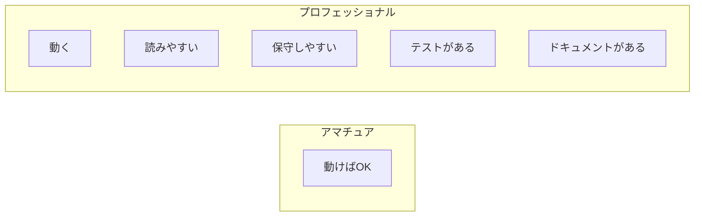
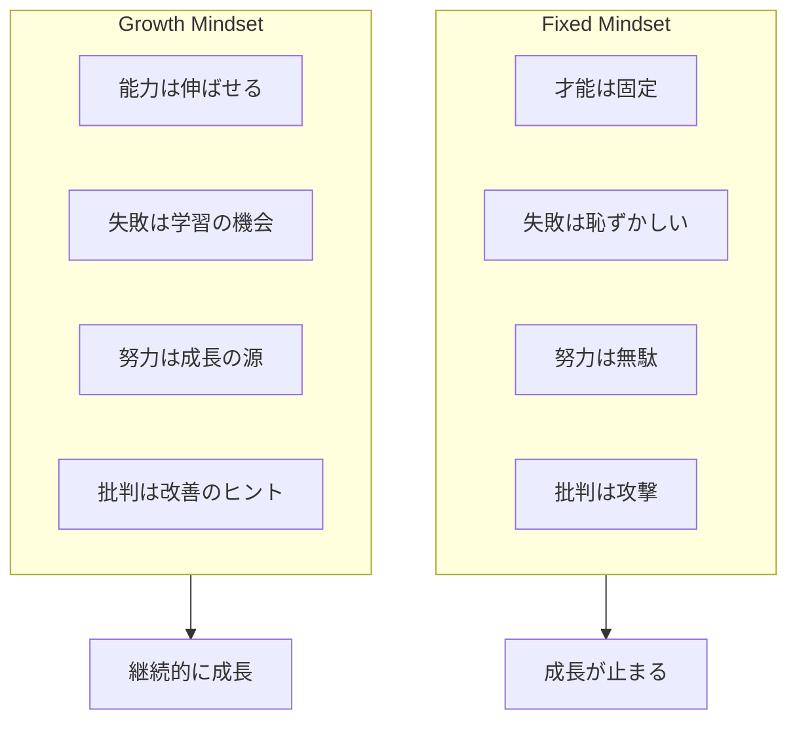
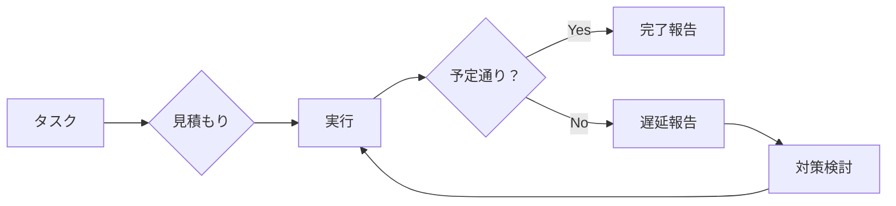
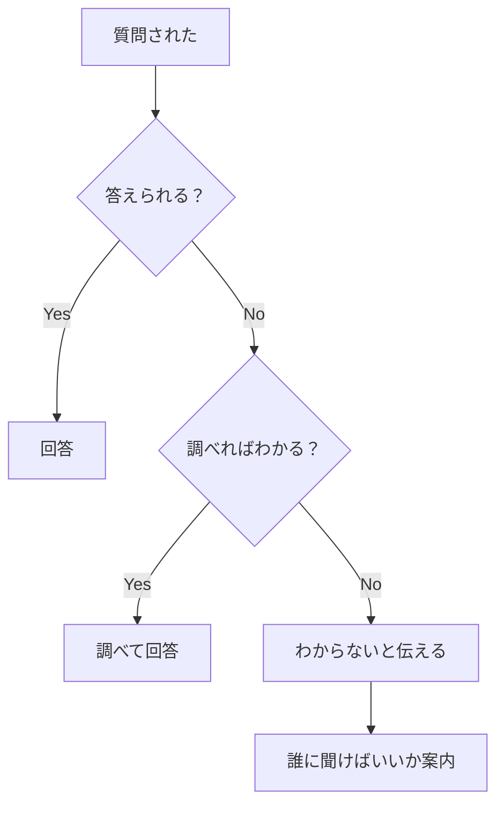

# 心構えの基本

## 📋 概要

| 項目 | 内容 |
|------|------|
| 所要時間 | 30分 |
| 難易度 | [基礎] |
| 前提知識 | なし |

## 🎯 なぜこれを学ぶのか

エンジニアとして成功するために、技術力と同じくらい重要なのが**心構え**です。

正しい心構えがあれば：
- 困難な問題に直面しても諦めずに取り組める
- チームの信頼を得られる
- 継続的に成長できる

## 📚 学習内容

### 1. プロフェッショナルとしての責任感

#### 1.1 「動けばいい」ではない



**プロのエンジニアは以下を意識します**:

| 観点 | 意識すること |
|------|-------------|
| 可読性 | 半年後の自分や他の人が読んでも理解できるか |
| 保守性 | 修正や機能追加がしやすいか |
| 信頼性 | エッジケースやエラー処理を考慮しているか |
| テスト | 動作を保証できるテストがあるか |

#### 1.2 自分の仕事に責任を持つ

```
❌ 「動かないのは〇〇のせい」
❌ 「仕様書に書いてなかったから」
❌ 「誰も教えてくれなかった」

✅ 「自分の担当範囲で問題が起きたら、原因を調査して解決する」
✅ 「不明点があれば、自分から確認する」
✅ 「わからないことは、調べるか質問する」
```

### 2. 成長マインドセット

#### 2.1 Fixed Mindset vs Growth Mindset



#### 2.2 エンジニアとしての成長マインドセット

| 状況 | Fixed Mindset | Growth Mindset |
|------|--------------|----------------|
| 難しい問題 | 「自分には無理」 | 「時間をかければ理解できる」 |
| バグが出た | 「自分はダメだ」 | 「次は同じミスをしない方法を考えよう」 |
| 知らない技術 | 「もう遅い」 | 「今から学べば良い」 |
| コードレビュー | 「批判された」 | 「改善点がわかった」 |

### 3. 自己管理

#### 3.1 時間管理



**時間管理のポイント**:

1. **見積もりを立てる習慣**
   - 「〇〇時間で終わる」と予測する
   - 予測と実績の差を振り返る
   - 見積もり精度を上げていく

2. **バッファを持つ**
   - 想定外のことは必ず起きる
   - 見積もりの1.5〜2倍を想定

3. **早めにアラートを上げる**
   - 遅れそうなら早めに報告
   - ギリギリまで抱え込まない

#### 3.2 健康管理

```
⚠️ 無理は長続きしない

- 睡眠を削ると判断力が落ちる
- 疲れているとバグが増える
- 燃え尽きると回復に時間がかかる

✅ 持続可能なペースで働く
✅ 定期的に休憩を取る
✅ 運動や趣味でリフレッシュ
```

### 4. 誠実さ

#### 4.1 わからないことは「わからない」と言う



**NGパターン**:
- ❌ 知ったかぶりをする
- ❌ 曖昧な返答をする
- ❌ 嘘をつく

**OKパターン**:
- ✅ 「わかりません。調べて回答します」
- ✅ 「その分野は詳しくないので、〇〇さんに聞いてみてください」
- ✅ 「自信がないので、確認させてください」

#### 4.2 ミスは隠さない

```
❌ バグを見つけたが、自分のミスなので黙っている
❌ テストを書かずにリリースしたが、誰にも言わない
❌ 設計を間違えたが、もう手遅れなので黙っている

✅ ミスは早めに報告し、対策を一緒に考える
✅ 失敗から学び、再発防止策を立てる
✅ チームで問題を共有し、協力して解決する
```

### 5. 謙虚さと尊重

#### 5.1 チームメンバーへの尊重

```
✅ 相手の意見を最後まで聞く
✅ 異なる意見も尊重する
✅ 建設的なフィードバックを心がける
✅ 感謝の気持ちを伝える
```

#### 5.2 コードレビューでの姿勢

**レビューする側**:
- 人格ではなくコードにコメントする
- 「なぜ」を説明する
- 良い点も伝える

**レビューされる側**:
- 指摘は攻撃ではない
- 改善の機会として受け止める
- 不明点は質問する

## ✅ まとめ

| 心構え | 実践すること |
|--------|-------------|
| 責任感 | 自分の仕事に責任を持つ |
| 成長マインドセット | 失敗を学習の機会と捉える |
| 自己管理 | 時間と健康を管理する |
| 誠実さ | わからないことはわからないと言う |
| 謙虚さ | チームメンバーを尊重する |

## 🔗 次のコンテンツ

[コミュニケーションの基本](02-communication-skills.md)に進んでください。
