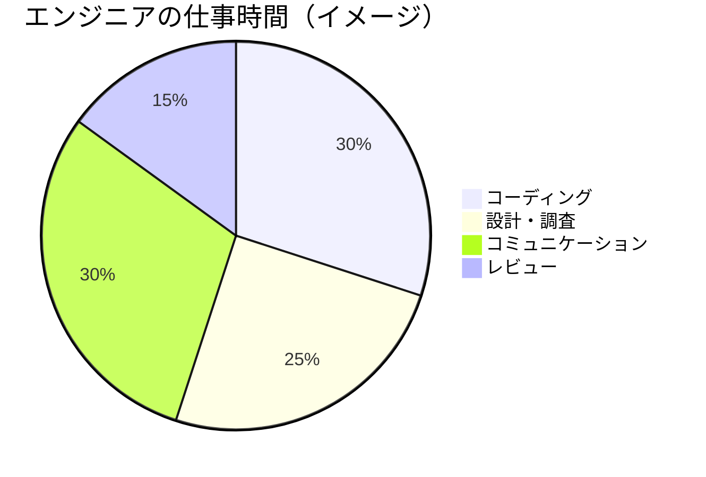
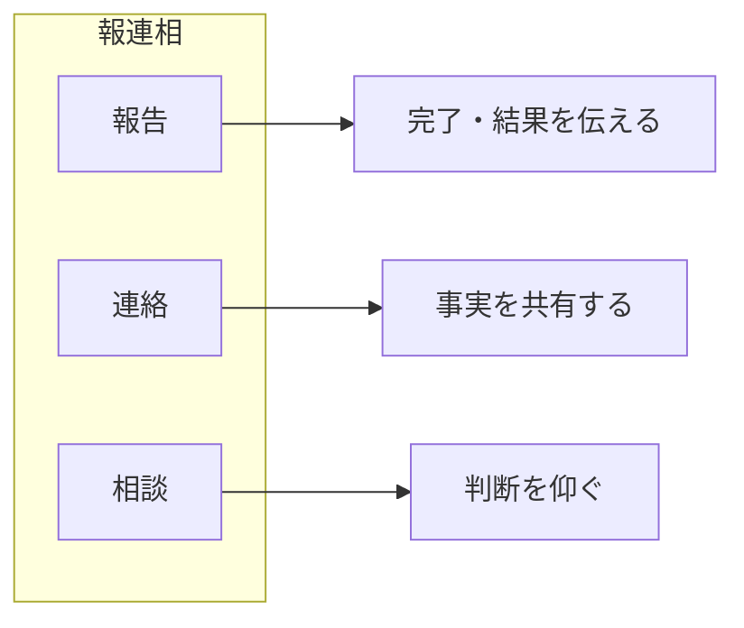
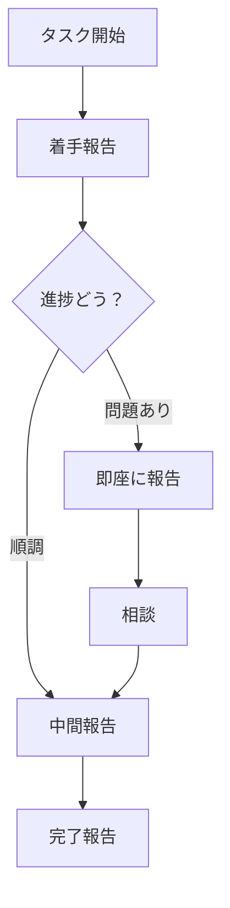
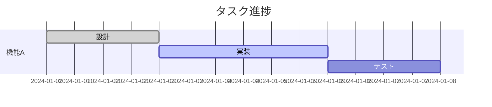
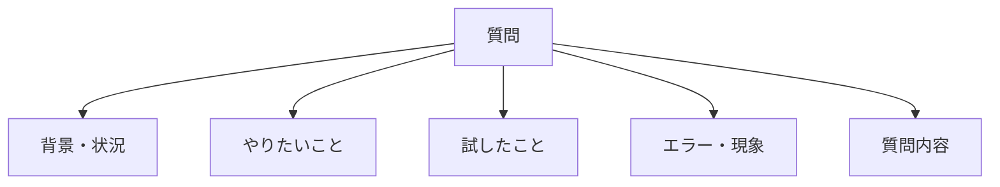
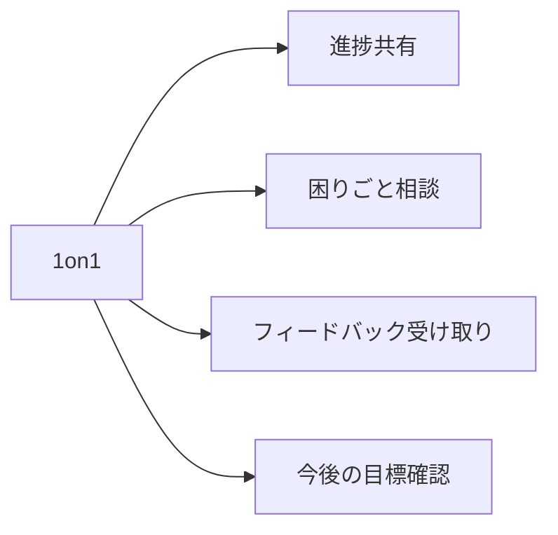

# コミュニケーションの基本

## 📋 概要

| 項目 | 内容 |
|------|------|
| 所要時間 | 45分 |
| 難易度 | [基礎] |
| 前提知識 | なし |

## 🎯 なぜこれを学ぶのか

エンジニアの仕事の大部分は**コミュニケーション**です。



一人でコードを書いているだけでは、良いプロダクトは作れません。

## 📚 学習内容

### 1. 報連相（ホウレンソウ）

#### 1.1 報連相とは



| 種類 | 意味 | 例 |
|------|------|-----|
| **報告** | 指示された仕事の経過や結果を伝える | 「〇〇の実装が完了しました」 |
| **連絡** | 必要な情報を関係者に伝える | 「明日15時からミーティングです」 |
| **相談** | 判断に迷うことを上司やチームに聞く | 「〇〇と△△どちらで実装すべきでしょうか」 |

#### 1.2 報告のタイミング



**報告すべきタイミング**:

| タイミング | 報告内容 |
|-----------|---------|
| 着手時 | 「〇〇に着手します」 |
| 中間（1日以上のタスク） | 「〇〇まで進みました。残り△△です」 |
| 問題発生時 | 「〇〇で問題が発生しました」 |
| 完了時 | 「〇〇が完了しました」 |
| 遅延しそうな時 | 「〇〇の理由で遅れそうです」 |

#### 1.3 悪い報告の例と改善

**❌ 悪い例**:
```
「終わりました」
→ 何が終わったのかわからない

「うまくいきません」
→ 何がどううまくいかないのかわからない

「〇〇をやっています」
→ いつ終わるのかわからない
```

**✅ 良い例**:
```
「ユーザー登録機能の実装が完了しました。PRを作成しましたのでレビューをお願いします」

「ユーザー登録機能の実装中に、メール送信でエラーが発生しています。
エラー内容は〇〇で、△△を試しましたが解決していません。
アドバイスをいただけますか？」

「ユーザー登録機能を実装中です。
現在50%程度完了しており、本日中に完了予定です」
```

### 2. 進捗報告の技術

#### 2.1 進捗報告のフォーマット

```markdown
## 進捗報告 - [日付]

### 完了したこと
- ユーザー登録APIの実装
- バリデーションの追加

### 進行中
- メール送信機能（70%完了）

### 予定
- 単体テストの作成

### 困っていること / 相談事項
- メール送信のテスト方法について相談したい

### 今日の作業予定
- メール送信機能の完成
- 単体テストの作成開始
```

#### 2.2 進捗の可視化



**進捗を伝えるコツ**:

| コツ | 説明 |
|------|------|
| **数値化する** | 「半分くらい」→「50%完了」 |
| **期限を明確に** | 「もう少し」→「本日17時までに」 |
| **ブロッカーを明示** | 「〇〇の回答待ちで止まっています」 |

### 3. 質問の技術

#### 3.1 良い質問の構成



**質問テンプレート**:
```markdown
## 状況
何をしようとしていますか？
例: ユーザー登録機能を実装しています

## やりたいこと
最終的に何を達成したいですか？
例: メールアドレスでユーザー登録できるようにしたい

## 試したこと
どんな方法を試しましたか？
例:
- 公式ドキュメントの〇〇を読んだ
- 〇〇で検索した
- 〇〇のコードを参考にした

## エラー・現象
何が起きていますか？
例: 「〇〇」というエラーが出る

## 質問
具体的に何を聞きたいですか？
例: このエラーの原因と解決方法を教えてください
```

#### 3.2 質問のNG例とOK例

**❌ NG例**:
```
「動きません」
「エラーが出ます」
「どうすればいいですか？」
```

**✅ OK例**:
```
「ユーザー登録APIを実装中です。
POSTリクエストを送ると、以下のエラーが発生します。

エラー: TypeError: Cannot read property 'email' of undefined

request.bodyが空になっているようですが、
body-parserの設定は以下のようにしています。

[コードを貼る]

何か設定が足りないでしょうか？」
```

#### 3.3 質問する前のチェックリスト

```
□ 公式ドキュメントを読んだか？
□ エラーメッセージをググったか？
□ 同じ問題の解決策がないか検索したか？
□ 最低10分は自分で考えたか？
□ 質問内容は具体的か？
```

### 4. Slackでのコミュニケーション

#### 4.1 Slackの使い分け

| 用途 | 適した場所 |
|------|-----------|
| 技術的な質問（後で検索したい） | Slack |
| 気軽な相談・雑談 | Slack |
| 緊急の連絡 | Slack（メンション付き） |
| 休暇連絡 | Slack |
| コンテンツの問題報告 | GitHub Issues |

#### 4.2 Slackのマナー

**✅ 良いマナー**:
```
- 挨拶は簡潔に（「おはようございます」のみのメッセージは避ける）
- 用件は1つのメッセージにまとめる
- スレッドを活用して話題を整理
- メンションは必要な人だけに
- 長文はNotionやGitHubにまとめてリンク共有
```

**❌ 避けること**:
```
- 「お疲れ様です」だけのメッセージ
- 細切れのメッセージを連投
- 関係ない人へのメンション
- 深夜・休日の非緊急メッセージ
```

### 5. ミーティングでのコミュニケーション

#### 5.1 1on1での姿勢



**1on1で話すこと**:
- 今週の進捗と来週の予定
- 困っていること、詰まっていること
- 学習の方向性について
- キャリアについて（余裕があれば）

**事前準備**:
```markdown
## 1on1 準備メモ

### 進捗
- 完了: Git基礎、TypeScript基礎
- 進行中: ソフトウェア設計（60%）

### 相談したいこと
- 設計パターンの学習順序について
- 応用演習のテーマについて

### 困っていること
- 〇〇の理解に時間がかかっている
```

## ✅ まとめ

| スキル | ポイント |
|--------|---------|
| 報連相 | タイミングと内容を適切に |
| 進捗報告 | 数値化、期限明確、ブロッカー明示 |
| 質問 | 背景・試したこと・具体的な質問 |
| Slack | 用途に応じた使い分け |
| 1on1 | 事前準備して臨む |

## 🔗 次のコンテンツ

[目的志向の思考](03-goal-oriented-thinking.md)に進んでください。
