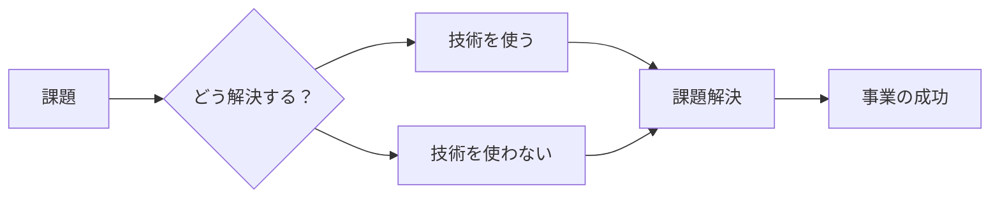
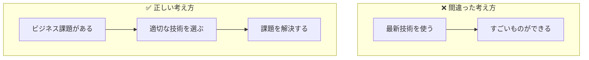
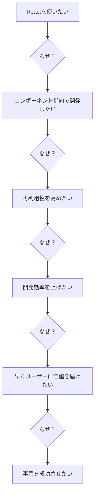
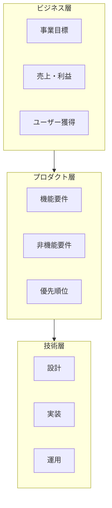
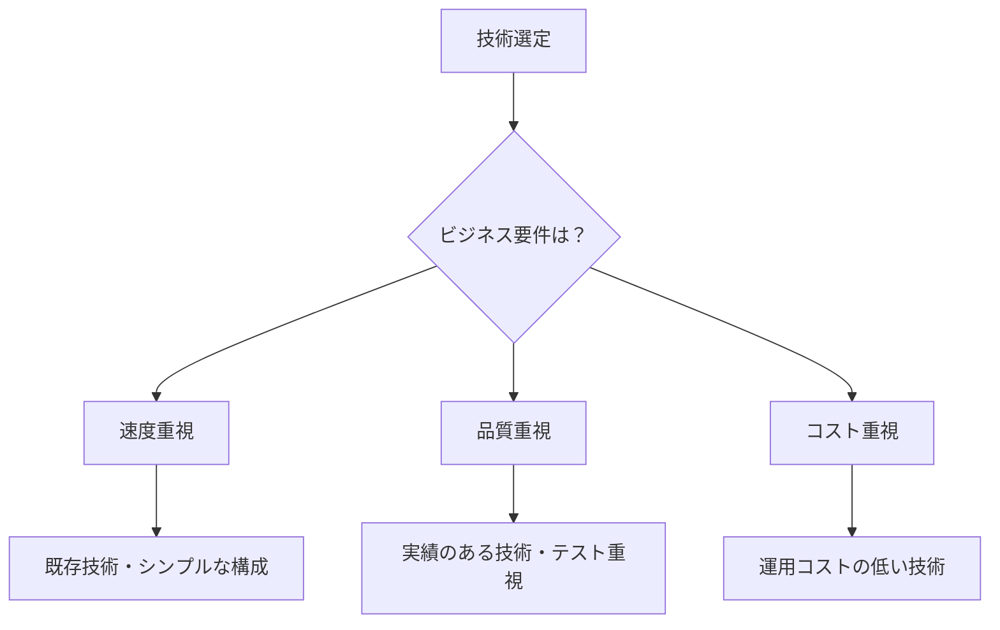
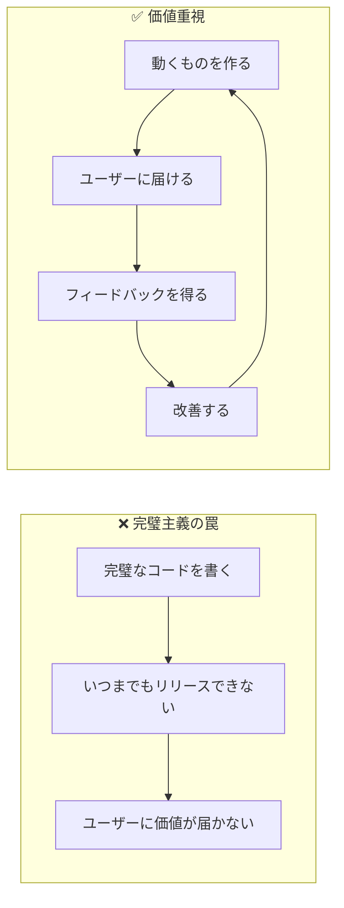
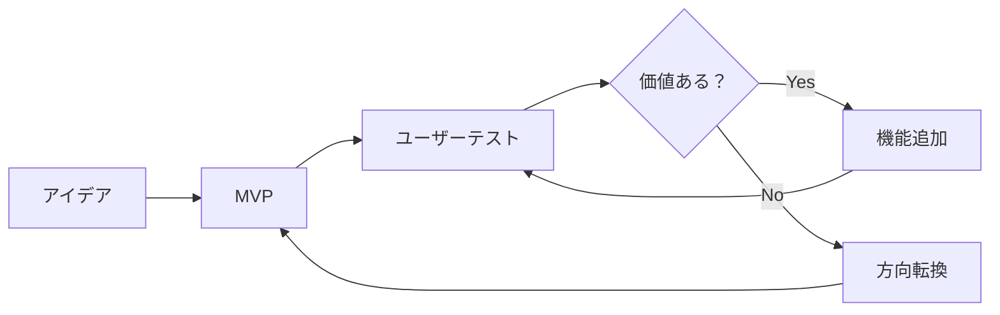
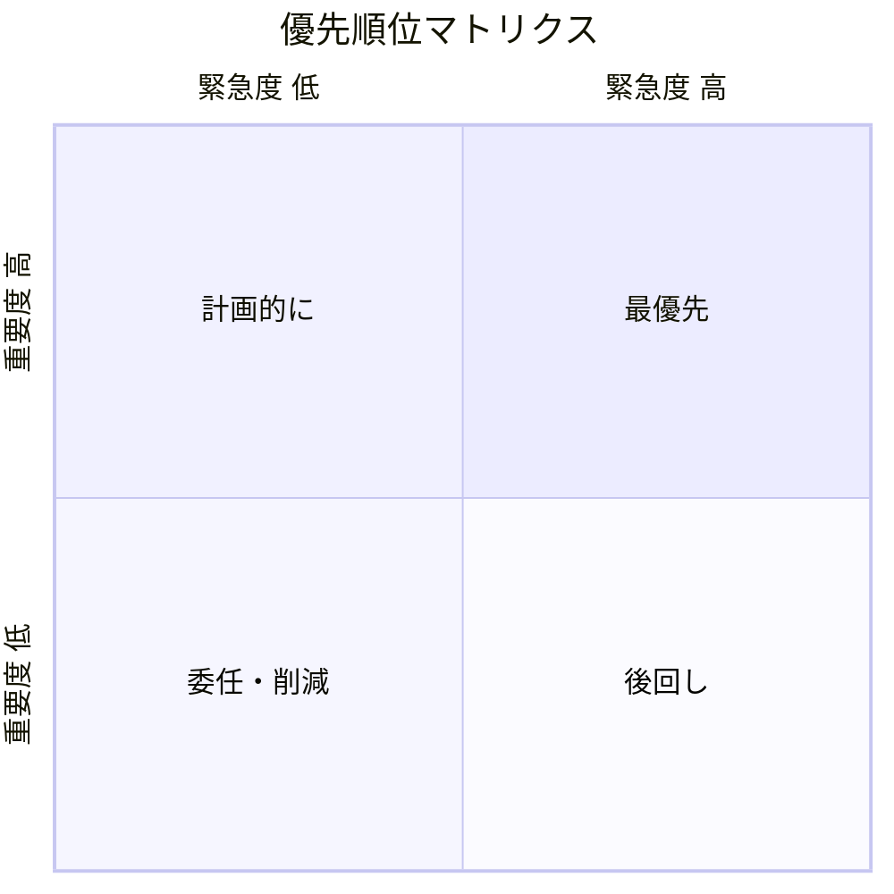

# 目的志向の思考

## 📋 概要

| 項目 | 内容 |
|------|------|
| 所要時間 | 30分 |
| 難易度 | [基礎] |
| 前提知識 | なし |

## 🎯 なぜこれを学ぶのか

エンジニアは「ものを作る」ことが仕事ではありません。
**「事業・サービスを成功に導く」** ことが仕事です。



技術は**手段**であり、**目的**ではありません。

## 📚 学習内容

### 1. 手段と目的を区別する

#### 1.1 よくある混同



| ❌ 手段が目的化 | ✅ 本来の目的 |
|----------------|--------------|
| Reactを使いたい | ユーザーに価値を届けたい |
| マイクロサービスにしたい | スケーラブルなシステムを作りたい |
| 新しい言語を試したい | 保守しやすいコードを書きたい |
| AIを導入したい | ユーザーの課題を解決したい |

#### 1.2 「なぜ？」を5回繰り返す



**本当の目的は「事業を成功させたい」**

この目的を達成するために、Reactが最適なら使う。
他に良い選択肢があれば、それを使う。

### 2. ビジネス視点を持つ

#### 2.1 エンジニアに求められるビジネス理解



**知っておくべきこと**:

| 観点 | 知るべきこと |
|------|-------------|
| ユーザー | 誰が使うのか、何を求めているのか |
| ビジネスモデル | どうやって収益を上げるのか |
| 競合 | 他にどんなサービスがあるのか |
| 優先順位 | 今何が最も重要なのか |

#### 2.2 技術選定の考え方



**判断基準**:

| 基準 | 考えること |
|------|-----------|
| チームのスキル | チームが使える技術か |
| 保守性 | 長期的に保守できるか |
| コスト | 開発・運用コストは適切か |
| 時間 | 期限内に完成できるか |
| リスク | 失敗したときの影響は |

### 3. 価値を届けることにフォーカス

#### 3.1 完璧主義の罠



**「完璧」より「価値を届ける」を優先**:

```
❌ 完璧なコードを3ヶ月かけて作る
✅ 動くものを2週間で作って、フィードバックを得ながら改善する

❌ すべての機能を実装してからリリース
✅ コア機能だけでリリースして、反応を見る

❌ 技術的負債を完全になくしてから次に進む
✅ 優先度の高い負債から対処し、ビジネスを止めない
```

#### 3.2 MVP（Minimum Viable Product）の考え方



**MVPとは**: ユーザーに価値を届けられる**最小限**の製品

| 観点 | MVP的思考 |
|------|----------|
| 機能 | 本当に必要な機能だけに絞る |
| 品質 | 致命的なバグがなければOK |
| デザイン | 使えれば最初は十分 |
| 技術 | 動けばまずはOK |

### 4. 優先順位をつける

#### 4.1 重要度と緊急度のマトリクス



| 象限 | 対応 |
|------|------|
| 重要 × 緊急 | **最優先**で対応 |
| 重要 × 非緊急 | **計画的**に対応 |
| 非重要 × 緊急 | **委任**または**時間を区切る** |
| 非重要 × 非緊急 | **後回し**または**やらない** |

#### 4.2 判断に迷ったら

```
1. ユーザーへの価値は？
2. ビジネスへの影響は？
3. 技術的なリスクは？
4. 時間とコストは？

→ これらを総合的に判断して優先順位を決める
→ 迷ったら上司やチームに相談
```

### 5. 実践：目的思考チェックリスト

作業を始める前に、以下を確認しましょう：

```markdown
## 目的思考チェックリスト

□ この作業の目的は何か？
□ 誰のための作業か？
□ ユーザーにどんな価値を届けるか？
□ ビジネスにどう貢献するか？
□ 他にもっと良い方法はないか？
□ 本当に今やるべきことか？
□ どこまでやれば「完了」か？
```

## ✅ まとめ

| ポイント | 内容 |
|----------|------|
| 手段と目的 | 技術は手段、ビジネス成功が目的 |
| ビジネス視点 | ユーザーと事業を理解する |
| 価値重視 | 完璧より価値を届けることを優先 |
| MVP | 最小限で価値を検証する |
| 優先順位 | 重要度と緊急度で判断する |

## 💬 考えてみよう

```
Q: あなたが作ろうとしている機能の「本当の目的」は何ですか？
Q: その目的を達成するために、本当にその技術が必要ですか？
Q: 最小限で価値を届けるには、何を作ればいいですか？
```

## 🔗 次のコンテンツ

[継続的な学習](04-continuous-learning.md)に進んでください。
