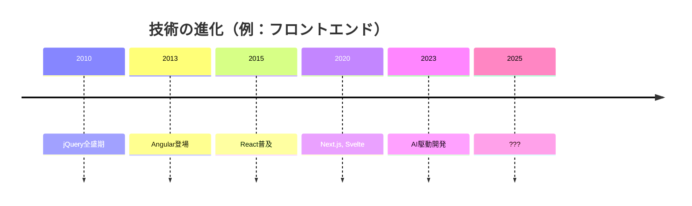
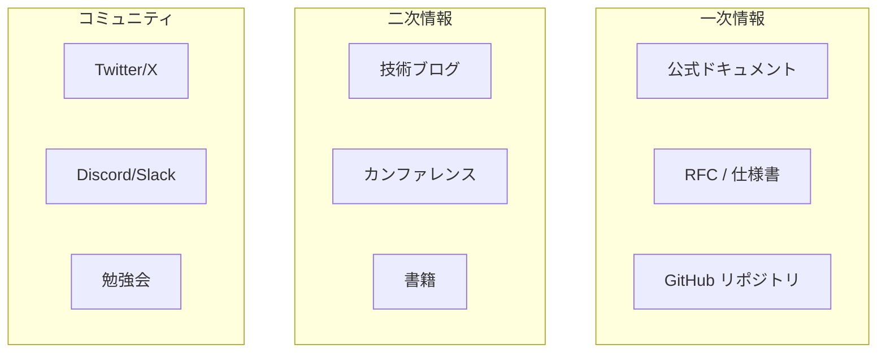
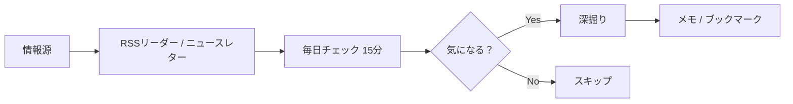
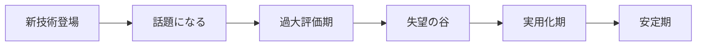
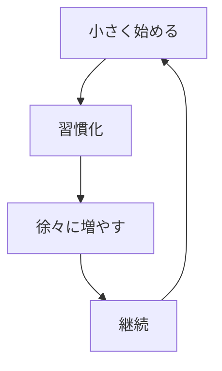
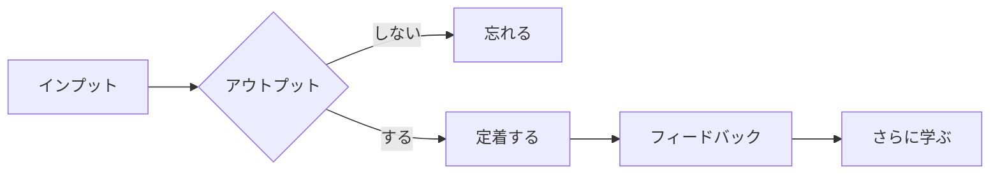

# 継続的な学習

## 📋 概要

| 項目 | 内容 |
|------|------|
| 所要時間 | 30分 |
| 難易度 | [基礎] |
| 前提知識 | なし |

## 🎯 なぜこれを学ぶのか

技術は常に進化しています。エンジニアとして成長し続けるには、**継続的な学習**が不可欠です。



**変化に対応できるエンジニア**になるために、アンテナを張り続けましょう。

## 📚 学習内容

### 1. 情報収集のアンテナを持つ

#### 1.1 情報源の種類



**おすすめの情報源**:

| カテゴリ | 情報源 | 特徴 |
|----------|--------|------|
| 公式 | 各技術の公式ドキュメント | 最も正確 |
| ニュース | Hacker News, dev.to | 最新トレンド |
| 日本語 | Zenn, Qiita | 日本語で読める |
| 動画 | YouTube, Udemy | 視覚的に学べる |
| SNS | Twitter/X | リアルタイム情報 |
| Podcast | Rebuild.fm など | 通勤中に聞ける |

#### 1.2 効率的な情報収集



**情報収集のコツ**:

| コツ | 説明 |
|------|------|
| **時間を決める** | 毎朝15分など、習慣化する |
| **フィルタリング** | すべてを追わず、関心領域に絞る |
| **メモを取る** | 気になったことはメモして後で深掘り |
| **アウトプット** | 学んだことを発信すると定着する |

### 2. 技術トレンドの把握

#### 2.1 トレンドを追う理由

```
✅ 追うべき理由
- 新しい技術で効率が上がることがある
- 業界の流れを知らないと取り残される
- 技術選定の判断材料になる

⚠️ 追いすぎない理由
- すべてを学ぶ時間はない
- 流行っているだけで使えないものもある
- 基礎がないと応用も身につかない
```

#### 2.2 技術の成熟度を見極める



**判断のポイント**:

| フェーズ | 特徴 | 対応 |
|----------|------|------|
| 話題期 | バズワード的に広まる | 情報収集のみ |
| 過大評価期 | 「これですべて解決！」 | 冷静に見る |
| 失望の谷 | 「使えない」との声 | 本質を見極める |
| 実用化期 | 実例が増える | 学習を検討 |
| 安定期 | ベストプラクティスが確立 | 積極的に採用 |

### 3. 学習の習慣化

#### 3.1 継続のコツ



**継続のためのTips**:

| Tips | 説明 |
|------|------|
| **毎日少しずつ** | 週末に8時間より、毎日1時間 |
| **時間を固定** | 「朝起きたら30分」など |
| **ハードルを下げる** | 「本を1ページ読む」から |
| **記録する** | 学習ログをつける |
| **アウトプット** | ブログやメモにまとめる |

#### 3.2 学習時間の作り方

```
1日のスキマ時間を活用：

- 通勤時間: Podcast、読書（30分）
- 昼休み: 技術記事を読む（15分）
- 夜: ハンズオンや実装（1時間）

週末:
- 土曜: 深い学習、プロジェクト（2-3時間）
- 日曜: 振り返り、アウトプット（1時間）
```

### 4. アウトプットで学びを定着

#### 4.1 アウトプットの効果



**アウトプットの形式**:

| 形式 | 難易度 | 効果 |
|------|--------|------|
| メモ | 低 | 思考の整理 |
| 社内共有 | 低 | チームへの貢献 |
| ブログ記事 | 中 | 深い理解 |
| 登壇 | 高 | 大きな成長 |
| OSS貢献 | 高 | 実践力向上 |

#### 4.2 アウトプットのコツ

```markdown
## ブログ記事のテンプレート

### タイトル
「〇〇を△△してみた」「〇〇入門」など

### 背景
なぜこれを学んだか

### やったこと
具体的な手順

### 学んだこと
理解したポイント

### つまずいたところ
エラーや解決方法

### まとめ
次にやりたいこと
```

### 5. 具体的なアクションプラン

#### 5.1 今日からできること

```markdown
## 今日からできるアクション

### レベル1: 受動的な情報収集
- [ ] 技術系ニュースサイトをブックマーク
- [ ] RSSリーダーを設定
- [ ] 気になる技術者をTwitterでフォロー

### レベル2: 習慣化
- [ ] 毎朝15分、技術記事を読む
- [ ] 週1回、学んだことをメモにまとめる

### レベル3: アウトプット
- [ ] 月1回、社内で学んだことを共有
- [ ] Zennやブログで記事を書く
```

#### 5.2 おすすめリソース

**ニュース・トレンド**:
- [Hacker News](https://news.ycombinator.com/) - 技術トレンドの定番
- [dev.to](https://dev.to/) - 開発者コミュニティ
- [TechFeed](https://techfeed.io/) - 日本語の技術ニュース

**学習**:
- [Zenn](https://zenn.dev/) - 日本語の技術記事
- [MDN Web Docs](https://developer.mozilla.org/) - Web技術の公式
- [freeCodeCamp](https://www.freecodecamp.org/) - 無料の学習プラットフォーム

**コミュニティ**:
- 各技術のDiscord/Slackコミュニティ
- 地域の勉強会（connpass等）
- カンファレンス（オンライン含む）

## ✅ まとめ

| ポイント | 内容 |
|----------|------|
| アンテナ | 複数の情報源を持つ |
| 効率化 | 時間を決めてフィルタリング |
| 見極め | トレンドの成熟度を判断 |
| 習慣化 | 毎日少しずつ継続 |
| アウトプット | 学んだことを発信して定着 |

## 💬 考えてみよう

```
Q: あなたが今後追いたい技術領域は何ですか？
Q: 毎日の中で、学習時間をどこで確保できますか？
Q: 最初のアウトプットは何にしますか？
```

## ➡️ 次のステップ

エンジニアの心構えを学び終えたら、[Git基礎](../01-git-basics/README.md)に進んでください！
