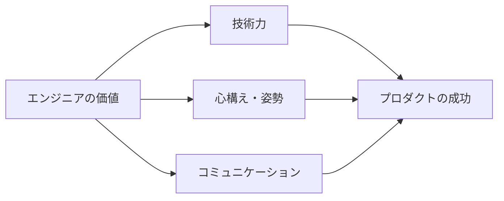
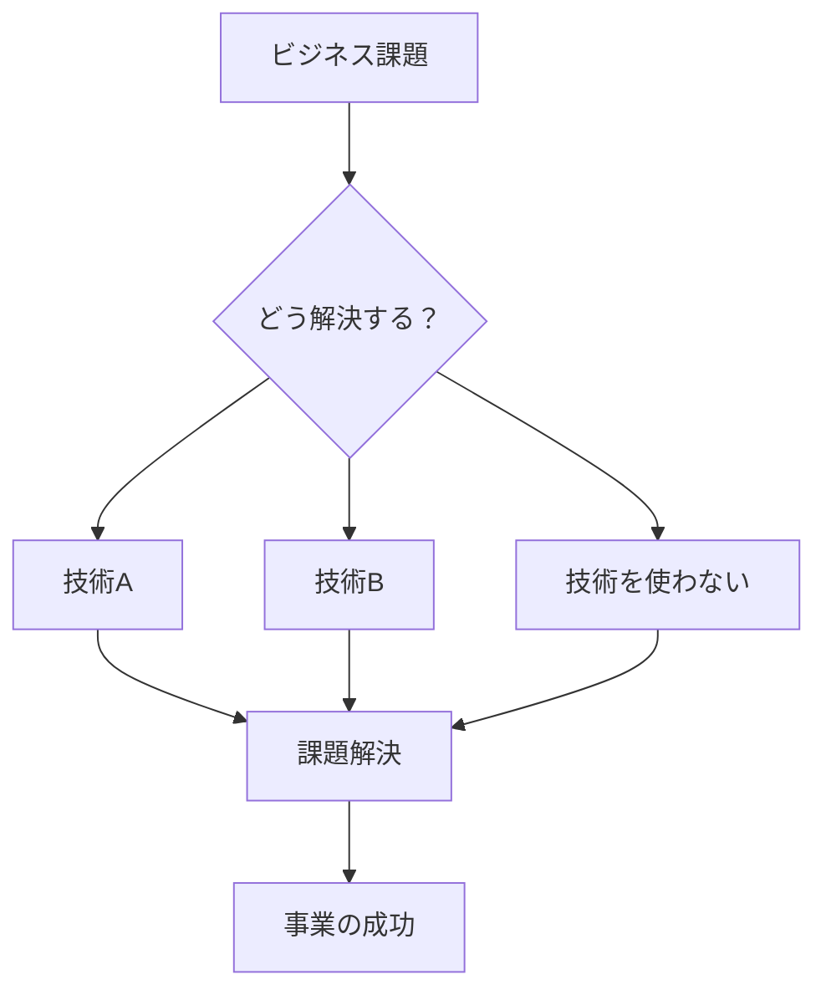

# エンジニアの心構え

## 📋 カテゴリ概要

| 項目 | 内容 |
|------|------|
| 学習期間 | 1日 |
| 難易度 | [基礎] |
| 前提知識 | なし |

## 🎯 なぜこれを学ぶのか

技術的なスキルだけでは、優秀なエンジニアにはなれません。

**AI時代において特に重要な理由**:

| 観点 | AIにできること | 人間にしかできないこと |
|------|---------------|---------------------|
| コーディング | コードを書く | なぜそのコードを書くか判断する |
| 問題解決 | 既知のパターンを適用 | ビジネス課題を理解し優先順位をつける |
| コミュニケーション | 文章を生成する | チームの文脈を理解し適切に報告する |

AIがコードを書ける時代だからこそ、**「何を作るか」「なぜ作るか」を判断する力**が重要です。

## 📚 学習内容

| No | コンテンツ | 内容 | 所要時間 |
|----|-----------|------|----------|
| 01 | [心構えの基本](01-mindset-fundamentals.md) | プロとしての姿勢、成長マインドセット | 30分 |
| 02 | [コミュニケーションの基本](02-communication-skills.md) | 報連相、進捗報告、質問の仕方 | 45分 |
| 03 | [目的志向の思考](03-goal-oriented-thinking.md) | 手段と目的、ビジネス視点 | 30分 |
| 04 | [継続的な学習](04-continuous-learning.md) | 情報収集、アンテナの張り方 | 30分 |

## 🏆 学習目標

この章を終えると、以下ができるようになります：

- [ ] エンジニアとしてのプロ意識を持てる
- [ ] 適切なタイミングで報連相ができる
- [ ] 進捗を効果的に共有できる
- [ ] 手段と目的を区別して考えられる
- [ ] 継続的に技術情報をキャッチアップできる

## 💡 この章のポイント

> **「作ることが目的ではない。事業・サービスを成功に導くのが目的」**

技術はあくまで手段です。優秀なエンジニアは、技術を使って**ビジネスの課題を解決する**人です。

## 📁 関連リソース

- [実践課題](../../../exercises/common/00-engineer-mindset/)
- [理解度チェックテスト](../../../tests/common/00-engineer-mindset/)

## ➡️ 次のステップ

この章を完了したら、[Git基礎](../01-git-basics/README.md)に進んでください。

---

**著作権表示**

Copyright © 2024 Honeycome Inc. All rights reserved.

本コンテンツは、Honeycome Inc.の所有物です。無断での複製、配布、転載を禁止します。
詳細は[利用規約](../../../docs/terms-of-use.md)をご覧ください。
