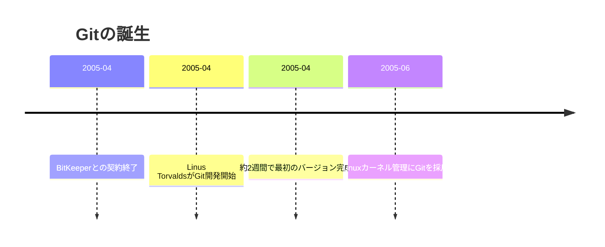
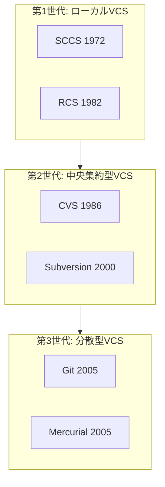
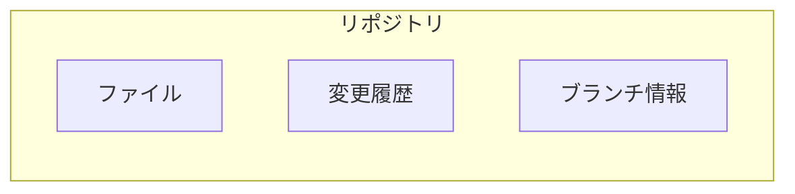
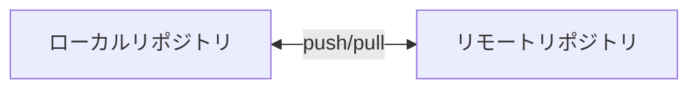
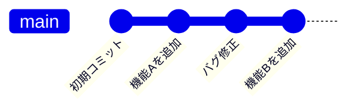
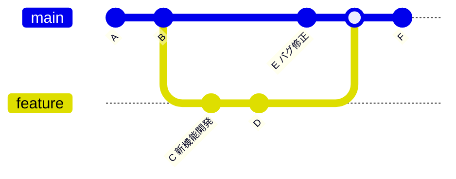
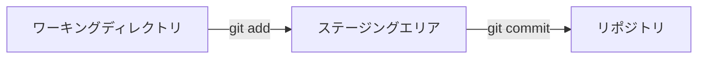
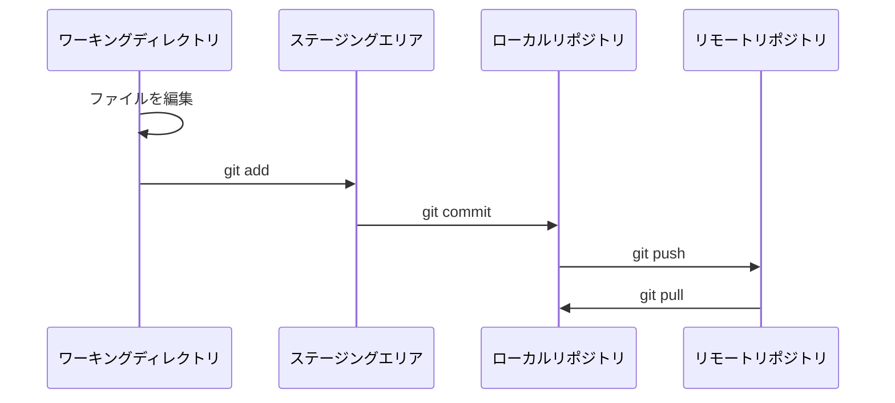

# Gitの基本概念

**難易度**: [基礎]  
**学習時間**: 約30分

## なぜ学ぶ必要があるのか

### この技術が解決する問題

ソフトウェア開発では、コードは常に変化します。新機能の追加、バグの修正、リファクタリングなど、毎日のように変更が加わります。

**バージョン管理がない場合の問題**：
- 「昨日動いていたコードが今日動かない」→ 何が変わったかわからない
- 「この変更は誰がしたの？」→ 追跡できない
- 「1週間前の状態に戻したい」→ 戻せない

**Gitがある場合**：
- すべての変更履歴が記録される
- いつでも過去の状態に戻れる
- 誰が何を変更したか追跡できる

### 実務での重要性

Gitは現代のソフトウェア開発における**必須スキル**です。

- ほぼすべての企業でGitが使用されている
- オープンソースプロジェクトはほぼGitHub/GitLabで管理
- 採用面接でGitの経験を問われることが多い

### AI時代における重要性

AIコーディング支援ツール（Cursor、GitHub Copilot等）を使う場合でも、Gitは重要です。

- AIが生成したコードの変更を追跡
- 問題があった場合に原因を特定
- AIの出力をレビューするためのプルリクエスト

## 技術の歴史的背景

### 技術の誕生

**2005年、Linus Torvalds**がLinuxカーネルの開発のためにGitを作成しました。



**なぜ作られたのか？**
- Linuxカーネルは数千人の開発者が関わる巨大プロジェクト
- 既存のバージョン管理システムは遅く、分散開発に向いていなかった
- 無料で使えるツールが必要だった

### 進化の過程



| 世代 | 特徴 | 問題点 |
|------|------|--------|
| 第1世代 | ローカルのみ | 共有できない |
| 第2世代 | 中央サーバー必須 | サーバーがないと作業できない、遅い |
| 第3世代 | 完全分散型 | 学習曲線がやや急 |

## 技術的な内容

### 基本概念

#### リポジトリ（Repository）

リポジトリは、プロジェクトのファイルと変更履歴を保存する場所です。



**2種類のリポジトリ**：
- **ローカルリポジトリ**: 自分のPCにあるリポジトリ
- **リモートリポジトリ**: サーバー（GitHub等）にあるリポジトリ



#### コミット（Commit）

コミットは、ある時点でのファイルの状態を記録したものです。「セーブポイント」のようなものです。



**コミットに含まれる情報**：
- 変更内容（差分）
- コミットメッセージ（何を変更したか）
- 作成者
- 作成日時
- 親コミットへの参照

#### ブランチ（Branch）

ブランチは、開発の「分岐」を表します。メインの開発ラインから分岐して、独立して作業できます。



**ブランチの利点**：
- メインのコードに影響を与えずに開発できる
- 複数の機能を並行して開発できる
- 失敗しても簡単に破棄できる

#### ワーキングディレクトリ、ステージングエリア、リポジトリ

Gitには3つの「場所」があります。



| 場所 | 説明 |
|------|------|
| ワーキングディレクトリ | 実際にファイルを編集する場所 |
| ステージングエリア | コミットする変更を準備する場所 |
| リポジトリ | コミットが保存される場所 |

### 基本的なワークフロー



1. ファイルを編集する
2. `git add` で変更をステージングエリアに追加
3. `git commit` でコミットを作成
4. `git push` でリモートリポジトリに送信
5. `git pull` でリモートの変更を取得

## コード例

### リポジトリの作成

```bash
# 新しいリポジトリを作成
mkdir my-project
cd my-project
git init

# または、既存のリポジトリをクローン
git clone https://github.com/username/repository.git
```

### 基本的なワークフロー

```bash
# 1. ファイルを作成・編集
echo "Hello, Git!" > hello.txt

# 2. 変更をステージングエリアに追加
git add hello.txt

# 3. コミットを作成
git commit -m "Add hello.txt"

# 4. リモートにプッシュ
git push origin main
```

### 状態の確認

```bash
# 現在の状態を確認
git status

# コミット履歴を確認
git log

# 変更内容を確認
git diff
```

## ベストプラクティス

### 良いコミットメッセージ

```bash
# 良い例
git commit -m "Add user authentication feature"
git commit -m "Fix login button not responding on mobile"

# 悪い例
git commit -m "fix"
git commit -m "update"
git commit -m "aaa"
```

**良いコミットメッセージのルール**：
- 何を変更したか明確に書く
- 命令形で書く（英語の場合）
- 50文字以内を目安に

### こまめにコミット

```bash
# 良い例：機能ごとにコミット
git commit -m "Add user model"
git commit -m "Add user controller"
git commit -m "Add user view"

# 悪い例：1回で全部コミット
git commit -m "Add user feature"  # 変更が大きすぎる
```

## まとめ

### 重要なポイント

1. **リポジトリ**: プロジェクトのファイルと変更履歴を保存する場所
2. **コミット**: ある時点でのファイルの状態を記録したもの
3. **ブランチ**: 開発の分岐を表す
4. **3つの場所**: ワーキングディレクトリ → ステージングエリア → リポジトリ

### 次のステップ

次は「基本コマンド」で、実際にGitを操作する方法を学びます。

[次へ: 基本コマンド →](01-git-basics-02.md)

## 確認テスト

1. リポジトリとは何ですか？
2. コミットとは何ですか？
3. ブランチを使う利点は何ですか？
4. ワーキングディレクトリ、ステージングエリア、リポジトリの違いは？

---

**ヒント**: わからないことがあれば、[GitHub Discussions](https://github.com/honeycome-bootcamp/bootcamp-v2/discussions)で質問してください！
