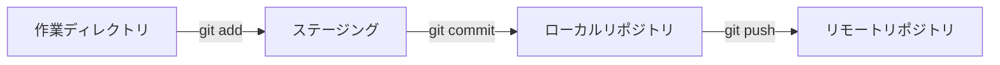

# 基本コマンド

## 📋 概要

| 項目 | 内容 |
|------|------|
| 所要時間 | 60分 |
| 難易度 | [基礎] |
| 前提知識 | Gitの基本概念 |

## 🎯 なぜこれを学ぶのか

Gitの基本コマンドは、日常的な開発作業で毎日使います。これらを覚えることで、コードの変更を安全に管理できます。

## 📚 学習内容

### 1. リポジトリの作成・取得

#### 1.1 git init - 新規リポジトリ作成

```bash
# 新しいプロジェクトを作成
mkdir my-project
cd my-project
git init
```

`.git`ディレクトリが作成され、このフォルダがGitリポジトリになります。

#### 1.2 git clone - 既存リポジトリの取得

```bash
# GitHubからリポジトリをコピー
git clone https://github.com/username/repository.git

# 別名でクローン
git clone https://github.com/username/repository.git my-folder
```

### 2. 基本的な変更の流れ



#### 2.1 git status - 状態確認

```bash
git status
```

出力例：
```
On branch main
Changes not staged for commit:
  modified:   index.html

Untracked files:
  style.css
```

#### 2.2 git add - ステージング

```bash
# 特定のファイルをステージ
git add index.html

# すべての変更をステージ
git add .

# 対話的にステージ
git add -p
```

#### 2.3 git commit - コミット

```bash
# コミット（エディタが開く）
git commit

# メッセージ付きコミット
git commit -m "Add user login feature"

# 直前のコミットを修正
git commit --amend
```

**良いコミットメッセージ**:
```
✅ Add user authentication feature
✅ Fix login button not working on mobile
✅ Update dependencies to latest versions

❌ fix
❌ update
❌ WIP
```

### 3. リモートとの同期

#### 3.1 git push - アップロード

```bash
# リモートに送信
git push origin main

# 初回のpush（上流ブランチを設定）
git push -u origin main
```

#### 3.2 git pull - ダウンロード

```bash
# リモートの変更を取得してマージ
git pull origin main

# fetch + merge の省略形
git pull
```

#### 3.3 git fetch - 取得のみ

```bash
# リモートの情報を取得（マージはしない）
git fetch origin

# 取得後に差分を確認
git diff origin/main
```

### 4. 差分の確認

#### 4.1 git diff

```bash
# ステージ前の変更を表示
git diff

# ステージ済みの変更を表示
git diff --staged

# 特定のコミット間の差分
git diff abc123 def456
```

#### 4.2 git log - 履歴の確認

```bash
# コミット履歴を表示
git log

# 1行で表示
git log --oneline

# グラフ表示
git log --oneline --graph --all

# 特定ファイルの履歴
git log -- index.html
```

### 5. 変更の取り消し

#### 5.1 ステージの取り消し

```bash
# ステージを取り消し（ファイルは変更のまま）
git restore --staged index.html

# すべてのステージを取り消し
git restore --staged .
```

#### 5.2 変更の破棄

```bash
# 作業ディレクトリの変更を破棄
git restore index.html

# ⚠️ 注意: 変更が完全に消えます
```

#### 5.3 コミットの取り消し

```bash
# 直前のコミットを取り消し（変更は残す）
git reset --soft HEAD~1

# 直前のコミットを取り消し（変更も破棄）
git reset --hard HEAD~1
```

### 6. コマンドチートシート

| コマンド | 説明 |
|---------|------|
| `git init` | リポジトリを初期化 |
| `git clone <url>` | リポジトリをコピー |
| `git status` | 状態を確認 |
| `git add <file>` | ステージに追加 |
| `git commit -m "msg"` | コミット |
| `git push` | リモートに送信 |
| `git pull` | リモートから取得 |
| `git log` | 履歴を表示 |
| `git diff` | 差分を表示 |
| `git restore <file>` | 変更を破棄 |

## ✅ まとめ

| 操作 | コマンド |
|------|---------|
| 変更を記録 | add → commit → push |
| 変更を取得 | fetch / pull |
| 状態確認 | status / log / diff |
| 取り消し | restore / reset |

## 💬 考えてみよう

```
Q: git add . と git add -p の違いは何ですか？
Q: git pull と git fetch の違いは何ですか？
Q: コミットメッセージを良くするポイントは何ですか？
```

## 🔗 次のコンテンツ

[ブランチ戦略](01-git-basics-03.md)に進んでください。
