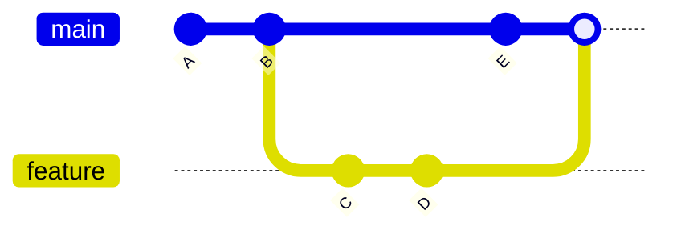
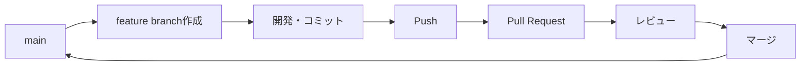
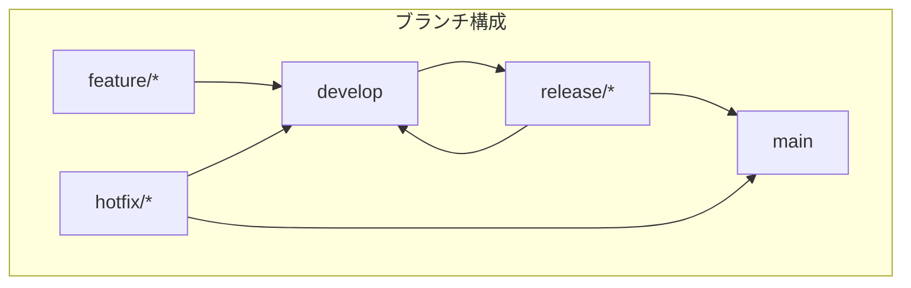

# ブランチ戦略

## 📋 概要

| 項目 | 内容 |
|------|------|
| 所要時間 | 45分 |
| 難易度 | [中級] |
| 前提知識 | 基本コマンド |

## 🎯 なぜこれを学ぶのか

ブランチを使うことで、メインのコードに影響を与えずに新機能の開発やバグ修正ができます。チーム開発では必須のスキルです。

## 📚 学習内容

### 1. ブランチとは



**ブランチ** = 独立した作業スペース

- mainブランチ: 本番環境のコード
- featureブランチ: 新機能の開発
- bugfixブランチ: バグ修正

### 2. ブランチの基本操作

#### 2.1 ブランチの作成

```bash
# ブランチを作成
git branch feature/login

# ブランチを作成して切り替え
git checkout -b feature/login
# または
git switch -c feature/login
```

#### 2.2 ブランチの切り替え

```bash
# ブランチを切り替え
git checkout main
# または
git switch main
```

#### 2.3 ブランチの一覧

```bash
# ローカルブランチ一覧
git branch

# リモートブランチも含む
git branch -a

# 現在のブランチを確認
git branch --show-current
```

#### 2.4 ブランチの削除

```bash
# マージ済みブランチを削除
git branch -d feature/login

# 強制削除（マージされていなくても）
git branch -D feature/login
```

### 3. ブランチ命名規則

| プレフィックス | 用途 | 例 |
|---------------|------|-----|
| `feature/` | 新機能 | `feature/user-login` |
| `bugfix/` | バグ修正 | `bugfix/login-error` |
| `hotfix/` | 緊急修正 | `hotfix/security-fix` |
| `release/` | リリース準備 | `release/v1.2.0` |

### 4. GitHub Flow



**シンプルで現代的なフロー**:

1. mainから新しいブランチを作成
2. 変更をコミット
3. Pull Requestを作成
4. レビューを受ける
5. mainにマージ

```bash
# 1. mainを最新に
git checkout main
git pull

# 2. featureブランチを作成
git checkout -b feature/add-login

# 3. 開発してコミット
git add .
git commit -m "Add login form"

# 4. プッシュ
git push -u origin feature/add-login

# 5. GitHubでPull Requestを作成
```

### 5. Git Flow（参考）



**大規模プロジェクト向けのフロー**:

| ブランチ | 役割 |
|---------|------|
| main | 本番環境 |
| develop | 開発の統合 |
| feature/* | 機能開発 |
| release/* | リリース準備 |
| hotfix/* | 緊急修正 |

> 💡 研修や小規模プロジェクトでは**GitHub Flow**で十分です。

### 6. ブランチ運用のベストプラクティス

```
✅ 良い習慣
- ブランチは小さく、短期間で
- 意味のある名前をつける
- こまめにmainをマージ（または rebase）
- 不要になったブランチは削除

❌ 避けるべきこと
- 長期間マージしないブランチ
- 意味不明な名前（temp、test123など）
- mainに直接コミット
```

## ✅ まとめ

| 操作 | コマンド |
|------|---------|
| ブランチ作成 | `git branch <name>` |
| 作成＋切替 | `git switch -c <name>` |
| 切り替え | `git switch <name>` |
| 一覧 | `git branch -a` |
| 削除 | `git branch -d <name>` |

## 💬 考えてみよう

```
Q: なぜmainに直接コミットしない方がいいのですか？
Q: GitHub FlowとGit Flowの違いは何ですか？
Q: ブランチが長期間残るとどんな問題がありますか？
```

## 🔗 次のコンテンツ

[マージとコンフリクト](01-git-basics-04.md)に進んでください。
