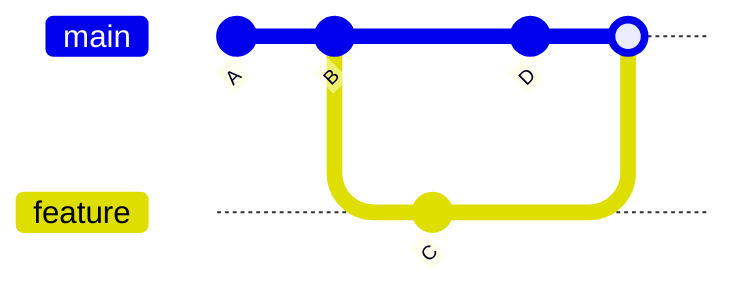
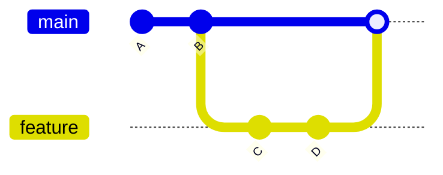
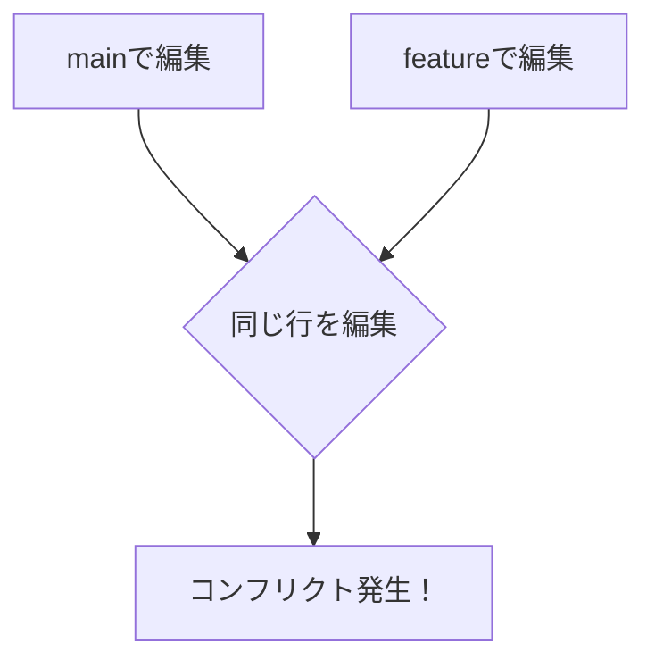
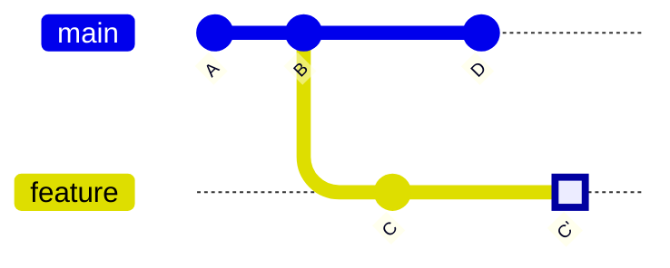

# マージとコンフリクト

## 📋 概要

| 項目 | 内容 |
|------|------|
| 所要時間 | 60分 |
| 難易度 | [中級] |
| 前提知識 | ブランチ戦略 |

## 🎯 なぜこれを学ぶのか

複数人で開発すると、同じファイルを編集することがあります。コンフリクト（競合）の解決方法を知っていれば、慌てずに対処できます。

## 📚 学習内容

### 1. マージとは



**マージ** = 2つのブランチの変更を統合すること

### 2. マージの種類

#### 2.1 Fast-forward マージ



mainに変更がない場合、ポインタを移動するだけ。

```bash
git checkout main
git merge feature/login
# Fast-forward
```

#### 2.2 3-way マージ


両方に変更がある場合、マージコミットを作成。

```bash
git checkout main
git merge feature/login
# Merge commit created
```

### 3. マージの実行

```bash
# featureブランチをmainにマージ
git checkout main
git pull origin main  # 最新を取得
git merge feature/login

# マージコミットのメッセージを編集
git merge feature/login --edit
```

### 4. コンフリクトとは



**同じファイルの同じ箇所を変更した場合**に発生。

### 5. コンフリクトの解決

#### 5.1 コンフリクトの発生

```bash
$ git merge feature/login
Auto-merging index.html
CONFLICT (content): Merge conflict in index.html
Automatic merge failed; fix conflicts and then commit the result.
```

#### 5.2 コンフリクトの内容

```html
<<<<<<< HEAD
<h1>Welcome to our site</h1>
=======
<h1>Welcome to the homepage</h1>
>>>>>>> feature/login
```

| マーカー | 意味 |
|---------|------|
| `<<<<<<< HEAD` | 現在のブランチの内容 |
| `=======` | 区切り |
| `>>>>>>> feature/login` | マージするブランチの内容 |

#### 5.3 解決方法

1. **ファイルを編集してマーカーを削除**

```html
<h1>Welcome to our homepage</h1>
```

2. **変更をステージ**

```bash
git add index.html
```

3. **コミット**

```bash
git commit -m "Merge feature/login, resolve conflict"
```

### 6. コンフリクト解決のツール

```bash
# マージツールを使用
git mergetool

# VS Codeでの解決（推奨）
# エディタが自動で開き、選択肢が表示される
# - Accept Current Change
# - Accept Incoming Change
# - Accept Both Changes
```

### 7. マージの中断

```bash
# マージを中断して元に戻す
git merge --abort
```

### 8. Rebase（参考）



**rebase** = ブランチの起点を付け替える

```bash
# featureブランチで
git rebase main

# コンフリクト解決後
git rebase --continue

# 中断
git rebase --abort
```

| | Merge | Rebase |
|-|-------|--------|
| 履歴 | マージコミットが残る | 直線的になる |
| 安全性 | 安全 | 公開済みコミットには使わない |
| 用途 | 一般的 | 履歴を整理したい場合 |

### 9. コンフリクト予防のベストプラクティス

```
✅ 予防策
- こまめにmainの変更を取り込む
- ブランチを小さく、短期間で
- 同じファイルを同時に編集しない
- チームで編集範囲を共有

❌ 避けるべきこと
- 長期間マージしない
- 大きな変更を一度にマージ
- コンフリクトを放置
```

```bash
# featureブランチで作業中、mainを取り込む
git checkout feature/login
git merge main  # または git rebase main
```

## ✅ まとめ

| 操作 | コマンド |
|------|---------|
| マージ | `git merge <branch>` |
| 中断 | `git merge --abort` |
| コンフリクト解決 | 編集 → add → commit |
| Rebase | `git rebase <branch>` |

## 💬 考えてみよう

```
Q: コンフリクトが発生したとき、最初にすべきことは何ですか？
Q: MergeとRebaseはどう使い分けますか？
Q: コンフリクトを予防するには何をすべきですか？
```

## 🔗 次のコンテンツ

[GitHubの使い方](01-git-basics-05.md)に進んでください。
