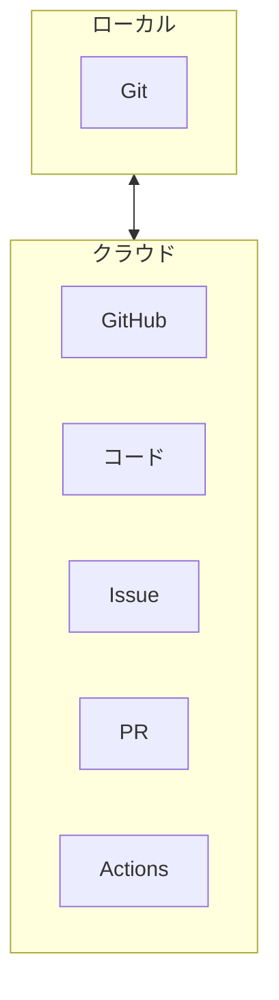
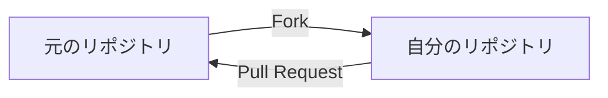

# GitHubの使い方

## 📋 概要

| 項目 | 内容 |
|------|------|
| 所要時間 | 60分 |
| 難易度 | [基礎] |
| 前提知識 | マージとコンフリクト |

## 🎯 なぜこれを学ぶのか

GitHubは世界中の開発者が使うプラットフォームです。Pull Requestを使ったコードレビューやIssueでの課題管理は、チーム開発の基盤です。

## 📚 学習内容

### 1. GitHubとは



**GitHub** = Gitリポジトリのホスティングサービス + 開発ツール

| 機能 | 説明 |
|------|------|
| Repository | コードを保存 |
| Pull Request | コードレビュー |
| Issues | タスク・バグ管理 |
| Actions | CI/CD |
| Slack | 議論・質問 |

### 2. リポジトリの操作

#### 2.1 リポジトリの作成

1. GitHubで「New repository」をクリック
2. 名前を入力
3. Public/Private を選択
4. 「Create repository」をクリック

#### 2.2 既存プロジェクトをプッシュ

```bash
# リモートを追加
git remote add origin https://github.com/username/repo.git

# 最初のプッシュ
git push -u origin main
```

### 3. Pull Request（PR）


#### 3.1 PRの作成

1. ブランチをプッシュ
2. GitHubで「Compare & pull request」をクリック
3. タイトルと説明を記入
4. レビュワーを指定
5. 「Create pull request」をクリック

#### 3.2 良いPRの書き方

```markdown
## 概要
ユーザーログイン機能を追加

## 変更内容
- ログインフォームの作成
- バリデーションの実装
- セッション管理の追加

## 確認方法
1. `npm run dev`で起動
2. `/login`にアクセス
3. テストアカウントでログイン

## スクリーンショット
（あれば）

## 関連Issue
Closes #123
```

#### 3.3 レビューの受け方・仕方

**レビューを受ける側**:
```
✅ 指摘は素直に受け止める
✅ 不明点は質問する
✅ 修正後は再レビューを依頼
```

**レビューする側**:
```
✅ コードの意図を理解する
✅ 具体的な改善案を示す
✅ 良い点も伝える
✅ 批判ではなく提案
```

### 4. Issues

#### 4.1 Issueの作成

```markdown
## 概要
ログインボタンをクリックしても反応しない

## 再現手順
1. /loginにアクセス
2. メールアドレスとパスワードを入力
3. ログインボタンをクリック
4. 何も起きない

## 期待する動作
ログインしてダッシュボードに遷移

## 環境
- OS: macOS 14.0
- Browser: Chrome 120
```

#### 4.2 IssueとPRの連携

PRの説明に以下を書くと、マージ時にIssueが自動クローズされます：

```markdown
Closes #123
Fixes #456
Resolves #789
```

### 5. GitHub Flow の実践

```bash
# 1. mainを最新に
git checkout main
git pull origin main

# 2. 新しいブランチを作成
git checkout -b feature/login

# 3. 開発してコミット
# ... コーディング ...
git add .
git commit -m "Add login feature"

# 4. プッシュ
git push -u origin feature/login

# 5. GitHubでPRを作成

# 6. レビューを受けて修正
git add .
git commit -m "Fix review comments"
git push

# 7. マージ後、ローカルを更新
git checkout main
git pull origin main

# 8. 不要なブランチを削除
git branch -d feature/login
```

### 6. その他の機能

#### 6.1 Fork

他の人のリポジトリをコピーして、自分のアカウントで作業。



#### 6.2 GitHub Actions（概要）

PRが作成されたとき、自動でテストを実行。

```yaml
# .github/workflows/test.yml
name: Test
on: [push, pull_request]
jobs:
  test:
    runs-on: ubuntu-latest
    steps:
      - uses: actions/checkout@v4
      - run: npm install
      - run: npm test
```

### 7. ベストプラクティス

```
✅ 良い習慣
- PRは小さく、レビューしやすく
- 意味のあるコミットメッセージ
- レビューコメントには丁寧に対応
- mainを常に動作する状態に

❌ 避けるべきこと
- 巨大なPR
- レビューなしでのマージ
- 直接mainにプッシュ
```

## ✅ まとめ

| 機能 | 用途 |
|------|------|
| Repository | コードの保存・共有 |
| Pull Request | コードレビュー |
| Issues | タスク・バグ管理 |
| Actions | 自動テスト・デプロイ |

## 💬 考えてみよう

```
Q: なぜPull Requestでレビューを受けるのですか？
Q: IssueとPRを連携させるメリットは何ですか？
Q: 良いPRの特徴は何ですか？
```

## 🔗 次のステップ

Git基礎カテゴリを修了しました！
[実践課題](./exercises/)に取り組んでから、[プログラミング基礎](../02-programming-fundamentals/)に進んでください。
