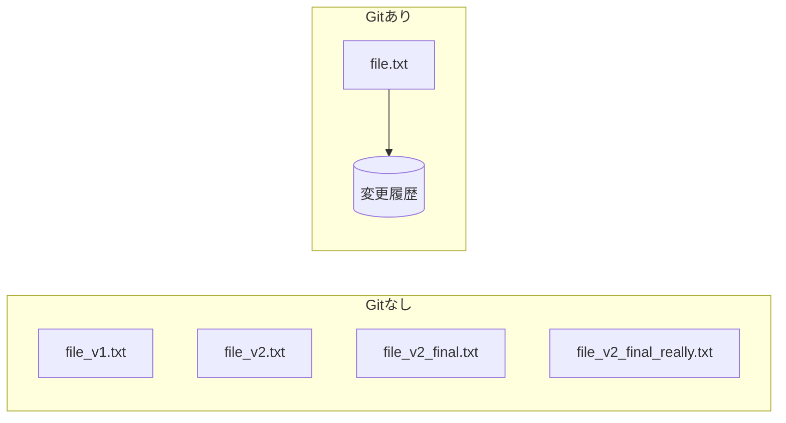
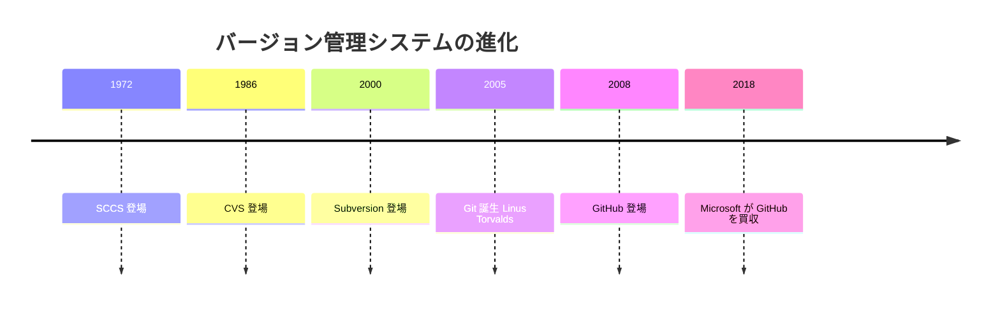
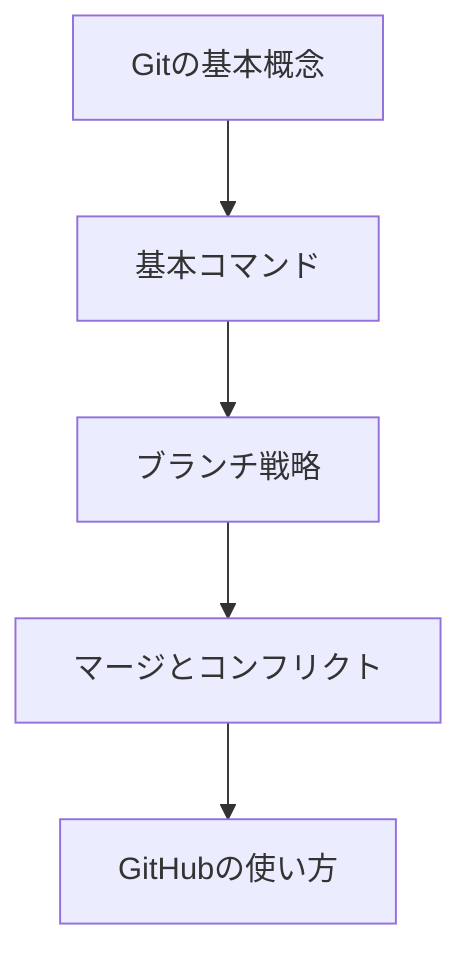

# 01. Git基礎

## 概要

**学習日数**: 1-2日

バージョン管理システムGitの基礎を学びます。Gitはソフトウェア開発において不可欠なツールであり、コードの変更履歴を管理し、チームでの協働開発を可能にします。

## なぜ学ぶ必要があるのか

### この技術が解決する問題

Gitがない場合：
- ファイルのコピーを大量に作成
- どれが最新かわからない
- 誰が何を変更したかわからない
- 過去の状態に戻せない

Gitがある場合：
- ファイルは1つで変更履歴を管理
- いつでも過去の状態に戻れる
- 誰が何を変更したか追跡可能
- 複数人での同時開発が可能

### 実務での重要性

- **すべての開発現場で使用**: 企業、オープンソース、個人開発問わず必須
- **採用条件**: 多くの企業でGit/GitHubの経験が求められる
- **協働開発の基盤**: チーム開発ではGitなしには成り立たない

### AI時代における重要性

- **AI生成コードの管理**: AIが生成したコードの変更履歴を管理
- **問題の特定**: AIが生成したコードに問題があった場合、履歴から原因を特定
- **レビュー**: プルリクエストでAI生成コードをレビュー

## 技術の歴史的背景

### 技術の誕生

- **2005年**: Linus Torvalds（Linuxの作者）がLinuxカーネル開発のためにGitを作成
- **背景**: 当時使用していたBitKeeperとの契約終了
- **設計思想**: 分散型、高速、シンプル

### 進化の過程

| 世代 | 代表的なツール | 特徴 |
|------|----------------|------|
| 第1世代 | SCCS, RCS | ローカルのみ、単一ファイル |
| 第2世代 | CVS, Subversion | 中央集約型、ネットワーク対応 |
| 第3世代 | Git, Mercurial | 分散型、高速、ブランチが軽量 |

### 業界への影響

- **オープンソースの爆発的成長**: GitHubの登場により、世界中の開発者が協力しやすくなった
- **開発フローの標準化**: Git Flow、GitHub Flowなどのフローが確立
- **CI/CDの普及**: Gitと連携した自動化が当たり前に

## 学習内容

### コンテンツ一覧

| No | コンテンツ | 難易度 | 内容 |
|----|------------|--------|------|
| 01 | [Gitの基本概念](01-git-basics-01.md) | [基礎] | リポジトリ、コミット、ブランチ |
| 02 | [基本コマンド](01-git-basics-02.md) | [基礎] | clone, add, commit, push, pull |
| 03 | [ブランチ戦略](01-git-basics-03.md) | [中級] | Git Flow、GitHub Flow |
| 04 | [マージとコンフリクト](01-git-basics-04.md) | [中級] | マージ、リベース、コンフリクト解決 |
| 05 | [GitHubの使い方](01-git-basics-05.md) | [基礎] | リポジトリ作成、プルリクエスト |

### 学習の流れ

## 学習目標

このカテゴリを修了すると、以下ができるようになります：

- [ ] Gitの基本概念（リポジトリ、コミット、ブランチ）を説明できる
- [ ] 基本的なGitコマンドを使える
- [ ] ブランチを作成し、マージできる
- [ ] コンフリクトを解決できる
- [ ] GitHubでプルリクエストを作成できる

## 実践課題

[exercises/common/01-git-basics/](../../../exercises/common/01-git-basics/)

## 理解度チェック

[tests/common/01-git-basics/](../../../tests/common/01-git-basics/)

## 参考リソース

- [Pro Git（日本語）](https://git-scm.com/book/ja/v2)
- [GitHub Docs](https://docs.github.com/ja)
- [Gitチートシート](https://training.github.com/downloads/ja/github-git-cheat-sheet/)
