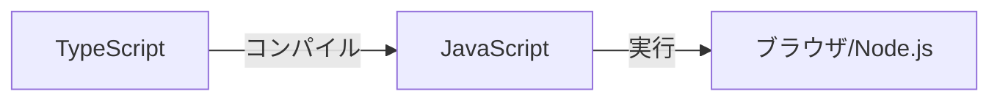

# 基本構文

## 📋 概要

| 項目 | 内容 |
|------|------|
| 所要時間 | 60分 |
| 難易度 | [基礎] |
| 前提知識 | なし |

## 🎯 なぜこれを学ぶのか

TypeScriptの基本構文は、すべてのプログラムの土台です。変数、データ型、制御構造を理解することで、あらゆるプログラムを書く基礎が身につきます。

## 📚 学習内容

### 1. TypeScriptとは



**TypeScript** = JavaScript + 型システム

```typescript
// JavaScript
function add(a, b) {
  return a + b;
}
add("1", 2); // "12" - バグ！

// TypeScript
function add(a: number, b: number): number {
  return a + b;
}
add("1", 2); // エラー！コンパイル時に検出
```

### 2. 変数の宣言

#### 2.1 let と const

```typescript
// let: 再代入可能
let count = 0;
count = 1; // OK

// const: 再代入不可（推奨）
const name = "Alice";
name = "Bob"; // エラー！

// var は使わない（レガシー）
var old = "避ける";
```

**ルール**: 基本は`const`、再代入が必要なときだけ`let`

#### 2.2 型注釈

```typescript
// 型を明示
let age: number = 25;
let name: string = "Alice";
let isActive: boolean = true;

// 型推論（TypeScriptが推測）
let score = 100; // number と推論される
```

### 3. 基本的なデータ型

#### 3.1 プリミティブ型

```typescript
// 数値
let integer: number = 42;
let decimal: number = 3.14;

// 文字列
let greeting: string = "Hello";
let template: string = `Hello, ${name}`; // テンプレートリテラル

// 真偽値
let isValid: boolean = true;

// null と undefined
let empty: null = null;
let notDefined: undefined = undefined;
```

#### 3.2 配列

```typescript
// 配列の型
let numbers: number[] = [1, 2, 3];
let names: string[] = ["Alice", "Bob"];

// 別の書き方
let values: Array<number> = [1, 2, 3];
```

#### 3.3 オブジェクト

```typescript
// オブジェクトの型
let user: { name: string; age: number } = {
  name: "Alice",
  age: 25
};

// インターフェースを使う（推奨）
interface User {
  name: string;
  age: number;
}

let user2: User = {
  name: "Bob",
  age: 30
};
```

### 4. 演算子

#### 4.1 算術演算子

```typescript
let a = 10;
let b = 3;

console.log(a + b);  // 13（加算）
console.log(a - b);  // 7（減算）
console.log(a * b);  // 30（乗算）
console.log(a / b);  // 3.333...（除算）
console.log(a % b);  // 1（剰余）
console.log(a ** b); // 1000（べき乗）
```

#### 4.2 比較演算子

```typescript
// 厳密等価（型も比較）
console.log(1 === 1);    // true
console.log(1 === "1");  // false

// 等価（型変換あり、避ける）
console.log(1 == "1");   // true

// 比較
console.log(5 > 3);   // true
console.log(5 >= 5);  // true
console.log(3 < 5);   // true
console.log(3 <= 3);  // true
```

#### 4.3 論理演算子

```typescript
let x = true;
let y = false;

console.log(x && y); // false（AND）
console.log(x || y); // true（OR）
console.log(!x);     // false（NOT）
```

### 5. 制御構造

#### 5.1 if文

```typescript
const score = 85;

if (score >= 90) {
  console.log("優");
} else if (score >= 70) {
  console.log("良");
} else if (score >= 50) {
  console.log("可");
} else {
  console.log("不可");
}
```

#### 5.2 switch文

```typescript
const color = "red";

switch (color) {
  case "red":
    console.log("赤");
    break;
  case "blue":
    console.log("青");
    break;
  default:
    console.log("その他");
}
```

#### 5.3 for文

```typescript
// 通常のfor
for (let i = 0; i < 5; i++) {
  console.log(i); // 0, 1, 2, 3, 4
}

// for...of（配列の要素）
const fruits = ["apple", "banana", "cherry"];
for (const fruit of fruits) {
  console.log(fruit);
}

// for...in（オブジェクトのキー）
const user = { name: "Alice", age: 25 };
for (const key in user) {
  console.log(key); // name, age
}
```

#### 5.4 while文

```typescript
let count = 0;
while (count < 3) {
  console.log(count);
  count++;
}
// 0, 1, 2
```

### 6. 配列の操作

```typescript
const numbers = [1, 2, 3, 4, 5];

// map: 変換
const doubled = numbers.map(n => n * 2);
// [2, 4, 6, 8, 10]

// filter: 絞り込み
const evens = numbers.filter(n => n % 2 === 0);
// [2, 4]

// find: 最初の要素を探す
const found = numbers.find(n => n > 3);
// 4

// reduce: 集計
const sum = numbers.reduce((acc, n) => acc + n, 0);
// 15

// forEach: 繰り返し（戻り値なし）
numbers.forEach(n => console.log(n));
```

### 7. 環境構築（参考）

```bash
# Node.jsをインストール後
npm init -y
npm install typescript ts-node @types/node -D

# tsconfig.json を作成
npx tsc --init

# 実行
npx ts-node index.ts
```

## ✅ まとめ

| 概念 | ポイント |
|------|---------|
| 変数 | `const`を基本、`let`は必要時のみ |
| 型 | `number`, `string`, `boolean`, 配列, オブジェクト |
| 制御構造 | if, switch, for, while |
| 配列操作 | map, filter, find, reduce |

## 💬 考えてみよう

```
Q: const と let はどう使い分けますか？
Q: === と == の違いは何ですか？
Q: map と forEach の違いは何ですか？
```

## 🔗 次のコンテンツ

[関数とモジュール](02-programming-fundamentals-02.md)に進んでください。
