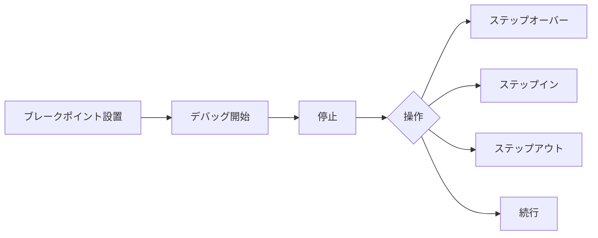

# デバッグ

## 📋 概要

| 項目 | 内容 |
|------|------|
| 所要時間 | 45分 |
| 難易度 | [基礎] |
| 前提知識 | エラーハンドリング |

## 🎯 なぜこれを学ぶのか

バグは必ず発生します。効率的なデバッグスキルは、問題解決時間を大幅に短縮し、生産性を向上させます。

## 📚 学習内容

### 1. console の活用

```typescript
// 基本的なログ
console.log("Hello");

// 変数の確認
const user = { name: "Alice", age: 25 };
console.log("user:", user);

// オブジェクトを見やすく
console.log(JSON.stringify(user, null, 2));

// テーブル表示
const users = [
  { name: "Alice", age: 25 },
  { name: "Bob", age: 30 }
];
console.table(users);

// グループ化
console.group("User Info");
console.log("Name:", user.name);
console.log("Age:", user.age);
console.groupEnd();

// 警告とエラー
console.warn("This is a warning");
console.error("This is an error");

// 実行時間の計測
console.time("operation");
// ... 処理 ...
console.timeEnd("operation"); // operation: 123.45ms
```

### 2. VS Code デバッガー

#### 2.1 launch.json の設定

```json
{
  "version": "0.2.0",
  "configurations": [
    {
      "name": "Debug TypeScript",
      "type": "node",
      "request": "launch",
      "runtimeExecutable": "npx",
      "runtimeArgs": ["ts-node"],
      "args": ["${file}"],
      "cwd": "${workspaceFolder}",
      "internalConsoleOptions": "openOnSessionStart"
    }
  ]
}
```

#### 2.2 デバッガーの使い方



| 操作 | ショートカット | 説明 |
|------|--------------|------|
| ステップオーバー | F10 | 次の行へ |
| ステップイン | F11 | 関数の中へ |
| ステップアウト | Shift+F11 | 関数から出る |
| 続行 | F5 | 次のブレークポイントまで |

### 3. ブラウザ開発者ツール

```typescript
// ブレークポイントをコードに埋め込む
function calculateTotal(items: Item[]): number {
  debugger;  // ここで停止
  return items.reduce((sum, item) => sum + item.price, 0);
}
```

#### よく使うパネル

| パネル | 用途 |
|-------|------|
| Console | ログの確認、式の評価 |
| Sources | コードの確認、ブレークポイント |
| Network | API通信の確認 |
| Elements | DOMの確認 |
| Application | ストレージの確認 |

### 4. デバッグのテクニック

#### 4.1 二分探索法

```typescript
// 問題のある箇所を特定
function complexFunction(): void {
  step1();
  console.log("step1 done");  // ← まずここまで動くか確認
  
  step2();
  console.log("step2 done");  // ← 次にここ
  
  step3();
  console.log("step3 done");  // ← 問題がここなら、step3を詳しく調査
}
```

#### 4.2 ラバーダック・デバッグ

コードを声に出して説明することで問題を発見する手法。

```typescript
// 「この関数は...」と説明してみる
function isValid(user: User): boolean {
  // "ユーザーがnullでなく..."
  // "名前が空でなく..."
  // "メールにアットマークが含まれ..."
  return user !== null &&
         user.name !== "" &&
         user.email.includes("@");
  // ↑ userがnullの場合、user.nameでエラー！
}
```

#### 4.3 最小再現ケースの作成

```typescript
// 複雑なコードから問題を切り出す
// 元のコード（複雑）
async function processOrder(orderId: string): Promise<void> {
  const order = await getOrder(orderId);
  const user = await getUser(order.userId);
  const discount = calculateDiscount(user, order);
  // ... 大量の処理
}

// 最小再現ケース（問題の特定に必要な部分だけ）
const testDiscount = calculateDiscount(
  { id: 1, memberSince: new Date() },
  { total: 100 }
);
console.log(testDiscount);
```

### 5. よくあるバグと対処法

#### 5.1 undefined / null エラー

```typescript
// エラー: Cannot read property 'name' of undefined
const user = getUser(id);
console.log(user.name);

// 対処: nullチェック
const user = getUser(id);
if (user) {
  console.log(user.name);
}
// または
console.log(user?.name);
```

#### 5.2 非同期の問題

```typescript
// エラー: データがない
let data: Data[];
fetchData().then(result => { data = result; });
console.log(data);  // undefined!

// 対処: awaitを使う
const data = await fetchData();
console.log(data);
```

#### 5.3 参照の問題

```typescript
// エラー: 元の配列が変わってしまう
const original = [1, 2, 3];
const copy = original;
copy.push(4);
console.log(original);  // [1, 2, 3, 4] - 変わってしまった！

// 対処: コピーを作る
const copy = [...original];
// または
const copy = original.slice();
```

### 6. ログのベストプラクティス

```typescript
// 開発用のログユーティリティ
const isDev = process.env.NODE_ENV === "development";

function debug(message: string, data?: unknown): void {
  if (isDev) {
    console.log(`[DEBUG] ${message}`, data ?? "");
  }
}

function trace(functionName: string): void {
  if (isDev) {
    console.log(`[TRACE] Entering ${functionName}`);
  }
}

// 使用
function processUser(user: User): void {
  trace("processUser");
  debug("Processing user", user);
  // ...
}
```

## ✅ まとめ

| テクニック | 用途 |
|-----------|------|
| console.log | 変数の確認 |
| デバッガー | ステップ実行、変数の監視 |
| 二分探索 | 問題箇所の特定 |
| 最小再現 | 問題の切り出し |

## 💬 考えてみよう

```
Q: console.log と デバッガーはどう使い分けますか？
Q: 「undefined is not an object」エラーの原因は何ですか？
Q: 効率的にバグを見つけるコツは何ですか？
```

## 🔗 次のステップ

プログラミング基礎カテゴリを修了しました！
[実践課題](./exercises/)に取り組んでから、[ソフトウェア設計](../03-software-design/)に進んでください。
