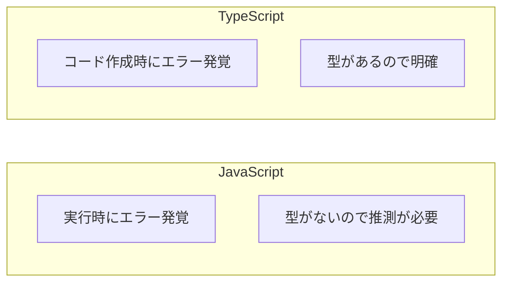
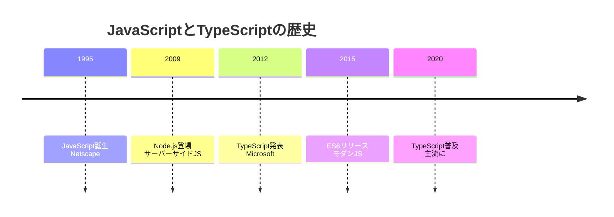
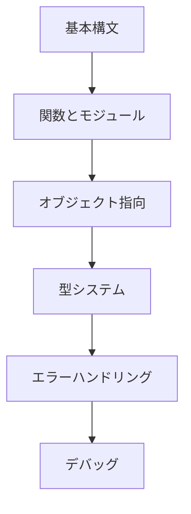

# 02. プログラミング基礎（TypeScript）

## 概要

**学習日数**: 3-4日

プログラミングの基礎をTypeScriptで学びます。TypeScriptはJavaScriptに型システムを追加した言語で、大規模開発やチーム開発に適しています。

## なぜ学ぶ必要があるのか

### この技術が解決する問題



**JavaScriptの問題**：
```javascript
// 実行するまでエラーがわからない
function add(a, b) {
  return a + b;
}
add("1", 2); // "12" - 意図しない結果
```

**TypeScriptの解決策**：
```typescript
// コード作成時にエラーがわかる
function add(a: number, b: number): number {
  return a + b;
}
add("1", 2); // エラー！数値が必要
```

### 実務での重要性

- **大規模プロジェクトの標準**: 多くの企業でTypeScriptが採用されている
- **コードの品質向上**: 型があることでバグが減少
- **開発効率の向上**: IDEの補完機能が強力になる

### AI時代における重要性

- **AI生成コードの検証**: 型エラーでAIの間違いを早期発見
- **正確な指示**: 型情報があるとAIへの指示が明確になる
- **レビューの効率化**: 型があることでレビューがしやすい

## 技術の歴史的背景

### 技術の誕生



- **1995年**: Netscape社のBrendan Eichが10日でJavaScriptを作成
- **2012年**: MicrosoftがTypeScriptを発表
- **背景**: JavaScriptの大規模開発での限界を解決

### 進化の過程

| 年 | バージョン | 主な変更 |
|----|-----------|---------|
| 2012 | TypeScript 0.8 | 初期リリース |
| 2014 | TypeScript 1.0 | 安定版リリース |
| 2016 | TypeScript 2.0 | null安全性の強化 |
| 2020 | TypeScript 4.0 | 可変長タプル型 |
| 2023 | TypeScript 5.0 | デコレータの標準化 |

## 学習内容

### コンテンツ一覧

| No | コンテンツ | 難易度 | 内容 |
|----|------------|--------|------|
| 01 | [基本構文](02-programming-fundamentals-01.md) | [基礎] | 変数、データ型、制御構造 |
| 02 | [関数とモジュール](02-programming-fundamentals-02.md) | [基礎] | 関数定義、モジュールシステム |
| 03 | [オブジェクト指向](02-programming-fundamentals-03.md) | [中級] | クラス、継承、インターフェース |
| 04 | [型システム](02-programming-fundamentals-04.md) | [中級] | 型推論、ジェネリクス、型ガード |
| 05 | [エラーハンドリング](02-programming-fundamentals-05.md) | [基礎] | try-catch、Error、カスタムエラー |
| 06 | [デバッグ](02-programming-fundamentals-06.md) | [基礎] | デバッガー、ログ、開発者ツール |

### 学習の流れ



## 学習目標

このカテゴリを修了すると、以下ができるようになります：

- [ ] TypeScriptの基本構文を使ってプログラムを書ける
- [ ] 関数を定義し、モジュールを分割できる
- [ ] クラスを使ったオブジェクト指向プログラミングができる
- [ ] 型システムを理解し、適切な型を定義できる
- [ ] エラーハンドリングができる
- [ ] デバッグツールを使って問題を解決できる

## 実践課題

[exercises/common/02-programming-fundamentals/](../../../exercises/common/02-programming-fundamentals/)

## 理解度チェック

[tests/common/02-programming-fundamentals/](../../../tests/common/02-programming-fundamentals/)

## 参考リソース

- [TypeScript公式ドキュメント](https://www.typescriptlang.org/docs/)
- [TypeScript Deep Dive（日本語）](https://typescript-jp.gitbook.io/deep-dive/)
- [サバイバルTypeScript](https://typescriptbook.jp/)
