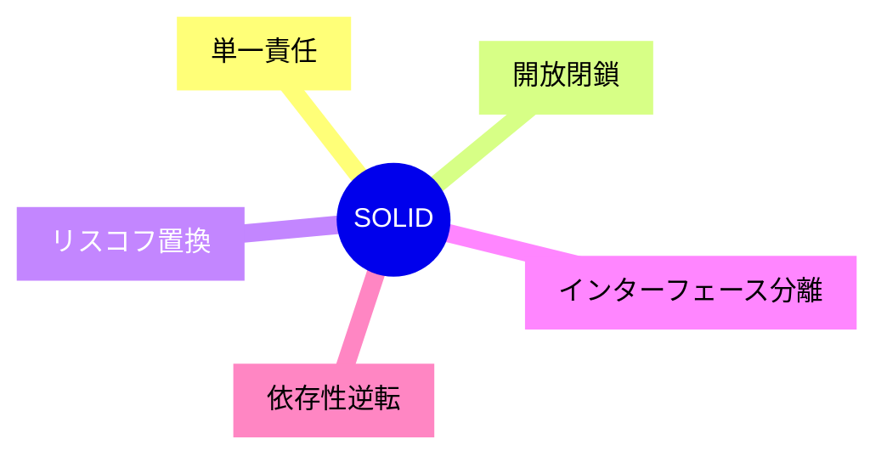
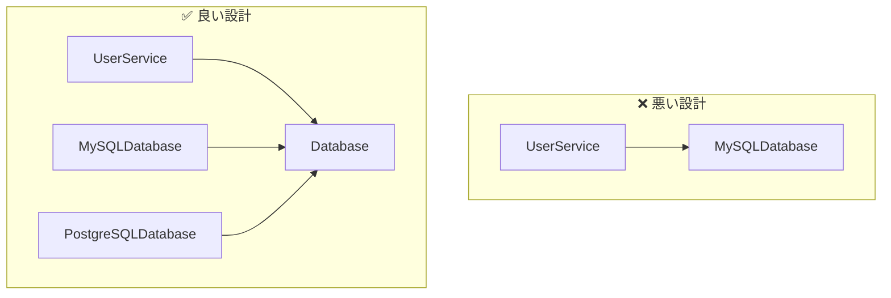

# SOLID原則

## 📋 概要

| 項目 | 内容 |
|------|------|
| 所要時間 | 60分 |
| 難易度 | [中級] |
| 前提知識 | オブジェクト指向 |

## 🎯 なぜこれを学ぶのか

SOLID原則は、保守性・拡張性の高いコードを書くための指針です。これを理解することで、長期間メンテナンスしやすいソフトウェアを作れます。

## 📚 学習内容

### SOLID原則とは



| 原則 | 英語 | 意味 |
|------|------|------|
| S | Single Responsibility | 1つのクラスは1つの責任 |
| O | Open/Closed | 拡張に開き、修正に閉じる |
| L | Liskov Substitution | 派生クラスは基底クラスと置換可能 |
| I | Interface Segregation | インターフェースを小さく分ける |
| D | Dependency Inversion | 具体でなく抽象に依存 |

### 1. 単一責任の原則（SRP）

**「クラスを変更する理由は1つだけであるべき」**

```typescript
// ❌ 悪い例: 複数の責任を持つ
class User {
  name: string;
  email: string;

  save(): void {
    // データベースに保存（データアクセスの責任）
  }

  sendEmail(): void {
    // メールを送信（通知の責任）
  }

  generateReport(): string {
    // レポート生成（表示の責任）
  }
}

// ✅ 良い例: 責任を分離
class User {
  constructor(
    public name: string,
    public email: string
  ) {}
}

class UserRepository {
  save(user: User): void {
    // データベースに保存
  }
}

class EmailService {
  send(to: string, message: string): void {
    // メールを送信
  }
}

class UserReportGenerator {
  generate(user: User): string {
    // レポート生成
  }
}
```

### 2. 開放閉鎖の原則（OCP）

**「拡張に対して開き、修正に対して閉じる」**

```typescript
// ❌ 悪い例: 新しい割引を追加するたびに修正が必要
class PriceCalculator {
  calculate(price: number, discountType: string): number {
    if (discountType === "percentage") {
      return price * 0.9;
    } else if (discountType === "fixed") {
      return price - 100;
    } else if (discountType === "member") {
      return price * 0.85;
    }
    // 新しい割引タイプを追加するたびにここを修正...
    return price;
  }
}

// ✅ 良い例: 拡張可能な設計
interface DiscountStrategy {
  apply(price: number): number;
}

class PercentageDiscount implements DiscountStrategy {
  constructor(private rate: number) {}
  apply(price: number): number {
    return price * (1 - this.rate);
  }
}

class FixedDiscount implements DiscountStrategy {
  constructor(private amount: number) {}
  apply(price: number): number {
    return price - this.amount;
  }
}

class PriceCalculator {
  calculate(price: number, discount: DiscountStrategy): number {
    return discount.apply(price);
  }
}

// 新しい割引を追加しても既存コードを修正しない
class MemberDiscount implements DiscountStrategy {
  apply(price: number): number {
    return price * 0.85;
  }
}
```

### 3. リスコフの置換原則（LSP）

**「派生クラスは基底クラスと置換可能であるべき」**

```typescript
// ❌ 悪い例: 派生クラスが基底クラスの契約を破る
class Bird {
  fly(): void {
    console.log("Flying");
  }
}

class Penguin extends Bird {
  fly(): void {
    throw new Error("Penguins can't fly!"); // 契約違反！
  }
}

function makeBirdFly(bird: Bird): void {
  bird.fly(); // Penguinでエラー！
}

// ✅ 良い例: インターフェースで能力を分離
interface Bird {
  eat(): void;
}

interface FlyingBird extends Bird {
  fly(): void;
}

interface SwimmingBird extends Bird {
  swim(): void;
}

class Sparrow implements FlyingBird {
  eat(): void { console.log("Eating seeds"); }
  fly(): void { console.log("Flying"); }
}

class Penguin implements SwimmingBird {
  eat(): void { console.log("Eating fish"); }
  swim(): void { console.log("Swimming"); }
}
```

### 4. インターフェース分離の原則（ISP）

**「クライアントは使わないメソッドに依存すべきでない」**

```typescript
// ❌ 悪い例: 巨大なインターフェース
interface Worker {
  work(): void;
  eat(): void;
  sleep(): void;
  attendMeeting(): void;
  writeReport(): void;
}

// ロボットは食事や睡眠が不要
class Robot implements Worker {
  work(): void { /* OK */ }
  eat(): void { throw new Error("Robots don't eat"); }
  sleep(): void { throw new Error("Robots don't sleep"); }
  attendMeeting(): void { /* OK */ }
  writeReport(): void { /* OK */ }
}

// ✅ 良い例: 小さなインターフェースに分割
interface Workable {
  work(): void;
}

interface Eatable {
  eat(): void;
}

interface Sleepable {
  sleep(): void;
}

class Human implements Workable, Eatable, Sleepable {
  work(): void { /* ... */ }
  eat(): void { /* ... */ }
  sleep(): void { /* ... */ }
}

class Robot implements Workable {
  work(): void { /* ... */ }
}
```

### 5. 依存性逆転の原則（DIP）

**「上位モジュールは下位モジュールに依存すべきでない。両方とも抽象に依存すべき」**

```typescript
// ❌ 悪い例: 具体的な実装に依存
class MySQLDatabase {
  save(data: string): void { /* ... */ }
}

class UserService {
  private db = new MySQLDatabase(); // 具体に依存

  createUser(name: string): void {
    this.db.save(name);
  }
}

// ✅ 良い例: 抽象に依存
interface Database {
  save(data: string): void;
}

class MySQLDatabase implements Database {
  save(data: string): void { /* ... */ }
}

class PostgreSQLDatabase implements Database {
  save(data: string): void { /* ... */ }
}

class UserService {
  constructor(private db: Database) {} // 抽象に依存

  createUser(name: string): void {
    this.db.save(name);
  }
}

// 使用時に注入（Dependency Injection）
const db = new MySQLDatabase();
const userService = new UserService(db);
```



## ✅ まとめ

| 原則 | 覚え方 |
|------|--------|
| SRP | 1クラス1責任 |
| OCP | 拡張はOK、修正はNG |
| LSP | 子は親の代わりになれる |
| ISP | 太いインターフェースを避ける |
| DIP | 具体でなく抽象に依存 |

## 💬 考えてみよう

```
Q: 単一責任の原則を守るとファイル数が増えますが、それは良いことですか？
Q: 開放閉鎖の原則を守るにはどんなパターンが有効ですか？
Q: 依存性注入（DI）のメリットは何ですか？
```

## 🔗 次のコンテンツ

[設計パターン](03-software-design-02.md)に進んでください。
