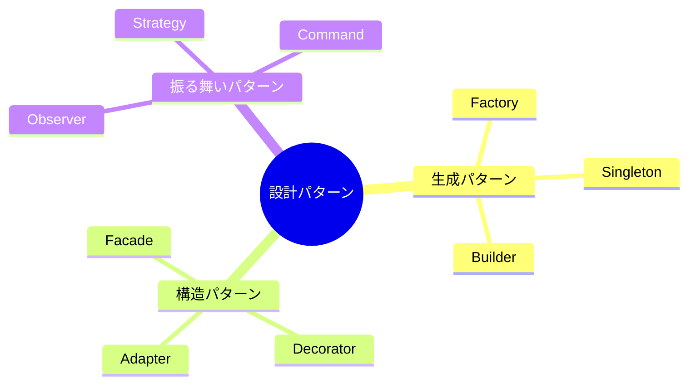

# 設計パターン

## 📋 概要

| 項目 | 内容 |
|------|------|
| 所要時間 | 60分 |
| 難易度 | [中級] |
| 前提知識 | SOLID原則 |

## 🎯 なぜこれを学ぶのか

設計パターンは、よくある問題に対する定番の解決策です。パターンを知ることで、設計の品質が向上し、チームでの会話もスムーズになります。

## 📚 学習内容

### 設計パターンの分類



### 1. Factory パターン

**オブジェクトの生成を専用クラスに委ねる**

```typescript
// 問題: 生成ロジックがあちこちに散らばる
// const user = new PremiumUser(...) or new FreeUser(...) ???

// Factory パターンで解決
interface User {
  name: string;
  getDiscount(): number;
}

class PremiumUser implements User {
  constructor(public name: string) {}
  getDiscount(): number { return 0.2; }
}

class FreeUser implements User {
  constructor(public name: string) {}
  getDiscount(): number { return 0; }
}

// Factory
class UserFactory {
  static create(name: string, isPremium: boolean): User {
    if (isPremium) {
      return new PremiumUser(name);
    }
    return new FreeUser(name);
  }
}

// 使用
const user = UserFactory.create("Alice", true);
console.log(user.getDiscount()); // 0.2
```

### 2. Singleton パターン

**インスタンスが1つだけ存在することを保証**

```typescript
class Logger {
  private static instance: Logger;
  private logs: string[] = [];

  // コンストラクタをprivateに
  private constructor() {}

  static getInstance(): Logger {
    if (!Logger.instance) {
      Logger.instance = new Logger();
    }
    return Logger.instance;
  }

  log(message: string): void {
    this.logs.push(`${new Date().toISOString()}: ${message}`);
    console.log(message);
  }

  getLogs(): string[] {
    return [...this.logs];
  }
}

// 使用
const logger1 = Logger.getInstance();
const logger2 = Logger.getInstance();
console.log(logger1 === logger2); // true（同じインスタンス）
```

> ⚠️ 注意: Singletonはテストが難しくなるため、乱用は避けましょう。

### 3. Strategy パターン

**アルゴリズムを交換可能にする**

```typescript
// 支払い方法を戦略として定義
interface PaymentStrategy {
  pay(amount: number): void;
}

class CreditCardPayment implements PaymentStrategy {
  constructor(private cardNumber: string) {}
  
  pay(amount: number): void {
    console.log(`Credit card ${this.cardNumber}: ${amount}円`);
  }
}

class PayPayPayment implements PaymentStrategy {
  constructor(private phoneNumber: string) {}
  
  pay(amount: number): void {
    console.log(`PayPay ${this.phoneNumber}: ${amount}円`);
  }
}

class CashPayment implements PaymentStrategy {
  pay(amount: number): void {
    console.log(`現金: ${amount}円`);
  }
}

// コンテキスト
class ShoppingCart {
  private items: { name: string; price: number }[] = [];

  addItem(name: string, price: number): void {
    this.items.push({ name, price });
  }

  checkout(payment: PaymentStrategy): void {
    const total = this.items.reduce((sum, item) => sum + item.price, 0);
    payment.pay(total);
  }
}

// 使用
const cart = new ShoppingCart();
cart.addItem("本", 1500);
cart.addItem("ペン", 200);

cart.checkout(new CreditCardPayment("1234-5678"));
cart.checkout(new PayPayPayment("090-1234-5678"));
```

### 4. Observer パターン

**状態変化を通知する**

```typescript
// 購読者インターフェース
interface Observer {
  update(data: any): void;
}

// 発行者
class EventEmitter {
  private observers: Observer[] = [];

  subscribe(observer: Observer): void {
    this.observers.push(observer);
  }

  unsubscribe(observer: Observer): void {
    this.observers = this.observers.filter(o => o !== observer);
  }

  notify(data: any): void {
    this.observers.forEach(observer => observer.update(data));
  }
}

// 具体的な購読者
class EmailNotifier implements Observer {
  update(data: any): void {
    console.log(`Email通知: ${JSON.stringify(data)}`);
  }
}

class SlackNotifier implements Observer {
  update(data: any): void {
    console.log(`Slack通知: ${JSON.stringify(data)}`);
  }
}

// 使用
const orderEvents = new EventEmitter();
orderEvents.subscribe(new EmailNotifier());
orderEvents.subscribe(new SlackNotifier());

// 注文が入ったら通知
orderEvents.notify({ orderId: 123, amount: 5000 });
```

### 5. Decorator パターン

**既存オブジェクトに機能を追加**

```typescript
interface Coffee {
  cost(): number;
  description(): string;
}

class SimpleCoffee implements Coffee {
  cost(): number { return 300; }
  description(): string { return "コーヒー"; }
}

// デコレーター基底クラス
abstract class CoffeeDecorator implements Coffee {
  constructor(protected coffee: Coffee) {}
  
  cost(): number { return this.coffee.cost(); }
  description(): string { return this.coffee.description(); }
}

// 具体的なデコレーター
class MilkDecorator extends CoffeeDecorator {
  cost(): number { return this.coffee.cost() + 50; }
  description(): string { return this.coffee.description() + " + ミルク"; }
}

class SugarDecorator extends CoffeeDecorator {
  cost(): number { return this.coffee.cost() + 20; }
  description(): string { return this.coffee.description() + " + 砂糖"; }
}

// 使用
let coffee: Coffee = new SimpleCoffee();
coffee = new MilkDecorator(coffee);
coffee = new SugarDecorator(coffee);

console.log(coffee.description()); // コーヒー + ミルク + 砂糖
console.log(coffee.cost());        // 370
```

### 6. Adapter パターン

**互換性のないインターフェースを接続**

```typescript
// 既存のシステム（変更不可）
class OldPaymentSystem {
  processPayment(amount: number): void {
    console.log(`旧システム: ${amount}円処理`);
  }
}

// 新しいインターフェース
interface NewPaymentGateway {
  pay(amount: number, currency: string): Promise<boolean>;
}

// Adapter
class PaymentAdapter implements NewPaymentGateway {
  constructor(private oldSystem: OldPaymentSystem) {}

  async pay(amount: number, currency: string): Promise<boolean> {
    // 通貨変換などの処理
    const jpyAmount = currency === "USD" ? amount * 150 : amount;
    this.oldSystem.processPayment(jpyAmount);
    return true;
  }
}

// 使用
const adapter = new PaymentAdapter(new OldPaymentSystem());
await adapter.pay(100, "USD"); // 旧システム: 15000円処理
```

### パターンの使い分け

| パターン | 使いどころ |
|---------|-----------|
| Factory | オブジェクト生成を一元化したい |
| Singleton | インスタンスを1つに制限したい |
| Strategy | アルゴリズムを切り替えたい |
| Observer | イベント駆動で処理したい |
| Decorator | 既存オブジェクトに機能追加したい |
| Adapter | 既存システムと接続したい |

## ✅ まとめ

| 分類 | パターン | 目的 |
|------|---------|------|
| 生成 | Factory | 生成を隠蔽 |
| 生成 | Singleton | 唯一のインスタンス |
| 振る舞い | Strategy | アルゴリズム交換 |
| 振る舞い | Observer | 状態変化通知 |
| 構造 | Decorator | 機能追加 |
| 構造 | Adapter | 互換性確保 |

## 💬 考えてみよう

```
Q: どんな場合にFactoryパターンを使いますか？
Q: Singletonパターンの欠点は何ですか？
Q: Strategyパターンを使う実例を考えてください。
```

## 🔗 次のコンテンツ

[アーキテクチャパターン](03-software-design-03.md)に進んでください。
