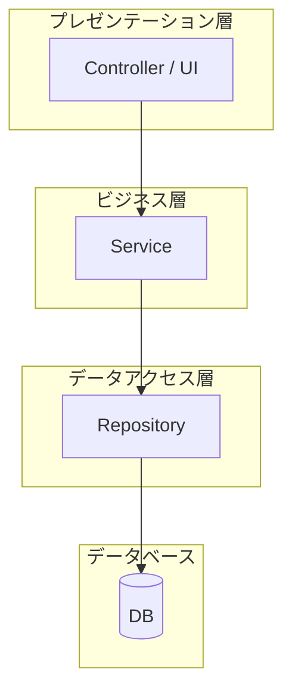
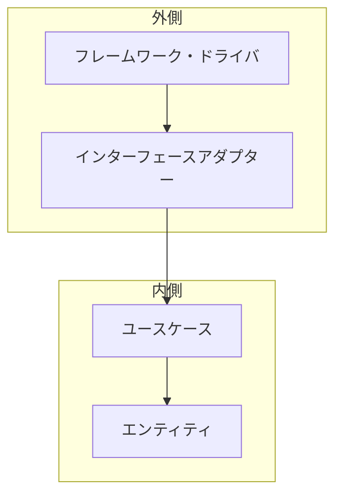
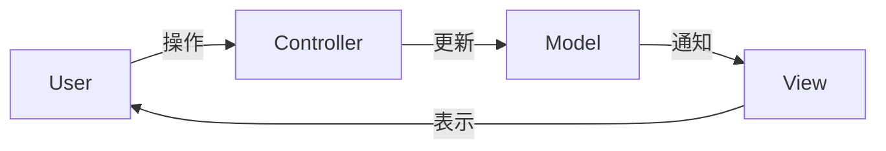

# アーキテクチャパターン

## 📋 概要

| 項目 | 内容 |
|------|------|
| 所要時間 | 45分 |
| 難易度 | [中級] |
| 前提知識 | 設計パターン |

## 🎯 なぜこれを学ぶのか

アーキテクチャパターンは、アプリケーション全体の構造を決める設計です。適切なアーキテクチャを選ぶことで、保守性とスケーラビリティが向上します。

## 📚 学習内容

### 1. レイヤードアーキテクチャ



**各層の責任**:

| 層 | 責任 |
|----|------|
| プレゼンテーション | UIとユーザー入力の処理 |
| ビジネス | ビジネスロジック |
| データアクセス | データの永続化 |

```typescript
// データアクセス層
class UserRepository {
  async findById(id: string): Promise<User | null> {
    // DBアクセス
  }

  async save(user: User): Promise<void> {
    // DBに保存
  }
}

// ビジネス層
class UserService {
  constructor(private userRepository: UserRepository) {}

  async createUser(name: string, email: string): Promise<User> {
    // ビジネスロジック（バリデーションなど）
    if (!email.includes("@")) {
      throw new Error("Invalid email");
    }
    const user = new User(name, email);
    await this.userRepository.save(user);
    return user;
  }
}

// プレゼンテーション層
class UserController {
  constructor(private userService: UserService) {}

  async handleCreateUser(req: Request, res: Response): Promise<void> {
    try {
      const user = await this.userService.createUser(
        req.body.name,
        req.body.email
      );
      res.json(user);
    } catch (error) {
      res.status(400).json({ error: error.message });
    }
  }
}
```

### 2. クリーンアーキテクチャ



**重要な原則**: 依存の方向は外側から内側へ

| 層 | 内容 | 例 |
|----|------|-----|
| エンティティ | ビジネスルール | User, Order |
| ユースケース | アプリケーション固有のビジネスルール | CreateOrder |
| アダプター | データ変換 | Controller, Repository |
| フレームワーク | 外部システム | Express, PostgreSQL |

```typescript
// エンティティ（ビジネスルール）
class User {
  constructor(
    public readonly id: string,
    public name: string,
    public email: string
  ) {
    if (!email.includes("@")) {
      throw new Error("Invalid email");
    }
  }
}

// ユースケース
interface UserRepository {
  save(user: User): Promise<void>;
  findById(id: string): Promise<User | null>;
}

class CreateUserUseCase {
  constructor(private userRepository: UserRepository) {}

  async execute(name: string, email: string): Promise<User> {
    const user = new User(generateId(), name, email);
    await this.userRepository.save(user);
    return user;
  }
}

// アダプター（インターフェースの実装）
class PostgreSQLUserRepository implements UserRepository {
  async save(user: User): Promise<void> {
    // PostgreSQLに保存
  }

  async findById(id: string): Promise<User | null> {
    // PostgreSQLから取得
  }
}

// コントローラー
class UserController {
  constructor(private createUserUseCase: CreateUserUseCase) {}

  async create(req: Request, res: Response): Promise<void> {
    const user = await this.createUserUseCase.execute(
      req.body.name,
      req.body.email
    );
    res.json({ id: user.id, name: user.name });
  }
}
```

### 3. MVC（Model-View-Controller）



| コンポーネント | 責任 |
|--------------|------|
| Model | データとビジネスロジック |
| View | 表示 |
| Controller | ユーザー入力の処理 |

### 4. アーキテクチャの選択

| アーキテクチャ | 適したプロジェクト |
|---------------|------------------|
| レイヤード | 中小規模のWebアプリ |
| クリーン | 大規模・長期運用 |
| MVC | シンプルなWebアプリ |

### 5. フォルダ構成の例

#### レイヤードアーキテクチャ

```
src/
├── controllers/
│   └── userController.ts
├── services/
│   └── userService.ts
├── repositories/
│   └── userRepository.ts
├── models/
│   └── user.ts
└── index.ts
```

#### クリーンアーキテクチャ

```
src/
├── domain/                 # エンティティ
│   └── entities/
│       └── user.ts
├── application/            # ユースケース
│   └── usecases/
│       └── createUser.ts
├── infrastructure/         # フレームワーク・DB
│   ├── database/
│   │   └── userRepository.ts
│   └── web/
│       └── userController.ts
└── index.ts
```

### 6. ベストプラクティス

```
✅ 良い設計
- 層の責任を明確に
- 依存の方向を統一（外→内）
- インターフェースで疎結合に
- テストしやすい構造

❌ 避けるべき設計
- コントローラーにビジネスロジック
- サービスから直接DBアクセス
- 循環依存
- 神クラス（何でもやるクラス）
```

## ✅ まとめ

| パターン | 特徴 |
|---------|------|
| レイヤード | シンプル、分かりやすい |
| クリーン | 依存性が制御される、テストしやすい |
| MVC | Webアプリの定番 |

## 💬 考えてみよう

```
Q: ビジネスロジックをコントローラーに書くと何が問題ですか？
Q: クリーンアーキテクチャで「依存が内側に向く」とはどういうことですか？
Q: どのアーキテクチャを選ぶか、何を基準に決めますか？
```

## 🔗 次のコンテンツ

[コード品質](03-software-design-04.md)に進んでください。

---

**著作権表示**

Copyright © 2024 Honeycome Inc. All rights reserved.

本コンテンツは、Honeycome Inc.の所有物です。無断での複製、配布、転載を禁止します。
詳細は[利用規約](../../docs/terms-of-use.md)をご覧ください。
