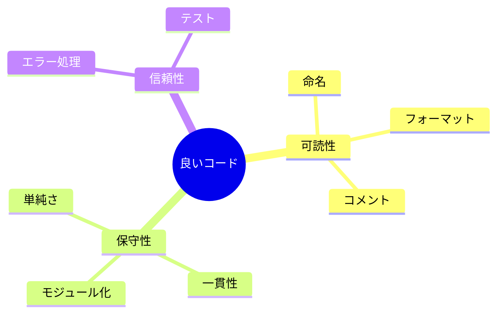

# コード品質

## 📋 概要

| 項目 | 内容 |
|------|------|
| 所要時間 | 45分 |
| 難易度 | [基礎] |
| 前提知識 | プログラミング基礎 |

## 🎯 なぜこれを学ぶのか

コードは書く時間より読む時間の方が長いです。品質の高いコードは、バグが少なく、保守しやすく、チーム開発をスムーズにします。

## 📚 学習内容

### 1. 良いコードの特徴



### 2. 命名規則

#### 変数名

```typescript
// ❌ 悪い例
const d = new Date();
const arr = [1, 2, 3];
const flag = true;
const temp = user.name;

// ✅ 良い例
const createdAt = new Date();
const userIds = [1, 2, 3];
const isActive = true;
const userName = user.name;
```

#### 関数名

```typescript
// ❌ 悪い例
function process(data) { }
function doStuff() { }
function handle() { }

// ✅ 良い例
function validateEmail(email: string): boolean { }
function calculateTotal(items: Item[]): number { }
function sendWelcomeEmail(user: User): Promise<void> { }
```

#### 命名のルール

| 種類 | 規則 | 例 |
|------|------|-----|
| 変数・関数 | camelCase | `userName`, `getUser` |
| クラス | PascalCase | `UserService` |
| 定数 | UPPER_SNAKE | `MAX_RETRY_COUNT` |
| 型・インターフェース | PascalCase | `User`, `ApiResponse` |
| boolean | is/has/can/should | `isActive`, `hasPermission` |

### 3. 関数の設計

```typescript
// ❌ 悪い例: 長すぎる、複数の責任
function processOrder(order: Order): void {
  // バリデーション（20行）
  // 在庫チェック（30行）
  // 支払い処理（40行）
  // メール送信（20行）
  // ログ出力（10行）
}

// ✅ 良い例: 小さな関数に分割
function processOrder(order: Order): void {
  validateOrder(order);
  checkInventory(order.items);
  processPayment(order);
  sendConfirmationEmail(order);
  logOrderCreated(order);
}

function validateOrder(order: Order): void {
  if (!order.items.length) {
    throw new ValidationError("Order must have items");
  }
}

function checkInventory(items: Item[]): void {
  // ...
}
```

**関数の設計原則**:
- 1つの関数は1つのことだけ
- 引数は少なく（3つ以下が理想）
- 副作用を避ける（できれば純粋関数）
- 20-30行以内

### 4. コメント

```typescript
// ❌ 悪いコメント: 何をしているか（コードを読めばわかる）
// ユーザーの年齢を取得
const age = user.age;

// ✅ 良いコメント: なぜそうしているか
// 法的要件により、18歳未満はサービス利用不可
if (user.age < 18) {
  throw new AgeRestrictionError();
}

// ✅ 良いコメント: 複雑なロジックの説明
// ヘロンの公式で三角形の面積を計算
// s = (a + b + c) / 2
// area = sqrt(s * (s-a) * (s-b) * (s-c))
function calculateTriangleArea(a: number, b: number, c: number): number {
  const s = (a + b + c) / 2;
  return Math.sqrt(s * (s - a) * (s - b) * (s - c));
}

// ✅ JSDoc（パブリックAPI用）
/**
 * ユーザーを作成します
 * @param name - ユーザー名（2-50文字）
 * @param email - メールアドレス
 * @returns 作成されたユーザー
 * @throws {ValidationError} 入力が不正な場合
 */
function createUser(name: string, email: string): User {
  // ...
}
```

### 5. コードの整理

```typescript
// ❌ 悪い例: 関連のないコードが混在
class UserService {
  createUser() { }
  sendEmail() { }        // メール送信は別のサービスに
  calculateDiscount() { } // 割引計算も別に
  logActivity() { }      // ログも別に
}

// ✅ 良い例: 責任ごとに分離
class UserService {
  constructor(
    private emailService: EmailService,
    private discountService: DiscountService,
    private logger: Logger
  ) {}

  createUser(name: string, email: string): User {
    // ユーザー作成のみに集中
  }
}
```

### 6. 早期リターン

```typescript
// ❌ 悪い例: ネストが深い
function processUser(user: User | null): string {
  if (user) {
    if (user.isActive) {
      if (user.hasPermission) {
        return "OK";
      } else {
        return "No permission";
      }
    } else {
      return "Inactive";
    }
  } else {
    return "No user";
  }
}

// ✅ 良い例: 早期リターン（ガード節）
function processUser(user: User | null): string {
  if (!user) return "No user";
  if (!user.isActive) return "Inactive";
  if (!user.hasPermission) return "No permission";
  
  return "OK";
}
```

### 7. マジックナンバーを避ける

```typescript
// ❌ 悪い例
if (status === 1) { }
if (retryCount > 3) { }
const price = amount * 1.1;

// ✅ 良い例
const STATUS_ACTIVE = 1;
const MAX_RETRY_COUNT = 3;
const TAX_RATE = 0.1;

if (status === STATUS_ACTIVE) { }
if (retryCount > MAX_RETRY_COUNT) { }
const price = amount * (1 + TAX_RATE);
```

### 8. コードレビューのチェックリスト

```
□ 命名は適切か？
□ 関数は1つのことだけしているか？
□ 重複コードはないか？
□ エラーハンドリングは適切か？
□ テストは書かれているか？
□ セキュリティ上の問題はないか？
□ パフォーマンス上の問題はないか？
```

## ✅ まとめ

| 観点 | ポイント |
|------|---------|
| 命名 | 意味のある名前、一貫した規則 |
| 関数 | 小さく、1つの責任 |
| コメント | なぜ（Why）を書く |
| 構造 | 早期リターン、ネストを浅く |

## 💬 考えてみよう

```
Q: 「良いコード」とは何ですか？
Q: コメントを書くべきケース、書かなくてよいケースは？
Q: レビューで指摘されたとき、どう対応すべきですか？
```

## 🔗 次のステップ

ソフトウェア設計カテゴリを修了しました！
[実践課題](./exercises/)に取り組んでから、[データベース基礎](../04-database-basics/)に進んでください。
