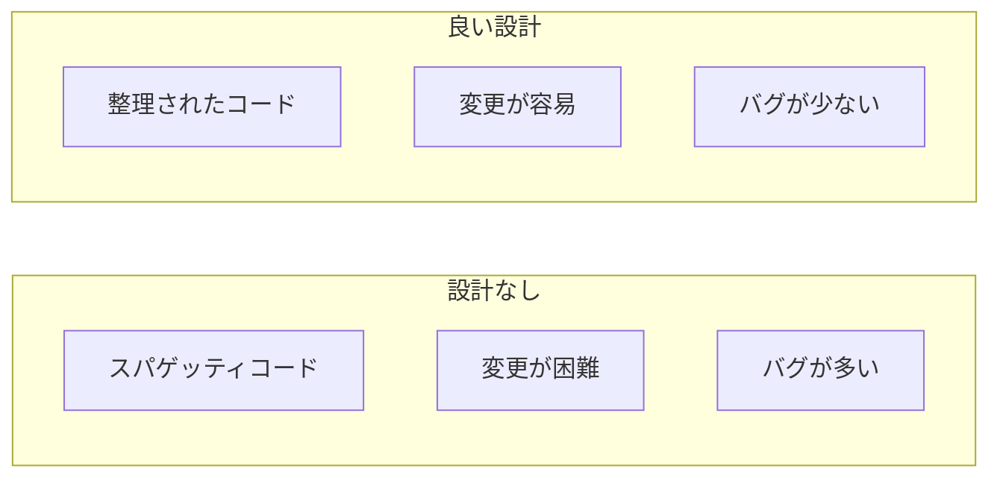
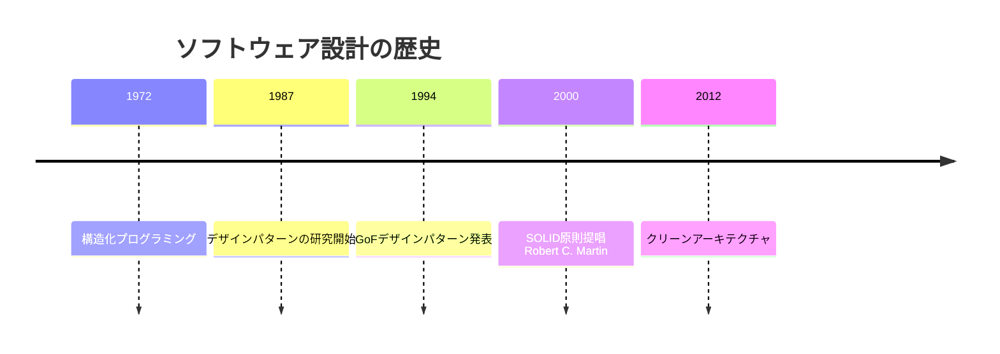

# 03. ソフトウェア設計

## 概要

**学習日数**: 2-3日

良いコードを書くための設計原則とパターンを学びます。SOLID原則、設計パターン、アーキテクチャパターンを理解し、保守性の高いコードを書けるようになります。

## なぜ学ぶ必要があるのか

### この技術が解決する問題

**設計がない場合**：
- コードが複雑で理解しにくい
- 1箇所の変更が他の場所に影響
- テストが書きにくい
- 新機能の追加が大変

**良い設計がある場合**：
- コードが整理されて理解しやすい
- 変更の影響範囲が限定的
- テストが書きやすい
- 新機能の追加が容易

### 実務での重要性

- **保守性**: 長期間メンテナンスするコードには設計が不可欠
- **チーム開発**: 設計原則があることでチームで統一した書き方ができる
- **スケーラビリティ**: システムの成長に対応できる

### AI時代における重要性

- **AIへの指示**: 設計を理解していると、AIに正確な指示ができる
- **AI生成コードのレビュー**: 設計原則に沿っているか判断できる
- **リファクタリング**: AIと協力してコードを改善できる

## 技術の歴史的背景

### 技術の誕生

- **1994年**: Gang of Four（GoF）がデザインパターンを体系化
- **2000年**: Robert C. Martin（Uncle Bob）がSOLID原則を提唱
- **2012年**: クリーンアーキテクチャが提唱される

## 学習内容

### コンテンツ一覧

| No | コンテンツ | 難易度 | 内容 |
|----|------------|--------|------|
| 01 | [SOLID原則](03-software-design-01.md) | [中級] | 単一責任、開放閉鎖、リスコフの置換、インターフェース分離、依存性逆転 |
| 02 | [設計パターン](03-software-design-02.md) | [中級] | Factory、Singleton、Observer、Strategy |
| 03 | [アーキテクチャパターン](03-software-design-03.md) | [中級] | レイヤード、クリーンアーキテクチャ |
| 04 | [コード品質](03-software-design-04.md) | [基礎] | 可読性、保守性、命名規則 |

## 学習目標

- [ ] SOLID原則を説明でき、コードに適用できる
- [ ] 基本的な設計パターンを理解し、使用できる
- [ ] アーキテクチャパターンを理解し、適切に選択できる
- [ ] 可読性・保守性の高いコードを書ける

## 参考リソース

- [Clean Code](https://www.amazon.co.jp/dp/4048930591)
- [リファクタリング](https://www.amazon.co.jp/dp/4274224546)
- [デザインパターン](https://www.amazon.co.jp/dp/4797311126)

---

**著作権表示**

Copyright © 2024 Honeycome Inc. All rights reserved.

本コンテンツは、Honeycome Inc.の所有物です。無断での複製、配布、転載を禁止します。
詳細は[利用規約](../../../docs/terms-of-use.md)をご覧ください。
