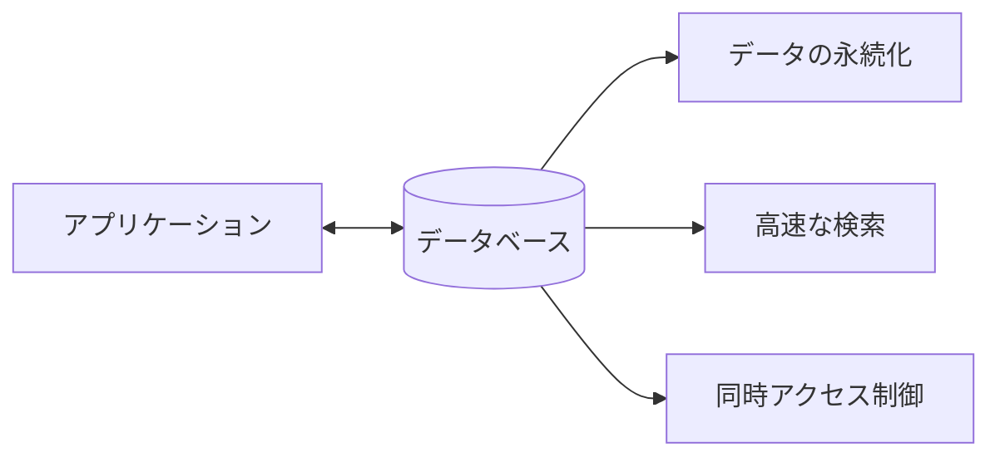
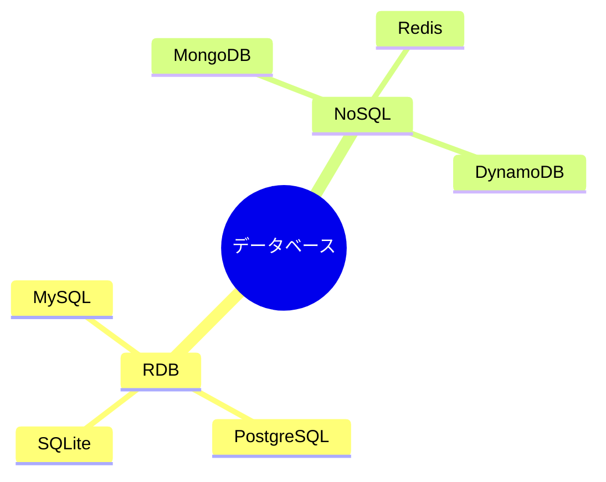
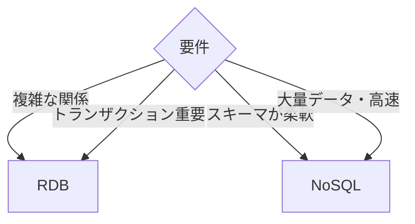

# データベースの基本概念

## 📋 概要

| 項目 | 内容 |
|------|------|
| 所要時間 | 45分 |
| 難易度 | [基礎] |
| 前提知識 | なし |

## 🎯 なぜこれを学ぶのか

データベースは、ほぼすべてのアプリケーションでデータを永続化するために使われます。データベースの基本を理解することで、効率的なデータ管理ができます。

## 📚 学習内容

### 1. データベースとは



**データベース** = データを構造化して保存・管理するシステム

### 2. データベースの種類



#### リレーショナルデータベース（RDB）

| 特徴 | 説明 |
|------|------|
| テーブル構造 | 行と列でデータを管理 |
| SQL | 標準化されたクエリ言語 |
| ACID | トランザクションの保証 |
| 正規化 | データの重複を排除 |

```
users テーブル
+----+-------+------------------+
| id | name  | email            |
+----+-------+------------------+
| 1  | Alice | alice@example.com|
| 2  | Bob   | bob@example.com  |
+----+-------+------------------+
```

#### NoSQL

| 種類 | 特徴 | 例 |
|------|------|-----|
| ドキュメント | JSONライクなデータ | MongoDB |
| キーバリュー | 高速な読み書き | Redis |
| ワイドカラム | 大量データ | Cassandra |
| グラフ | 関係性の表現 | Neo4j |

```json
// MongoDBの例
{
  "_id": "1",
  "name": "Alice",
  "email": "alice@example.com",
  "orders": [
    { "id": "o1", "total": 1000 },
    { "id": "o2", "total": 2000 }
  ]
}
```

### 3. RDBの基本構造

#### テーブル（Table）

```
products テーブル
+----+--------+-------+-------------+
| id | name   | price | category_id |
+----+--------+-------+-------------+
| 1  | りんご  | 100   | 1           |
| 2  | バナナ  | 80    | 1           |
| 3  | 牛乳   | 200   | 2           |
+----+--------+-------+-------------+

categories テーブル
+----+--------+
| id | name   |
+----+--------+
| 1  | 果物   |
| 2  | 乳製品  |
+----+--------+
```

#### キー

| キーの種類 | 説明 | 例 |
|-----------|------|-----|
| 主キー（Primary Key） | 各行を一意に識別 | id |
| 外部キー（Foreign Key） | 他テーブルへの参照 | category_id |
| ユニークキー | 重複を許さない | email |

### 4. データ型

| 型 | 説明 | 例 |
|----|------|-----|
| INTEGER | 整数 | id, age, quantity |
| VARCHAR(n) | 可変長文字列 | name, email |
| TEXT | 長い文字列 | description |
| BOOLEAN | 真偽値 | is_active |
| DATE | 日付 | birth_date |
| TIMESTAMP | 日時 | created_at |
| DECIMAL | 精密な小数 | price |

### 5. RDBとNoSQLの使い分け



| 要件 | 推奨 |
|------|------|
| ECサイト（注文・在庫管理） | RDB |
| ソーシャルメディア（投稿） | NoSQL |
| 金融システム | RDB |
| ログ・分析 | NoSQL |
| 一般的なWebアプリ | RDB |

### 6. 主要なデータベース

| DB | 種類 | 特徴 |
|----|------|------|
| PostgreSQL | RDB | 高機能、拡張性が高い |
| MySQL | RDB | 広く使われている |
| SQLite | RDB | 軽量、ファイルベース |
| MongoDB | NoSQL | ドキュメント指向 |
| Redis | NoSQL | インメモリ、高速 |

## ✅ まとめ

| 概念 | ポイント |
|------|---------|
| RDB | テーブル構造、SQL、ACID保証 |
| NoSQL | 柔軟なスキーマ、スケーラビリティ |
| 使い分け | 要件に応じて選択 |

## 💬 考えてみよう

```
Q: RDBとNoSQLはどう使い分けますか？
Q: 主キーと外部キーの違いは何ですか？
Q: なぜデータ型を適切に選ぶことが重要ですか？
```

## 🔗 次のコンテンツ

[SQL基礎](04-database-basics-02.md)に進んでください。
