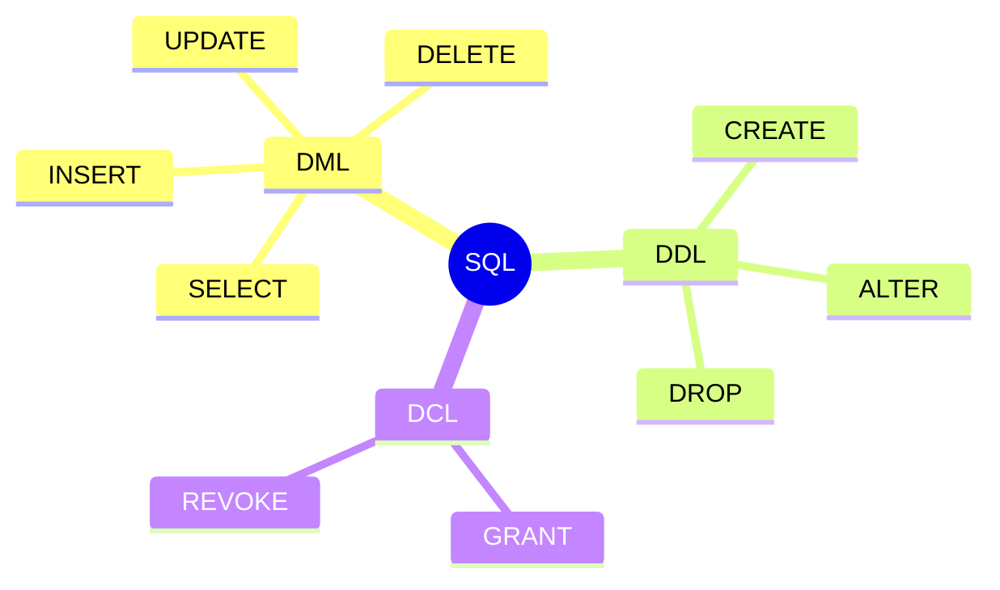
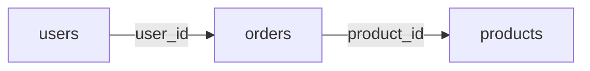

# SQL基礎

## 📋 概要

| 項目 | 内容 |
|------|------|
| 所要時間 | 60分 |
| 難易度 | [基礎] |
| 前提知識 | データベースの基本概念 |

## 🎯 なぜこれを学ぶのか

SQLは、リレーショナルデータベースを操作するための標準言語です。データの取得、追加、更新、削除など、基本的な操作を習得します。

## 📚 学習内容

### 1. SQLの分類



| 分類 | 説明 | コマンド |
|------|------|---------|
| DML | データ操作 | SELECT, INSERT, UPDATE, DELETE |
| DDL | 定義 | CREATE, ALTER, DROP |
| DCL | 権限制御 | GRANT, REVOKE |

### 2. SELECT - データの取得

#### 基本構文

```sql
SELECT カラム名 FROM テーブル名 WHERE 条件;
```

#### 例

```sql
-- すべてのカラムを取得
SELECT * FROM users;

-- 特定のカラムを取得
SELECT name, email FROM users;

-- 条件付き
SELECT * FROM users WHERE age >= 20;

-- 並び替え
SELECT * FROM users ORDER BY created_at DESC;

-- 件数制限
SELECT * FROM users LIMIT 10;

-- 組み合わせ
SELECT name, email 
FROM users 
WHERE age >= 20 
ORDER BY name 
LIMIT 10;
```

#### WHERE句の演算子

| 演算子 | 説明 | 例 |
|--------|------|-----|
| = | 等しい | `age = 25` |
| <> / != | 等しくない | `status <> 'deleted'` |
| < > <= >= | 比較 | `price >= 1000` |
| AND / OR | 論理演算 | `age >= 20 AND age <= 30` |
| IN | リスト内 | `status IN ('active', 'pending')` |
| LIKE | パターン | `name LIKE '%田%'` |
| IS NULL | NULL判定 | `deleted_at IS NULL` |
| BETWEEN | 範囲 | `price BETWEEN 100 AND 500` |

### 3. INSERT - データの追加

```sql
-- 単一行
INSERT INTO users (name, email, age) 
VALUES ('Alice', 'alice@example.com', 25);

-- 複数行
INSERT INTO users (name, email, age) VALUES 
  ('Bob', 'bob@example.com', 30),
  ('Carol', 'carol@example.com', 28);
```

### 4. UPDATE - データの更新

```sql
-- 単一行（WHERE重要！）
UPDATE users 
SET email = 'new@example.com' 
WHERE id = 1;

-- 複数カラム
UPDATE users 
SET name = 'Alice Smith', age = 26 
WHERE id = 1;

-- 条件に一致するすべて
UPDATE products 
SET price = price * 1.1 
WHERE category_id = 1;
```

> ⚠️ **注意**: WHERE句を忘れるとすべての行が更新されます！

### 5. DELETE - データの削除

```sql
-- 単一行
DELETE FROM users WHERE id = 1;

-- 条件に一致するすべて
DELETE FROM users WHERE status = 'inactive';

-- すべて削除（危険！）
DELETE FROM users;
```

> ⚠️ **注意**: WHERE句を忘れるとすべての行が削除されます！

### 6. JOIN - テーブルの結合



#### INNER JOIN

両方のテーブルに存在するデータのみ取得。

```sql
SELECT users.name, orders.total
FROM users
INNER JOIN orders ON users.id = orders.user_id;
```

#### LEFT JOIN

左テーブルのすべて + 右テーブルの一致するデータ。

```sql
SELECT users.name, orders.total
FROM users
LEFT JOIN orders ON users.id = orders.user_id;
```

#### 複数テーブルの結合

```sql
SELECT 
  users.name,
  products.name AS product_name,
  orders.quantity
FROM users
INNER JOIN orders ON users.id = orders.user_id
INNER JOIN products ON orders.product_id = products.id;
```

### 7. 集計関数

| 関数 | 説明 | 例 |
|------|------|-----|
| COUNT | 件数 | `COUNT(*)` |
| SUM | 合計 | `SUM(price)` |
| AVG | 平均 | `AVG(age)` |
| MAX | 最大 | `MAX(price)` |
| MIN | 最小 | `MIN(price)` |

```sql
-- 件数
SELECT COUNT(*) FROM users;

-- グループ化
SELECT category_id, COUNT(*) as count
FROM products
GROUP BY category_id;

-- HAVING（グループの条件）
SELECT category_id, AVG(price) as avg_price
FROM products
GROUP BY category_id
HAVING AVG(price) > 100;
```

### 8. よく使うパターン

```sql
-- ページネーション
SELECT * FROM products 
ORDER BY created_at DESC 
LIMIT 10 OFFSET 20;

-- 存在チェック
SELECT EXISTS(SELECT 1 FROM users WHERE email = 'test@example.com');

-- UPSERT（存在すれば更新、なければ挿入）
INSERT INTO users (email, name) VALUES ('test@example.com', 'Test')
ON CONFLICT (email) DO UPDATE SET name = 'Test';
```

## ✅ まとめ

| 操作 | コマンド |
|------|---------|
| 取得 | SELECT ... FROM ... WHERE |
| 追加 | INSERT INTO ... VALUES |
| 更新 | UPDATE ... SET ... WHERE |
| 削除 | DELETE FROM ... WHERE |
| 結合 | JOIN ... ON |
| 集計 | COUNT, SUM, AVG, GROUP BY |

## 💬 考えてみよう

```
Q: INNER JOINとLEFT JOINの違いは何ですか？
Q: UPDATEやDELETEでWHERE句を忘れるとどうなりますか？
Q: GROUP BYとHAVINGはどう使い分けますか？
```

## 🔗 次のコンテンツ

[データベース設計](04-database-basics-03.md)に進んでください。

---

**著作権表示**

Copyright © 2024 Honeycome Inc. All rights reserved.

本コンテンツは、Honeycome Inc.の所有物です。無断での複製、配布、転載を禁止します。
詳細は[利用規約](../../docs/terms-of-use.md)をご覧ください。
