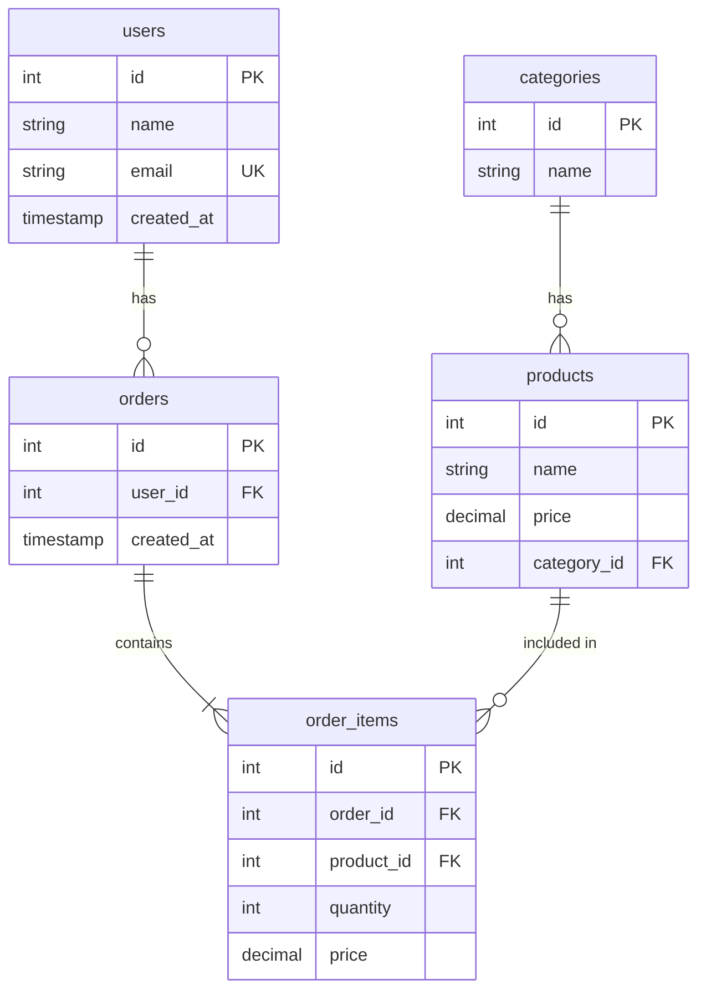
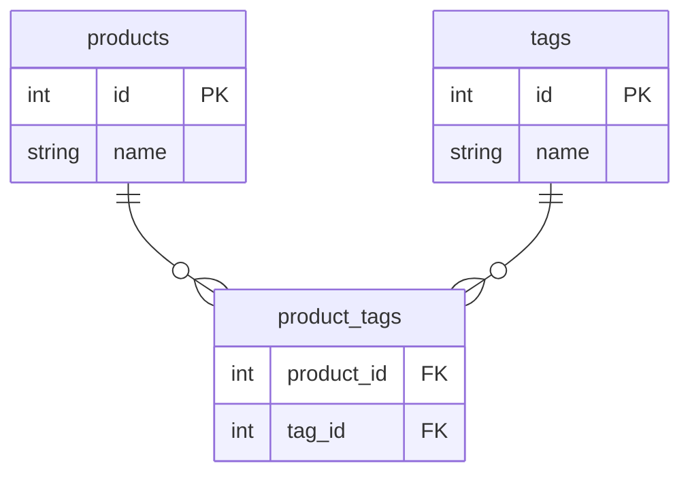
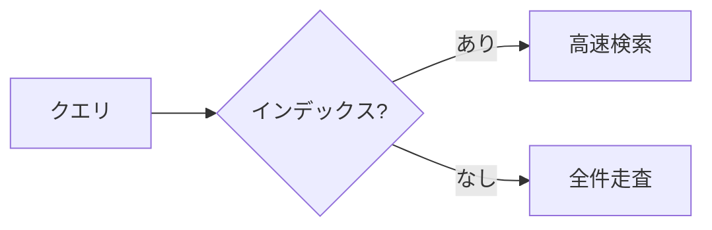

# データベース設計

## 📋 概要

| 項目 | 内容 |
|------|------|
| 所要時間 | 60分 |
| 難易度 | [中級] |
| 前提知識 | SQL基礎 |

## 🎯 なぜこれを学ぶのか

良いデータベース設計は、アプリケーションのパフォーマンスと保守性に直結します。正規化とER図を理解して、効率的なデータ構造を設計できるようになります。

## 📚 学習内容

### 1. 正規化とは

**正規化** = データの重複を排除し、整合性を保つための手法


### 2. 正規化の例

#### 非正規形（問題あり）

```
orders テーブル
+----+-------+-------------+---------------+----------+
| id | user  | user_email  | product_names | total    |
+----+-------+-------------+---------------+----------+
| 1  | Alice | a@ex.com    | りんご,バナナ   | 180      |
| 2  | Alice | a@ex.com    | 牛乳          | 200      |
+----+-------+-------------+---------------+----------+

問題点:
- ユーザー情報の重複
- 商品名がカンマ区切り（検索困難）
- メールアドレスの更新が大変
```

#### 第1正規形（繰り返しを排除）

```
orders
+----+---------+
| id | user_id |
+----+---------+
| 1  | 1       |
| 2  | 1       |
+----+---------+

order_items（繰り返しを別テーブルに）
+----+----------+------------+-------+
| id | order_id | product_id | qty   |
+----+----------+------------+-------+
| 1  | 1        | 1          | 1     |
| 2  | 1        | 2          | 1     |
| 3  | 2        | 3          | 1     |
+----+----------+------------+-------+
```

#### 第2正規形（部分関数従属を排除）

#### 第3正規形（推移関数従属を排除）

```
users
+----+-------+-------------+
| id | name  | email       |
+----+-------+-------------+
| 1  | Alice | a@ex.com    |
+----+-------+-------------+

products
+----+--------+-------+
| id | name   | price |
+----+--------+-------+
| 1  | りんご  | 100   |
| 2  | バナナ  | 80    |
| 3  | 牛乳   | 200   |
+----+--------+-------+

orders
+----+---------+------------+
| id | user_id | created_at |
+----+---------+------------+
| 1  | 1       | 2024-01-01 |
+----+---------+------------+

order_items
+----+----------+------------+-----+-------+
| id | order_id | product_id | qty | price |
+----+----------+------------+-----+-------+
| 1  | 1        | 1          | 1   | 100   |
| 2  | 1        | 2          | 1   | 80    |
+----+----------+------------+-----+-------+
```

### 3. ER図（Entity Relationship Diagram）



### 4. リレーションシップ

| 関係 | 記号 | 説明 | 例 |
|------|------|------|-----|
| 1対1 | `\|\|--\|\|` | 1つずつ対応 | ユーザー - プロフィール |
| 1対多 | `\|\|--o{` | 1つが複数に対応 | ユーザー - 注文 |
| 多対多 | `}o--o{` | 複数が複数に対応 | 商品 - タグ |

#### 多対多の実装（中間テーブル）



### 5. テーブル設計のベストプラクティス

```sql
-- 良いテーブル設計の例
CREATE TABLE users (
  id SERIAL PRIMARY KEY,
  name VARCHAR(100) NOT NULL,
  email VARCHAR(255) NOT NULL UNIQUE,
  password_hash VARCHAR(255) NOT NULL,
  is_active BOOLEAN DEFAULT true,
  created_at TIMESTAMP DEFAULT CURRENT_TIMESTAMP,
  updated_at TIMESTAMP DEFAULT CURRENT_TIMESTAMP
);

-- インデックス
CREATE INDEX idx_users_email ON users(email);
CREATE INDEX idx_users_created_at ON users(created_at);
```

#### 命名規則

| 対象 | 規則 | 例 |
|------|------|-----|
| テーブル | 複数形、snake_case | users, order_items |
| カラム | snake_case | created_at, user_id |
| 主キー | id | id |
| 外部キー | テーブル名_id | user_id, product_id |
| 真偽値 | is_/has_ | is_active, has_permission |
| 日時 | _at | created_at, updated_at |

### 6. インデックス



```sql
-- よく検索するカラムにインデックス
CREATE INDEX idx_users_email ON users(email);

-- 複合インデックス
CREATE INDEX idx_orders_user_date ON orders(user_id, created_at);
```

**インデックスを張るべきカラム**:
- WHERE句でよく使う
- JOINで使う
- ORDER BYで使う

**インデックスの注意点**:
- 書き込みが遅くなる
- ストレージを消費する
- 不要なインデックスは削除

## ✅ まとめ

| 概念 | ポイント |
|------|---------|
| 正規化 | 重複排除、整合性確保 |
| ER図 | テーブル関係の可視化 |
| インデックス | 検索の高速化 |

## 💬 考えてみよう

```
Q: 正規化しすぎると何が問題ですか？
Q: インデックスを張るべきカラムはどう判断しますか？
Q: 多対多の関係を実装するにはどうしますか？
```

## 🔗 次のコンテンツ

[トランザクション](04-database-basics-04.md)に進んでください。
