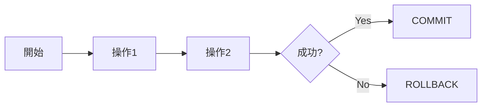
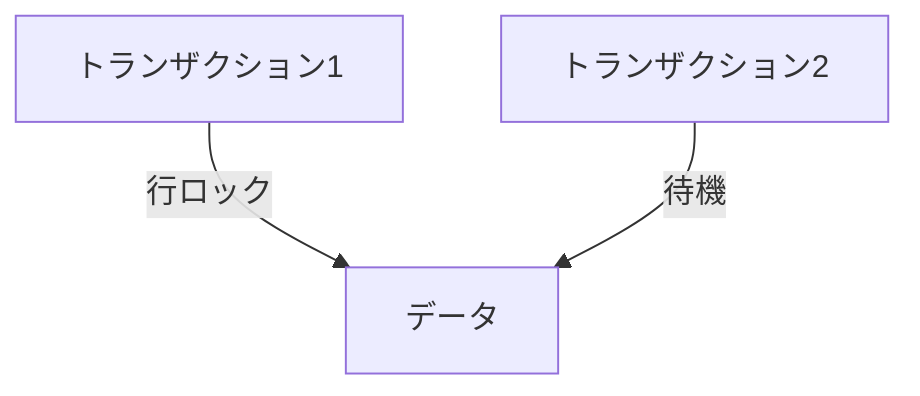
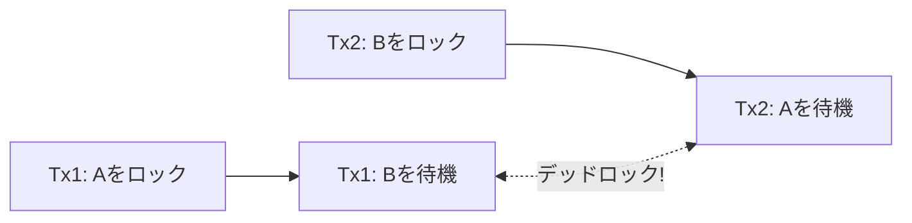

# トランザクション

## 📋 概要

| 項目 | 内容 |
|------|------|
| 所要時間 | 45分 |
| 難易度 | [中級] |
| 前提知識 | SQL基礎 |

## 🎯 なぜこれを学ぶのか

トランザクションは、データの整合性を保証するための仕組みです。銀行の送金や注文処理など、複数の操作を「全部成功」か「全部失敗」にする必要がある場面で不可欠です。

## 📚 学習内容

### 1. トランザクションとは



**トランザクション** = 複数の操作を1つの単位として扱う仕組み

### 2. ACID特性

| 特性 | 英語 | 説明 |
|------|------|------|
| A | Atomicity（原子性） | 全部成功か全部失敗 |
| C | Consistency（一貫性） | データは常に整合性を保つ |
| I | Isolation（分離性） | 同時実行でも干渉しない |
| D | Durability（永続性） | コミット後は確実に保存 |

### 3. トランザクションの例

#### 銀行の送金

```sql
-- 送金処理（AからBに1000円）
BEGIN;

-- Aの残高を減らす
UPDATE accounts SET balance = balance - 1000 WHERE user_id = 'A';

-- Bの残高を増やす
UPDATE accounts SET balance = balance + 1000 WHERE user_id = 'B';

COMMIT;
```

**トランザクションがない場合の問題**:

```
1. Aの残高を減らす → 成功
2. Bの残高を増やす → 失敗（エラー）

結果: Aのお金が消えた！
```

**トランザクションがある場合**:

```
1. Aの残高を減らす → 成功
2. Bの残高を増やす → 失敗（エラー）
3. ROLLBACK → 1の操作も取り消し

結果: 何も変わらない（整合性維持）
```

### 4. TypeScriptでの使用例

```typescript
async function transferMoney(
  fromId: string,
  toId: string,
  amount: number
): Promise<void> {
  const client = await pool.connect();
  
  try {
    await client.query('BEGIN');
    
    // 送金元の残高チェック
    const result = await client.query(
      'SELECT balance FROM accounts WHERE user_id = $1 FOR UPDATE',
      [fromId]
    );
    
    if (result.rows[0].balance < amount) {
      throw new Error('Insufficient balance');
    }
    
    // 送金元から引く
    await client.query(
      'UPDATE accounts SET balance = balance - $1 WHERE user_id = $2',
      [amount, fromId]
    );
    
    // 送金先に足す
    await client.query(
      'UPDATE accounts SET balance = balance + $1 WHERE user_id = $2',
      [amount, toId]
    );
    
    await client.query('COMMIT');
  } catch (error) {
    await client.query('ROLLBACK');
    throw error;
  } finally {
    client.release();
  }
}
```

### 5. 分離レベル

同時実行時の挙動を制御するレベル。

| レベル | ダーティリード | 反復不能読取 | ファントム |
|--------|:-------------:|:-----------:|:---------:|
| READ UNCOMMITTED | ⚠️ | ⚠️ | ⚠️ |
| READ COMMITTED | ✅ | ⚠️ | ⚠️ |
| REPEATABLE READ | ✅ | ✅ | ⚠️ |
| SERIALIZABLE | ✅ | ✅ | ✅ |

```sql
-- 分離レベルの設定
SET TRANSACTION ISOLATION LEVEL READ COMMITTED;
```

#### 問題の説明

**ダーティリード**: 他のトランザクションの未コミットデータを読む
```
Tx1: UPDATE... (未コミット)
Tx2: SELECT... → 未コミットの値を読んでしまう
Tx1: ROLLBACK
結果: Tx2は存在しないデータを読んだ
```

**反復不能読取**: 同じクエリで異なる結果
```
Tx1: SELECT... → 100円
Tx2: UPDATE... → COMMIT
Tx1: SELECT... → 200円（変わった！）
```

**ファントムリード**: 同じ条件で行数が変わる
```
Tx1: SELECT COUNT... → 10件
Tx2: INSERT... → COMMIT
Tx1: SELECT COUNT... → 11件（増えた！）
```

### 6. ロック



```sql
-- 行ロック（他のトランザクションは待機）
SELECT * FROM accounts WHERE id = 1 FOR UPDATE;

-- 読み取り時もロック（共有ロック）
SELECT * FROM accounts WHERE id = 1 FOR SHARE;
```

### 7. デッドロック



**対策**:
- ロックの順序を統一する
- タイムアウトを設定する
- 小さなトランザクションにする

### 8. ベストプラクティス

```
✅ 良いプラクティス
- トランザクションは短く
- 必要な範囲だけロック
- エラー時は必ずROLLBACK
- 適切な分離レベルを選択

❌ 避けるべきこと
- 長時間のトランザクション
- 不要なロック
- ROLLBACKの漏れ
```

## ✅ まとめ

| 概念 | ポイント |
|------|---------|
| ACID | 原子性、一貫性、分離性、永続性 |
| COMMIT/ROLLBACK | 確定/取り消し |
| 分離レベル | 同時実行の制御 |
| ロック | 排他制御 |

## 💬 考えてみよう

```
Q: トランザクションがないとどんな問題が起きますか？
Q: 分離レベルはどう選びますか？
Q: デッドロックを防ぐにはどうしますか？
```

## 🔗 次のステップ

データベース基礎カテゴリを修了しました！
[実践課題](./exercises/)に取り組んでから、[テストと品質](../05-testing-quality/)に進んでください。
