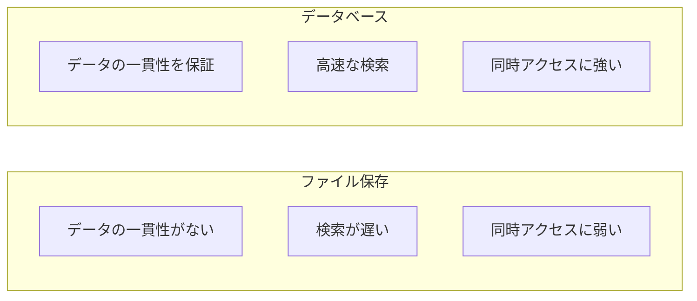
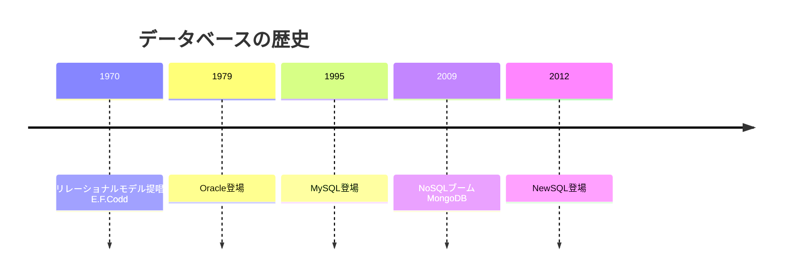

# 04. データベース基礎

## 概要

**学習日数**: 2-3日

データの保存と取得の基礎を学びます。リレーショナルデータベース、SQL、データベース設計、トランザクションについて理解します。

## なぜ学ぶ必要があるのか

### この技術が解決する問題

### 実務での重要性

- **ほぼすべてのアプリケーションで使用**: ユーザー情報、商品情報、注文履歴など
- **パフォーマンスの鍵**: 適切なデータベース設計がアプリの速度を左右
- **データの整合性**: ビジネスロジックの正確性を担保

### AI時代における重要性

- **AIが生成するクエリの検証**: パフォーマンスやセキュリティの観点で確認
- **データモデルの設計**: AIへの正確な指示に必要

## 技術の歴史的背景

## 学習内容

| No | コンテンツ | 難易度 | 内容 |
|----|------------|--------|------|
| 01 | [データベースの基本概念](04-database-basics-01.md) | [基礎] | RDB、NoSQL、データモデル |
| 02 | [SQL基礎](04-database-basics-02.md) | [基礎] | SELECT、INSERT、UPDATE、DELETE、JOIN |
| 03 | [データベース設計](04-database-basics-03.md) | [中級] | 正規化、ER図 |
| 04 | [トランザクション](04-database-basics-04.md) | [中級] | ACID特性、分離レベル |

## 学習目標

- [ ] リレーショナルデータベースの基本概念を説明できる
- [ ] SQLで基本的なクエリを書ける
- [ ] データベースを正規化できる
- [ ] トランザクションの概念を理解している

## 参考リソース

- [SQL入門](https://www.w3schools.com/sql/)
- [PostgreSQL公式ドキュメント](https://www.postgresql.org/docs/)

---

**著作権表示**

Copyright © 2024 Honeycome Inc. All rights reserved.

本コンテンツは、Honeycome Inc.の所有物です。無断での複製、配布、転載を禁止します。
詳細は[利用規約](../../../docs/terms-of-use.md)をご覧ください。
