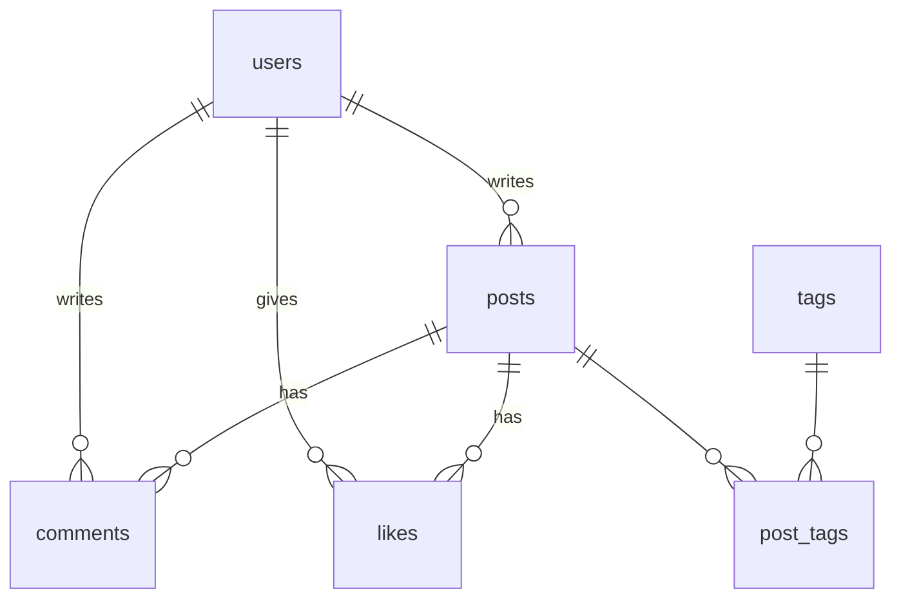

# 課題3: データベース設計

## 📋 概要

| 項目 | 内容 |
|------|------|
| 難易度 | ⭐⭐⭐ |
| 所要時間 | 90分 |

## 🎯 目標

要件からデータベースを設計し、テーブルを作成する。

## 📝 課題内容

### シナリオ: ブログシステム

以下の要件を満たすブログシステムのデータベースを設計してください。

**要件**:
- ユーザーは複数の記事を投稿できる
- 記事は複数のタグを持てる（多対多）
- ユーザーは記事にコメントできる
- ユーザーは記事に「いいね」できる
- 記事は下書き、公開、非公開のステータスを持つ

### 課題3-1: ER図の作成

Mermaidまたは手書きでER図を作成してください。

以下を含めること:
- エンティティ（テーブル）
- 属性（カラム）
- リレーションシップ
- 主キー（PK）、外部キー（FK）

### 課題3-2: テーブル定義

各テーブルのCREATE文を作成してください。

**必須テーブル**:
- users
- posts
- tags
- post_tags（中間テーブル）
- comments
- likes

**含めるべきカラム**:
- 適切なデータ型
- NOT NULL制約
- UNIQUE制約
- 外部キー制約
- created_at, updated_at

### 課題3-3: サンプルデータ

各テーブルにサンプルデータをINSERTしてください。

- ユーザー: 3人以上
- 記事: 5件以上
- タグ: 5種類以上
- コメント: 5件以上
- いいね: 5件以上

### 課題3-4: クエリ作成

以下のデータを取得するクエリを書いてください。

1. 記事一覧（投稿者名、タイトル、ステータス、投稿日）
2. 特定の記事の詳細（タグ一覧を含む）
3. ユーザーごとの記事数
4. 最もいいねが多い記事トップ5
5. 最もコメントが多い記事
6. 特定のタグが付いた記事一覧
7. 最近7日間に投稿された記事

### 期待する成果物

```
/exercise-03/
├── er-diagram.md       # ER図（Mermaid記法）
├── create-tables.sql   # CREATE文
├── insert-data.sql     # INSERTサンプルデータ
└── queries.sql         # 各種クエリ
```

## 💡 ヒント

<details>
<summary>ER図のヒント</summary>



</details>

<details>
<summary>テーブル設計のヒント</summary>

```sql
CREATE TABLE posts (
  id INTEGER PRIMARY KEY AUTOINCREMENT,
  user_id INTEGER NOT NULL,
  title TEXT NOT NULL,
  content TEXT,
  status TEXT DEFAULT 'draft' CHECK(status IN ('draft', 'published', 'private')),
  created_at TEXT DEFAULT CURRENT_TIMESTAMP,
  updated_at TEXT DEFAULT CURRENT_TIMESTAMP,
  FOREIGN KEY (user_id) REFERENCES users(id)
);
```

</details>

## ✅ 完了条件

- [ ] ER図が正しく作成されている
- [ ] すべてのテーブルが作成できる
- [ ] サンプルデータが投入できる
- [ ] 7つのクエリが正しく動作する

## 📤 提出物

- 上記の成果物一式
