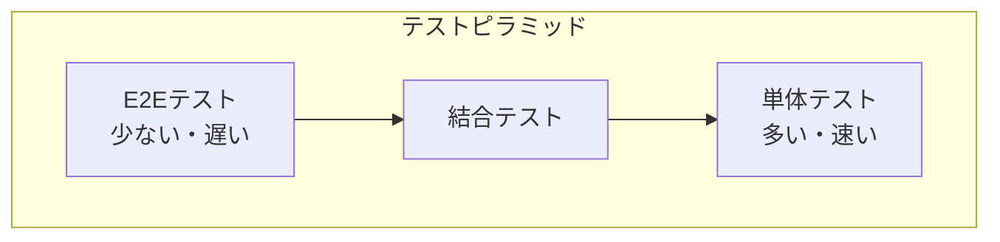

# テストの種類

## 📋 概要

| 項目 | 内容 |
|------|------|
| 所要時間 | 45分 |
| 難易度 | [基礎] |
| 前提知識 | プログラミング基礎 |

## 🎯 なぜこれを学ぶのか

テストは、コードの品質を保証し、バグを早期発見するための重要な技術です。テストの種類を理解することで、適切なテスト戦略を立てられます。

## 📚 学習内容

### 1. テストピラミッド



| レベル | 特徴 | 量 |
|--------|------|-----|
| 単体テスト | 高速、単一の関数/クラス | 多い |
| 結合テスト | 複数モジュールの連携 | 中程度 |
| E2Eテスト | ユーザー視点、遅い | 少ない |

### 2. 単体テスト（Unit Test）

**単一の関数やクラスを個別にテスト**

```typescript
// テスト対象
function add(a: number, b: number): number {
  return a + b;
}

// テスト
test('add関数は2つの数値を足す', () => {
  expect(add(1, 2)).toBe(3);
  expect(add(-1, 1)).toBe(0);
  expect(add(0, 0)).toBe(0);
});
```

**特徴**:
- 高速
- 独立している
- 頻繁に実行できる
- 問題の特定が容易

### 3. 結合テスト（Integration Test）

**複数のモジュールの連携をテスト**

```typescript
// テスト対象：UserServiceとUserRepository
test('ユーザー作成フロー', async () => {
  const repository = new UserRepository(database);
  const service = new UserService(repository);
  
  const user = await service.createUser('Alice', 'alice@example.com');
  
  expect(user.id).toBeDefined();
  expect(user.name).toBe('Alice');
  
  // データベースにも保存されているか確認
  const saved = await repository.findById(user.id);
  expect(saved).toEqual(user);
});
```

**特徴**:
- モジュール間の連携を確認
- 単体テストより遅い
- 環境の準備が必要

### 4. E2Eテスト（End-to-End Test）

**ユーザーの操作を再現してテスト**

```typescript
// Playwrightの例
test('ログインフロー', async ({ page }) => {
  await page.goto('http://localhost:3000/login');
  
  await page.fill('input[name="email"]', 'test@example.com');
  await page.fill('input[name="password"]', 'password123');
  await page.click('button[type="submit"]');
  
  await expect(page).toHaveURL('/dashboard');
  await expect(page.locator('h1')).toContainText('Welcome');
});
```

**特徴**:
- ユーザー視点
- 実環境に近い
- 最も遅い
- 不安定になりやすい

### 5. その他のテスト

| テスト | 目的 |
|--------|------|
| スナップショットテスト | UIの変更検出 |
| パフォーマンステスト | 応答速度、負荷耐性 |
| セキュリティテスト | 脆弱性の検出 |
| 回帰テスト | 修正後に既存機能が壊れていないか |

### 6. テストのベストプラクティス

```
✅ 良いテスト
- 独立している（順序に依存しない）
- 再現可能
- 1つのことをテスト
- 失敗理由がわかりやすい

❌ 避けるべきテスト
- 実装の詳細をテスト
- 外部サービスに依存
- テスト間で状態を共有
- 曖昧なアサーション
```

### 7. テストを書く順番


1. **まず単体テスト**: 基本的なロジックを確認
2. **次に結合テスト**: モジュールの連携を確認
3. **最後にE2Eテスト**: 重要なユーザーフローを確認

## ✅ まとめ

| テスト種類 | 速度 | 範囲 | 量 |
|-----------|:----:|:----:|:--:|
| 単体テスト | 速い | 狭い | 多 |
| 結合テスト | 中程度 | 中程度 | 中 |
| E2Eテスト | 遅い | 広い | 少 |

## 💬 考えてみよう

```
Q: なぜ単体テストを多く書くべきですか？
Q: E2Eテストはどんなケースに有効ですか？
Q: テストピラミッドの形が崩れるとどんな問題がありますか？
```

## 🔗 次のコンテンツ

[単体テスト](05-testing-quality-02.md)に進んでください。

---

**著作権表示**

Copyright © 2024 Honeycome Inc. All rights reserved.

本コンテンツは、Honeycome Inc.の所有物です。無断での複製、配布、転載を禁止します。
詳細は[利用規約](../../docs/terms-of-use.md)をご覧ください。
