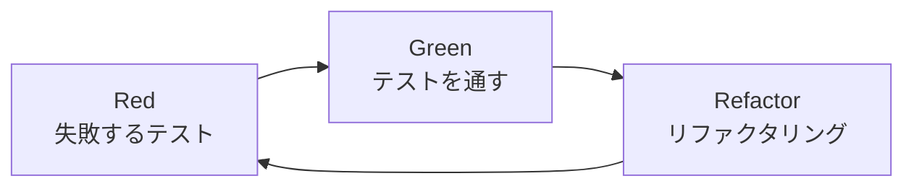
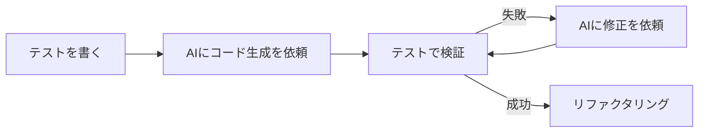

# TDD（テスト駆動開発）

## 📋 概要

| 項目 | 内容 |
|------|------|
| 所要時間 | 45分 |
| 難易度 | [中級] |
| 前提知識 | 単体テスト |

## 🎯 なぜこれを学ぶのか

TDDは「テストを先に書く」開発手法です。テストファーストで開発することで、設計が改善され、バグが減少します。

## 📚 学習内容

### 1. TDDとは



**TDD = テスト駆動開発（Test-Driven Development）**

1. **Red**: まず失敗するテストを書く
2. **Green**: テストが通る最小限のコードを書く
3. **Refactor**: コードを改善する

### 2. TDDのサイクル

#### Step 1: Red（失敗するテスト）

```typescript
// まずテストを書く
test('FizzBuzz: 3の倍数はFizzを返す', () => {
  expect(fizzBuzz(3)).toBe('Fizz');
  expect(fizzBuzz(6)).toBe('Fizz');
});

// この時点ではfizzBuzz関数は存在しない → 失敗
```

#### Step 2: Green（テストを通す）

```typescript
// 最小限の実装
function fizzBuzz(n: number): string {
  if (n % 3 === 0) return 'Fizz';
  return n.toString();
}

// テストが通る！
```

#### Step 3: Refactor（改善）

```typescript
// コードを改善（この場合は特に変更なし）
// テストが通ることを確認
```

#### 繰り返し

```typescript
// 次のテストを追加
test('FizzBuzz: 5の倍数はBuzzを返す', () => {
  expect(fizzBuzz(5)).toBe('Buzz');
  expect(fizzBuzz(10)).toBe('Buzz');
});

// 失敗 → 実装 → 通る → リファクタリング
function fizzBuzz(n: number): string {
  if (n % 3 === 0) return 'Fizz';
  if (n % 5 === 0) return 'Buzz';
  return n.toString();
}

// さらに追加
test('FizzBuzz: 15の倍数はFizzBuzzを返す', () => {
  expect(fizzBuzz(15)).toBe('FizzBuzz');
});

// 最終的な実装
function fizzBuzz(n: number): string {
  if (n % 15 === 0) return 'FizzBuzz';
  if (n % 3 === 0) return 'Fizz';
  if (n % 5 === 0) return 'Buzz';
  return n.toString();
}
```

### 3. TDDの実践例：バリデーション

```typescript
// Step 1: Red - テストを先に書く
describe('EmailValidator', () => {
  test('有効なメールアドレスはtrueを返す', () => {
    expect(isValidEmail('test@example.com')).toBe(true);
    expect(isValidEmail('user.name@domain.co.jp')).toBe(true);
  });

  test('無効なメールアドレスはfalseを返す', () => {
    expect(isValidEmail('')).toBe(false);
    expect(isValidEmail('invalid')).toBe(false);
    expect(isValidEmail('@domain.com')).toBe(false);
    expect(isValidEmail('user@')).toBe(false);
  });
});

// Step 2: Green - 最小限の実装
function isValidEmail(email: string): boolean {
  if (!email) return false;
  const parts = email.split('@');
  if (parts.length !== 2) return false;
  if (!parts[0] || !parts[1]) return false;
  return parts[1].includes('.');
}

// Step 3: Refactor - 改善
function isValidEmail(email: string): boolean {
  const emailRegex = /^[^\s@]+@[^\s@]+\.[^\s@]+$/;
  return emailRegex.test(email);
}
```

### 4. TDDとAI駆動開発



**TDDとAIの相性は良い**:
1. テストを書く（仕様を明確にする）
2. AIにコードを生成させる
3. テストでAIの出力を検証
4. 必要なら修正を依頼

### 5. TDDのメリット・デメリット

| メリット | デメリット |
|---------|-----------|
| 設計が改善される | 初期コストが高い |
| バグが減る | 学習コストがある |
| 仕様が明確になる | 過度なテストになりがち |
| リファクタリングが安全 | すべてに適さない |

### 6. TDDに向いている場面

```
✅ TDDに向いている
- ロジックが明確な関数
- バリデーション
- 計算処理
- データ変換

❌ TDDに向いていない
- UI/UX
- 探索的な開発
- プロトタイピング
- 外部APIとの連携（結合テストで）
```

## ✅ まとめ

| 概念 | ポイント |
|------|---------|
| Red | 失敗するテストを先に書く |
| Green | テストを通す最小限の実装 |
| Refactor | コードを改善 |
| サイクル | 小さく回す |

## 💬 考えてみよう

```
Q: なぜテストを先に書くのですか？
Q: TDDに向いていない場面はどんなときですか？
Q: AI駆動開発とTDDを組み合わせるメリットは何ですか？
```

## 🔗 次のコンテンツ

[カバレッジ](05-testing-quality-04.md)に進んでください。

---

**著作権表示**

Copyright © 2024 Honeycome Inc. All rights reserved.

本コンテンツは、Honeycome Inc.の所有物です。無断での複製、配布、転載を禁止します。
詳細は[利用規約](../../docs/terms-of-use.md)をご覧ください。
