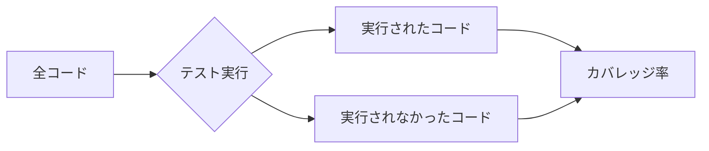

# カバレッジ

## 📋 概要

| 項目 | 内容 |
|------|------|
| 所要時間 | 30分 |
| 難易度 | [中級] |
| 前提知識 | 単体テスト |

## 🎯 なぜこれを学ぶのか

コードカバレッジは、テストがコードをどれだけ網羅しているかを示す指標です。カバレッジを測定することで、テストの不足を発見できます。

## 📚 学習内容

### 1. カバレッジとは



**カバレッジ = テストで実行されたコードの割合**

### 2. カバレッジの種類

| 種類 | 説明 |
|------|------|
| 行カバレッジ | 実行された行の割合 |
| ブランチカバレッジ | 実行された分岐の割合 |
| 関数カバレッジ | 呼び出された関数の割合 |
| 文カバレッジ | 実行された文の割合 |

### 3. カバレッジの測定

```bash
# Vitestでカバレッジを測定
npm install @vitest/coverage-v8 -D

# 実行
npx vitest run --coverage
```

```typescript
// vitest.config.ts
import { defineConfig } from 'vitest/config';

export default defineConfig({
  test: {
    coverage: {
      provider: 'v8',
      reporter: ['text', 'html'],
      exclude: ['node_modules/', 'test/'],
    },
  },
});
```

### 4. カバレッジレポートの読み方

```
----------------------|---------|----------|---------|---------|
File                  | % Stmts | % Branch | % Funcs | % Lines |
----------------------|---------|----------|---------|---------|
All files             |   85.71 |    66.67 |     100 |   85.71 |
 math.ts              |     100 |      100 |     100 |     100 |
 userService.ts       |   71.43 |       50 |     100 |   71.43 |
----------------------|---------|----------|---------|---------|
```

### 5. カバレッジの例

```typescript
// カバレッジ50%の例
function greet(name: string, formal: boolean): string {
  if (formal) {
    return `Hello, Mr./Ms. ${name}`;  // ← テストされていない
  }
  return `Hi, ${name}!`;  // ← テストされている
}

test('カジュアルな挨拶', () => {
  expect(greet('Alice', false)).toBe('Hi, Alice!');
});
// formal = true のケースがテストされていない

// カバレッジ100%にするには
test('フォーマルな挨拶', () => {
  expect(greet('Alice', true)).toBe('Hello, Mr./Ms. Alice');
});
```

### 6. カバレッジの目安

| カバレッジ | 評価 | 説明 |
|-----------|------|------|
| 80%以上 | 良い | 一般的な目標値 |
| 60-80% | 許容範囲 | 重要な部分はカバー |
| 60%未満 | 要改善 | テスト不足 |

### 7. カバレッジの注意点

```
⚠️ カバレッジ100% ≠ バグがない

// カバレッジ100%でもバグがある例
function add(a: number, b: number): number {
  return a * b; // バグ！足し算なのに掛け算
}

test('add', () => {
  expect(add(2, 2)).toBe(4); // たまたま通る
});
```

**カバレッジは品質の1指標であり、絶対的な基準ではない**

### 8. ベストプラクティス

```
✅ 良いアプローチ
- 重要なビジネスロジックを優先的にカバー
- 分岐を意識してテスト
- カバレッジを継続的に計測

❌ 避けるべきこと
- カバレッジ100%を目的にする
- 意味のないテストを書く
- カバレッジ率だけで品質を判断
```

### 9. CIでのカバレッジチェック

```yaml
# .github/workflows/test.yml
name: Test
on: [push, pull_request]
jobs:
  test:
    runs-on: ubuntu-latest
    steps:
      - uses: actions/checkout@v4
      - uses: actions/setup-node@v4
      - run: npm ci
      - run: npm run test:coverage
      - name: Check coverage
        run: |
          coverage=$(cat coverage/coverage-summary.json | jq '.total.lines.pct')
          if (( $(echo "$coverage < 80" | bc -l) )); then
            echo "Coverage is below 80%"
            exit 1
          fi
```

## ✅ まとめ

| 概念 | ポイント |
|------|---------|
| カバレッジ | テストで実行されたコードの割合 |
| 目安 | 80%程度を目標に |
| 注意 | 100%でもバグがないとは限らない |

## 💬 考えてみよう

```
Q: カバレッジが高いとバグがないと言えますか？
Q: カバレッジを上げるべきでない場合はありますか？
Q: ブランチカバレッジが重要な理由は何ですか？
```

## 🔗 次のステップ

テストと品質カテゴリを修了しました！
[実践課題](./exercises/)に取り組んでから、[セキュリティ基礎](../06-security-basics/)に進んでください。

---

**著作権表示**

Copyright © 2024 Honeycome Inc. All rights reserved.

本コンテンツは、Honeycome Inc.の所有物です。無断での複製、配布、転載を禁止します。
詳細は[利用規約](../../docs/terms-of-use.md)をご覧ください。
