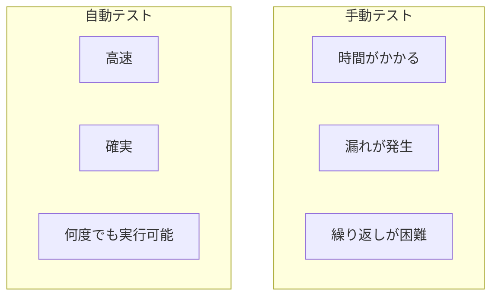

# 05. テストと品質

## 概要

**学習日数**: 2-3日

コードの品質を担保するためのテスト手法を学びます。単体テスト、テスト駆動開発（TDD）、コードカバレッジについて理解します。

## なぜ学ぶ必要があるのか

### この技術が解決する問題

### 実務での重要性

- **品質保証**: バグを早期発見し、本番環境での問題を防ぐ
- **リファクタリングの安心**: テストがあれば安心してコードを変更できる
- **ドキュメント**: テストコードは仕様書の役割も果たす

### AI時代における重要性

- **AI生成コードの検証**: テストでAIの出力が正しいか確認
- **TDDでAI活用**: テストを先に書き、AIにコードを生成させる

## 学習内容

| No | コンテンツ | 難易度 | 内容 |
|----|------------|--------|------|
| 01 | [テストの種類](05-testing-quality-01.md) | [基礎] | 単体テスト、結合テスト、E2Eテスト |
| 02 | [単体テスト](05-testing-quality-02.md) | [基礎] | Jest、Vitestの使い方 |
| 03 | [TDD](05-testing-quality-03.md) | [中級] | テスト駆動開発の基礎 |
| 04 | [カバレッジ](05-testing-quality-04.md) | [中級] | コードカバレッジの測定 |

## 学習目標

- [ ] テストの種類と目的を説明できる
- [ ] Jest/Vitestで単体テストを書ける
- [ ] TDDのサイクルを実践できる
- [ ] コードカバレッジを測定できる

## 参考リソース

- [Jest公式ドキュメント](https://jestjs.io/ja/)
- [Vitest公式ドキュメント](https://vitest.dev/)

---

**著作権表示**

Copyright © 2024 Honeycome Inc. All rights reserved.

本コンテンツは、Honeycome Inc.の所有物です。無断での複製、配布、転載を禁止します。
詳細は[利用規約](../../../docs/terms-of-use.md)をご覧ください。
