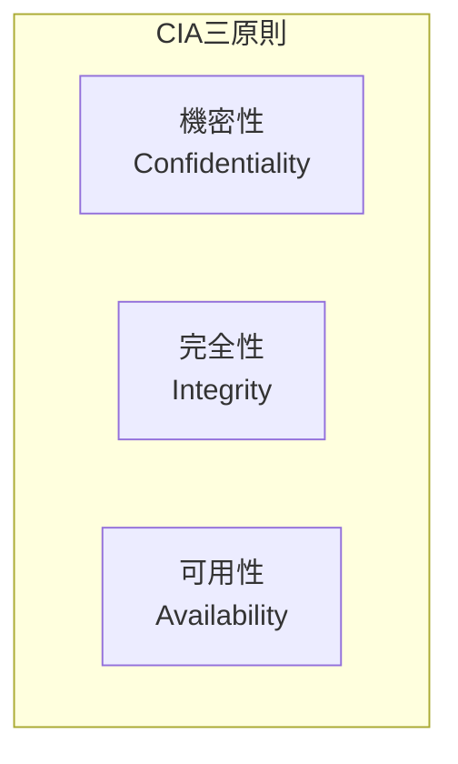
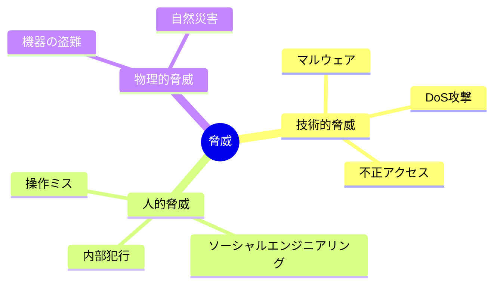
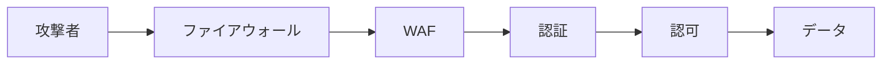

# セキュリティ基本概念

## 📋 概要

| 項目 | 内容 |
|------|------|
| 所要時間 | 30分 |
| 難易度 | [基礎] |
| 前提知識 | なし |

## 🎯 なぜこれを学ぶのか

セキュリティの基本を知らないと、脆弱なシステムを作ってしまいます。情報漏洩やサービス停止は、企業の信頼を大きく損なう可能性があります。

## 📚 学習内容

### 1. CIA三原則



| 原則 | 説明 | 脅威例 |
|------|------|--------|
| 機密性 | 許可された人だけがアクセス | 情報漏洩、盗聴 |
| 完全性 | データが改ざんされていない | データ改ざん、なりすまし |
| 可用性 | 必要なときに利用できる | DoS攻撃、システム障害 |

### 2. 脅威の種類



### 3. セキュリティの基本原則

#### 最小権限の原則

必要最小限の権限だけを与える。

```typescript
// ❌ 悪い例: すべてのデータにアクセスできる
const user = { role: 'admin', permissions: ['*'] };

// ✅ 良い例: 必要な権限だけ
const user = { role: 'editor', permissions: ['read', 'write'] };
```

#### 多層防御

複数の防御層を設ける。



#### 信頼境界

外部からの入力はすべて信頼しない。

### 4. 開発者が意識すべきこと

```
✅ セキュアな開発
- 入力は必ず検証
- 出力はエスケープ
- 機密情報は暗号化
- エラーメッセージに詳細を含めない
- ログに機密情報を出力しない

❌ 避けるべきこと
- ハードコードされたパスワード
- 暗号化なしの通信
- 安易なエラー処理
- 過剰な権限付与
```

## ✅ まとめ

| 概念 | ポイント |
|------|---------|
| CIA | 機密性、完全性、可用性 |
| 最小権限 | 必要最小限の権限 |
| 多層防御 | 複数の防御層 |
| 信頼境界 | 外部入力は信頼しない |

## 🔗 次のコンテンツ

[OWASP Top 10](06-security-basics-02.md)に進んでください。
