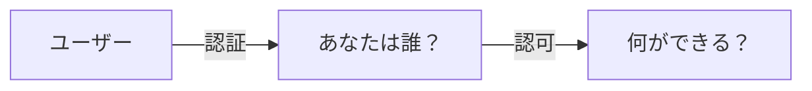
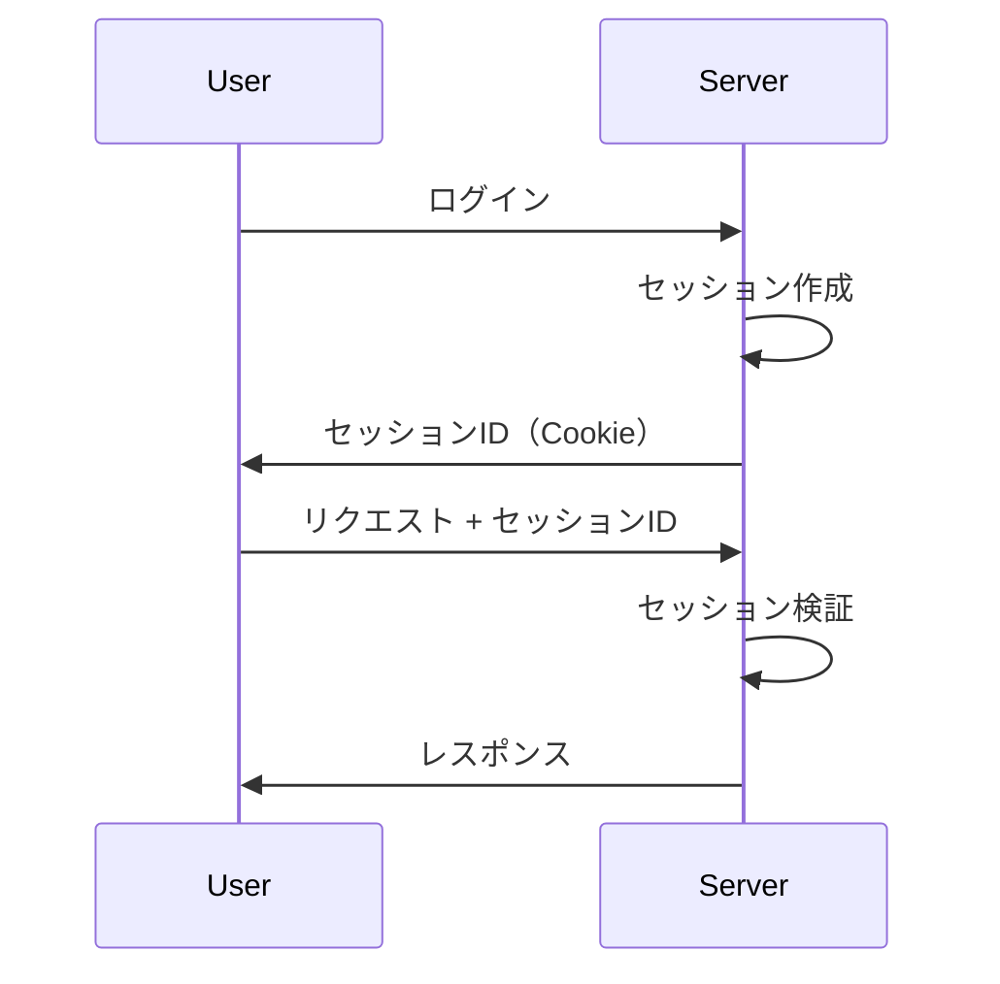
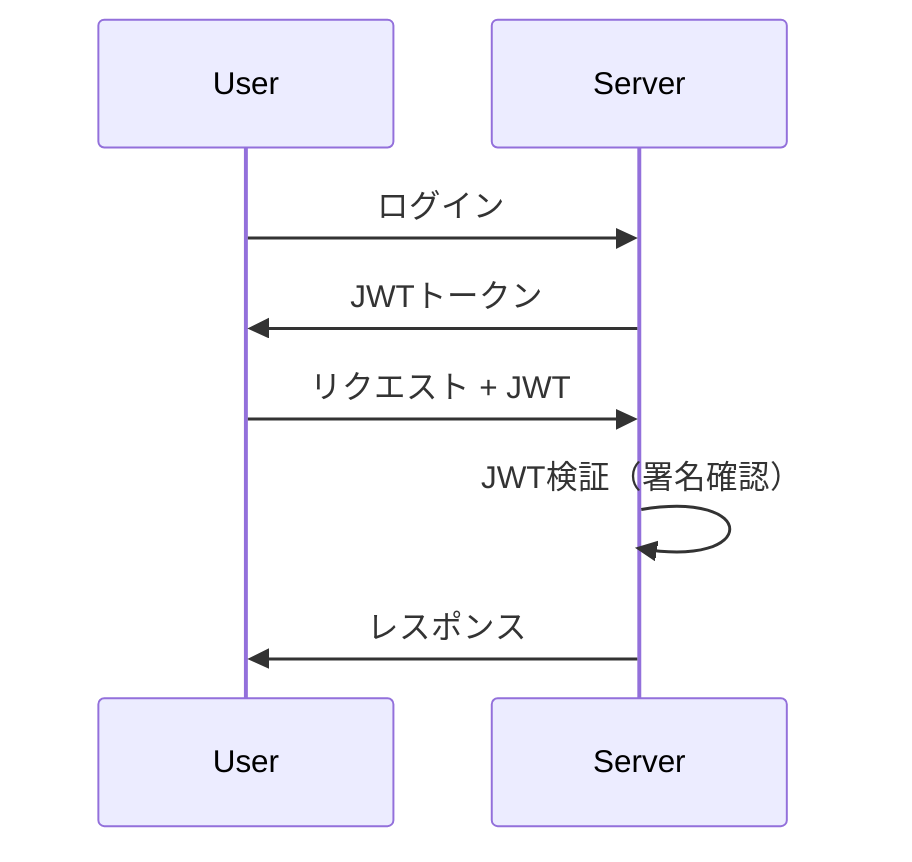
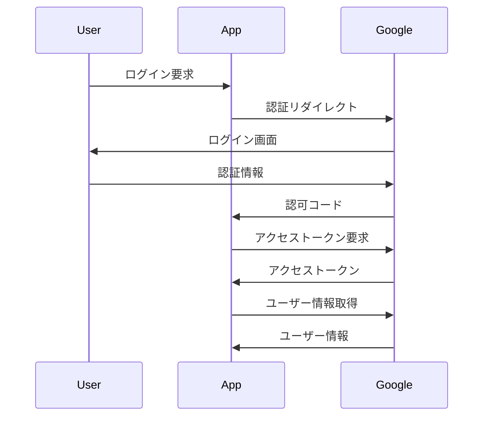
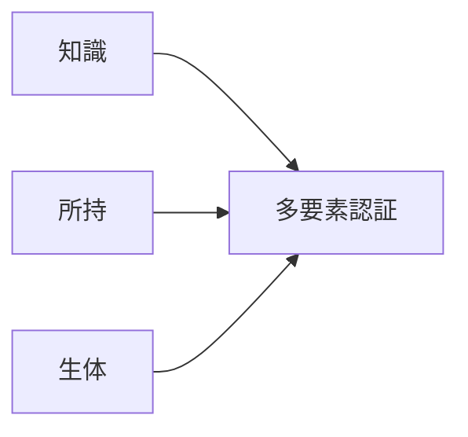

# 認証・認可

## 📋 概要

| 項目 | 内容 |
|------|------|
| 所要時間 | 45分 |
| 難易度 | [中級] |
| 前提知識 | OWASP Top 10 |

## 🎯 なぜこれを学ぶのか

認証と認可は、セキュリティの基盤です。「誰であるか」と「何ができるか」を正しく制御することで、不正アクセスを防ぎます。

## 📚 学習内容

### 1. 認証と認可の違い



| 概念 | 説明 | 例 |
|------|------|-----|
| 認証 | 本人確認 | ログイン |
| 認可 | 権限確認 | 管理者のみアクセス可 |

### 2. 認証方式

#### パスワード認証

```typescript
// パスワードのハッシュ化（bcrypt）
import bcrypt from 'bcrypt';

// 保存時
const hash = await bcrypt.hash(password, 10);

// 検証時
const isValid = await bcrypt.compare(password, hash);
```

#### セッション認証



#### JWT（JSON Web Token）



```typescript
import jwt from 'jsonwebtoken';

// トークン発行
const token = jwt.sign(
  { userId: user.id, role: user.role },
  process.env.JWT_SECRET,
  { expiresIn: '1h' }
);

// トークン検証
const payload = jwt.verify(token, process.env.JWT_SECRET);
```

### 3. OAuth 2.0



### 4. 認可（Authorization）

#### ロールベースアクセス制御（RBAC）

```typescript
const roles = {
  admin: ['read', 'write', 'delete', 'manage'],
  editor: ['read', 'write'],
  viewer: ['read'],
};

function hasPermission(userRole: string, action: string): boolean {
  return roles[userRole]?.includes(action) ?? false;
}

// 使用
if (!hasPermission(user.role, 'delete')) {
  throw new Error('Permission denied');
}
```

#### ミドルウェアでの認可

```typescript
function requireRole(role: string) {
  return (req, res, next) => {
    if (req.user.role !== role) {
      return res.status(403).json({ error: 'Forbidden' });
    }
    next();
  };
}

// 使用
app.delete('/api/users/:id', requireRole('admin'), deleteUser);
```

### 5. 多要素認証（MFA）



| 要素 | 例 |
|------|-----|
| 知識 | パスワード、PIN |
| 所持 | スマホ、セキュリティキー |
| 生体 | 指紋、顔認証 |

### 6. ベストプラクティス

```
✅ パスワード
- 8文字以上、複雑さを要求
- bcryptでハッシュ化
- ソルトを使用

✅ セッション
- HTTPSのみでCookie送信
- セッションタイムアウト
- ログアウト時に破棄

✅ JWT
- 短い有効期限
- 機密情報を含めない
- 署名を必ず検証
```

## ✅ まとめ

| 概念 | ポイント |
|------|---------|
| 認証 | 本人確認（パスワード、JWT） |
| 認可 | 権限確認（RBAC） |
| MFA | 複数要素で強化 |

## 🔗 次のコンテンツ

[セキュアコーディング](06-security-basics-04.md)に進んでください。
