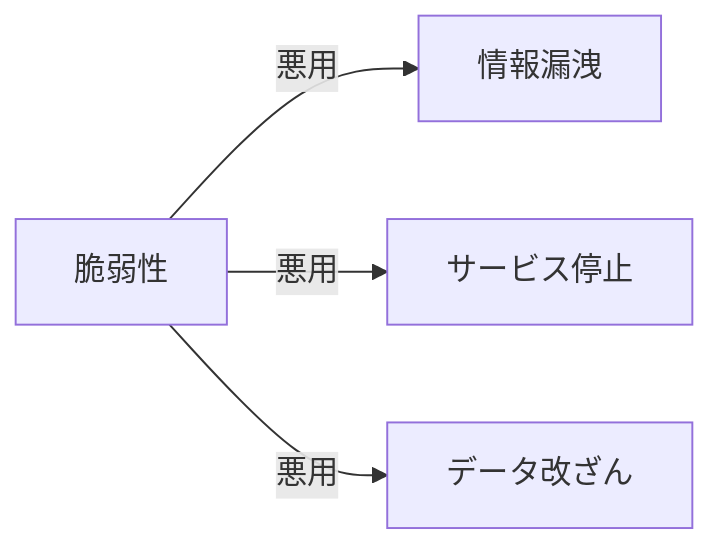

# 06. セキュリティ基礎

## 概要

**学習日数**: 1-2日

安全なシステムを作るためのセキュリティの基礎を学びます。OWASP Top 10、認証・認可、セキュアコーディングについて理解します。

## なぜ学ぶ必要があるのか

### この技術が解決する問題

### 実務での重要性

- **法的責任**: 個人情報漏洩は法的な問題に発展
- **信頼**: セキュリティ問題は企業の信頼を失う
- **コスト**: 事後対応は予防の何倍ものコストがかかる

### AI時代における重要性

- **AI生成コードの脆弱性**: AIは脆弱なコードを生成することがある
- **セキュリティレビュー**: AI生成コードのセキュリティを確認

## 学習内容

| No | コンテンツ | 難易度 | 内容 |
|----|------------|--------|------|
| 01 | [セキュリティ基本概念](06-security-basics-01.md) | [基礎] | 機密性、完全性、可用性 |
| 02 | [OWASP Top 10](06-security-basics-02.md) | [中級] | よくある脆弱性 |
| 03 | [認証・認可](06-security-basics-03.md) | [中級] | 認証と認可の違い |
| 04 | [セキュアコーディング](06-security-basics-04.md) | [中級] | 入力検証、出力エスケープ |

## 学習目標

- [ ] セキュリティの基本概念を説明できる
- [ ] OWASP Top 10の脆弱性を理解している
- [ ] 認証と認可の違いを説明できる
- [ ] 基本的なセキュアコーディングができる

## 参考リソース

- [OWASP](https://owasp.org/)
- [IPA セキュリティ](https://www.ipa.go.jp/security/)

---

**著作権表示**

Copyright © 2024 Honeycome Inc. All rights reserved.

本コンテンツは、Honeycome Inc.の所有物です。無断での複製、配布、転載を禁止します。
詳細は[利用規約](../../../docs/terms-of-use.md)をご覧ください。
