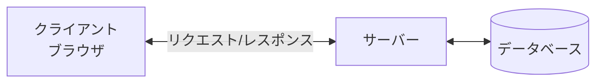
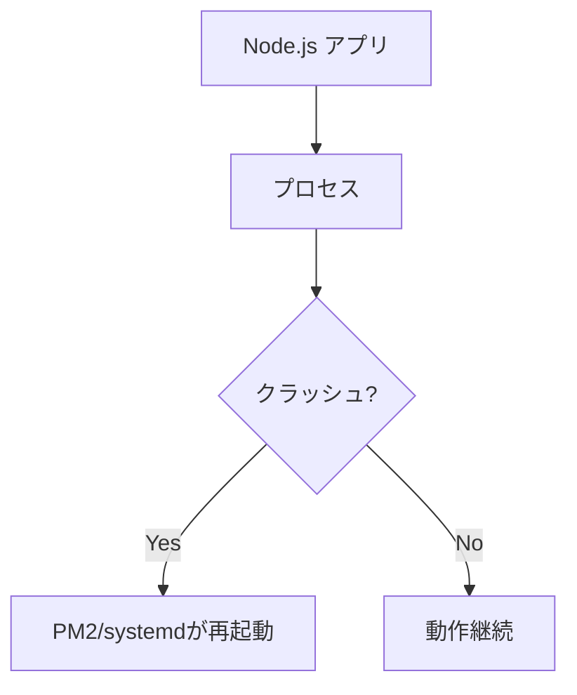

# サーバー基礎

## 📋 概要

| 項目 | 内容 |
|------|------|
| 所要時間 | 30分 |
| 難易度 | [基礎] |
| 前提知識 | なし |

## 🎯 なぜこれを学ぶのか

アプリケーションはサーバー上で動作します。サーバーの基礎を理解することで、デプロイやトラブルシューティングができるようになります。

## 📚 学習内容

### 1. サーバーとは



**サーバー** = クライアントからのリクエストに応答するコンピュータ

### 2. サーバーの種類

| 種類 | 役割 | 例 |
|------|------|-----|
| Webサーバー | HTTPリクエストの処理 | Nginx, Apache |
| アプリケーションサーバー | ビジネスロジックの実行 | Node.js, Java |
| データベースサーバー | データの保存・検索 | PostgreSQL, MySQL |

### 3. Linux基礎コマンド

```bash
# ディレクトリ操作
ls -la        # ファイル一覧
cd /path/to   # ディレクトリ移動
pwd           # 現在のパス

# ファイル操作
cat file.txt  # ファイル表示
less file.txt # ページング表示
tail -f log   # リアルタイム表示

# プロセス管理
ps aux        # プロセス一覧
top           # リソース監視
kill PID      # プロセス終了

# ネットワーク
curl URL      # HTTPリクエスト
netstat -tlnp # ポート確認
```

### 4. プロセス管理



```bash
# PM2でNode.jsアプリを管理
pm2 start app.js
pm2 list
pm2 logs
pm2 restart app
```

## ✅ まとめ

| 概念 | ポイント |
|------|---------|
| サーバー | リクエストを処理 |
| Linux | 基本コマンドを覚える |
| プロセス | 管理ツールで自動復旧 |

## 🔗 次のコンテンツ

[ネットワーク基礎](07-infrastructure-basics-02.md)に進んでください。
