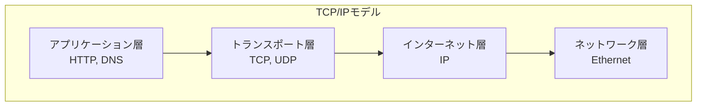
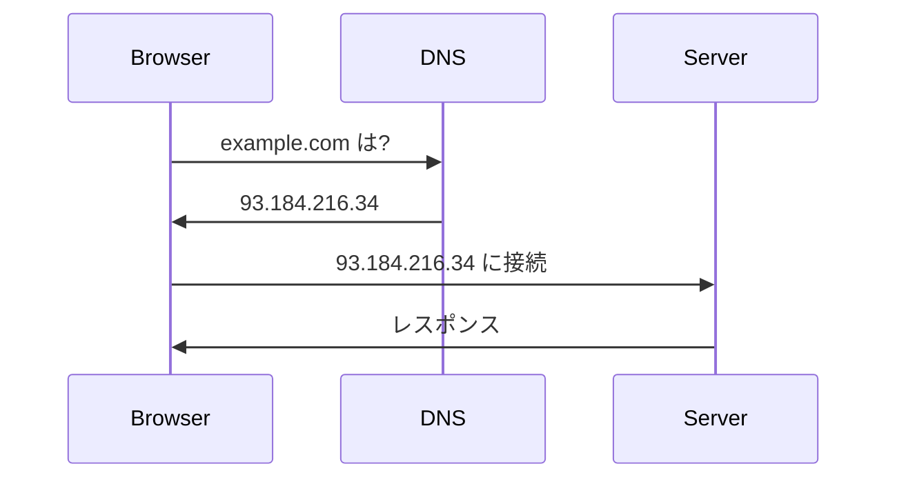
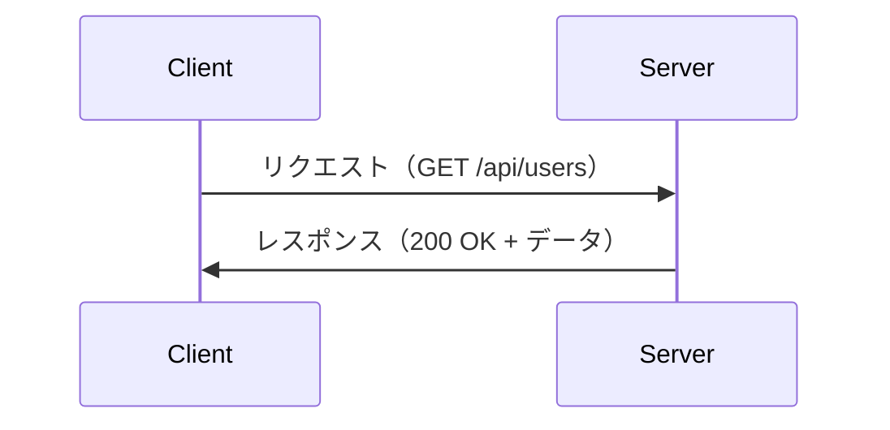
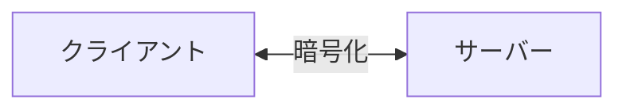

# ネットワーク基礎

## 📋 概要

| 項目 | 内容 |
|------|------|
| 所要時間 | 45分 |
| 難易度 | [基礎] |
| 前提知識 | サーバー基礎 |

## 🎯 なぜこれを学ぶのか

Webアプリケーションはネットワーク上で動作します。TCP/IP、DNS、HTTPの基礎を理解することで、問題解決能力が向上します。

## 📚 学習内容

### 1. TCP/IPモデル



### 2. IPアドレス

| 種類 | 説明 | 例 |
|------|------|-----|
| IPv4 | 32ビット | 192.168.1.1 |
| IPv6 | 128ビット | 2001:db8::1 |
| プライベート | 内部ネットワーク | 10.x, 172.16-31.x, 192.168.x |
| パブリック | インターネット | その他 |

### 3. ポート番号

| ポート | プロトコル |
|:------:|----------|
| 22 | SSH |
| 80 | HTTP |
| 443 | HTTPS |
| 3000 | 開発サーバー（慣習） |
| 5432 | PostgreSQL |
| 3306 | MySQL |

### 4. DNS



**DNS** = ドメイン名をIPアドレスに変換

```bash
# DNSの確認
nslookup example.com
dig example.com
```

### 5. HTTP/HTTPS



#### HTTPメソッド

| メソッド | 用途 |
|---------|------|
| GET | データ取得 |
| POST | データ作成 |
| PUT | データ更新（全体） |
| PATCH | データ更新（部分） |
| DELETE | データ削除 |

#### ステータスコード

| コード | 意味 |
|:------:|------|
| 200 | 成功 |
| 201 | 作成成功 |
| 400 | リクエストエラー |
| 401 | 認証エラー |
| 403 | 権限エラー |
| 404 | 見つからない |
| 500 | サーバーエラー |

### 6. HTTPS



**HTTPS** = HTTP + TLS（暗号化）

- データの盗聴を防ぐ
- データの改ざんを検出
- サーバーの正当性を確認

## ✅ まとめ

| 概念 | ポイント |
|------|---------|
| IP | ネットワーク上のアドレス |
| DNS | ドメイン名をIPに変換 |
| HTTP | Webの通信プロトコル |
| HTTPS | 暗号化されたHTTP |

## 🔗 次のコンテンツ

[クラウド基礎](07-infrastructure-basics-03.md)に進んでください。

---

**著作権表示**

Copyright © 2024 Honeycome Inc. All rights reserved.

本コンテンツは、Honeycome Inc.の所有物です。無断での複製、配布、転載を禁止します。
詳細は[利用規約](../../docs/terms-of-use.md)をご覧ください。
