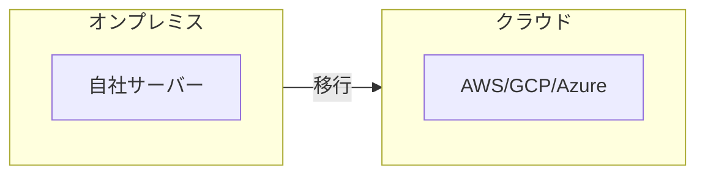
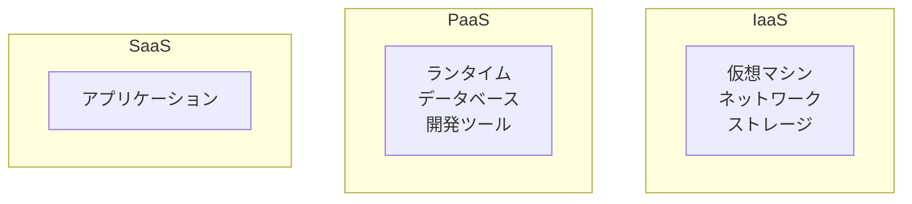
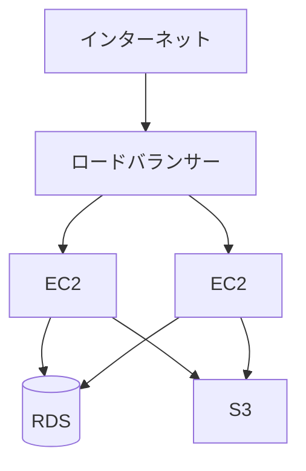

# クラウド基礎

## 📋 概要

| 項目 | 内容 |
|------|------|
| 所要時間 | 45分 |
| 難易度 | [基礎] |
| 前提知識 | ネットワーク基礎 |

## 🎯 なぜこれを学ぶのか

現代のアプリケーションのほとんどはクラウド上で動作します。クラウドの基本概念を理解することで、インフラ設計や運用ができるようになります。

## 📚 学習内容

### 1. クラウドとは

**クラウド** = インターネット経由で利用するコンピューティングリソース

### 2. クラウドのメリット

| 観点 | オンプレミス | クラウド |
|------|------------|---------|
| 初期費用 | 高い | 低い |
| スケーリング | 時間がかかる | 即座に可能 |
| 運用負担 | 大きい | 小さい |
| 柔軟性 | 低い | 高い |

### 3. サービスモデル

| モデル | 説明 | 例 |
|--------|------|-----|
| IaaS | インフラを提供 | EC2, GCE |
| PaaS | プラットフォームを提供 | Heroku, App Engine |
| SaaS | アプリケーションを提供 | Gmail, Slack |

### 4. 主要サービス（AWS）

| カテゴリ | サービス | 説明 |
|---------|---------|------|
| コンピューティング | EC2 | 仮想サーバー |
| コンピューティング | Lambda | サーバーレス関数 |
| ストレージ | S3 | オブジェクトストレージ |
| データベース | RDS | マネージドDB |
| ネットワーク | VPC | 仮想ネットワーク |
| コンテナ | ECS/EKS | コンテナオーケストレーション |

### 5. 基本的なアーキテクチャ

### 6. 料金体系

| 要素 | 課金方式 |
|------|---------|
| コンピューティング | 時間/秒単位 |
| ストレージ | GB単位 |
| データ転送 | GB単位（アウトバウンド） |
| リクエスト | リクエスト数 |

**コスト最適化**:
- 不要なリソースを削除
- 適切なサイズを選択
- リザーブドインスタンス

## ✅ まとめ

| 概念 | ポイント |
|------|---------|
| クラウド | オンデマンドでリソースを利用 |
| IaaS/PaaS/SaaS | 管理範囲が異なる |
| 料金 | 使った分だけ課金 |

## 🔗 次のコンテンツ

[Docker基礎](07-infrastructure-basics-04.md)に進んでください。
