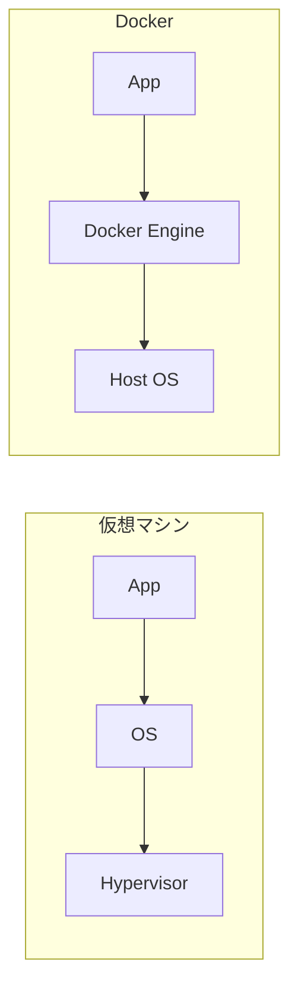

# Docker基礎

## 📋 概要

| 項目 | 内容 |
|------|------|
| 所要時間 | 60分 |
| 難易度 | [中級] |
| 前提知識 | クラウド基礎 |

## 🎯 なぜこれを学ぶのか

Dockerは現代の開発・デプロイの標準です。環境の差異をなくし、どこでも同じように動作するアプリケーションを作れます。

## 📚 学習内容

### 1. Dockerとは



**Docker** = アプリケーションをコンテナとしてパッケージ化

### 2. 基本概念

| 概念 | 説明 |
|------|------|
| イメージ | アプリの設計図 |
| コンテナ | イメージから起動したインスタンス |
| Dockerfile | イメージを作る手順書 |
| レジストリ | イメージの保管場所 |

### 3. 基本コマンド

```bash
# イメージの操作
docker pull nginx              # イメージ取得
docker images                  # イメージ一覧
docker rmi nginx               # イメージ削除

# コンテナの操作
docker run -d -p 80:80 nginx   # 起動
docker ps                      # 実行中のコンテナ
docker ps -a                   # 全コンテナ
docker stop <container_id>     # 停止
docker rm <container_id>       # 削除

# ログ・接続
docker logs <container_id>     # ログ表示
docker exec -it <container_id> bash  # 接続
```

### 4. Dockerfile

```dockerfile
# ベースイメージ
FROM node:20-slim

# 作業ディレクトリ
WORKDIR /app

# 依存関係のコピー・インストール
COPY package*.json ./
RUN npm ci

# アプリケーションのコピー
COPY . .

# ビルド
RUN npm run build

# ポート
EXPOSE 3000

# 実行コマンド
CMD ["npm", "start"]
```

### 5. イメージのビルド

```bash
# ビルド
docker build -t myapp:1.0 .

# タグ付け
docker tag myapp:1.0 myregistry/myapp:1.0

# プッシュ
docker push myregistry/myapp:1.0
```

### 6. よく使うオプション

```bash
docker run \
  -d \                          # バックグラウンド実行
  --name myapp \                # コンテナ名
  -p 3000:3000 \                # ポートマッピング
  -v $(pwd)/data:/app/data \    # ボリュームマウント
  -e NODE_ENV=production \      # 環境変数
  --restart unless-stopped \    # 自動再起動
  myapp:1.0
```

### 7. マルチステージビルド

```dockerfile
# ビルドステージ
FROM node:20 AS builder
WORKDIR /app
COPY package*.json ./
RUN npm ci
COPY . .
RUN npm run build

# 実行ステージ（軽量イメージ）
FROM node:20-slim
WORKDIR /app
COPY --from=builder /app/dist ./dist
COPY --from=builder /app/node_modules ./node_modules
EXPOSE 3000
CMD ["node", "dist/index.js"]
```

### 8. Docker Compose（概要）

```yaml
# docker-compose.yml
version: '3.8'
services:
  app:
    build: .
    ports:
      - "3000:3000"
    environment:
      - DATABASE_URL=postgres://db:5432/app
    depends_on:
      - db
  
  db:
    image: postgres:15
    volumes:
      - pgdata:/var/lib/postgresql/data
    environment:
      - POSTGRES_PASSWORD=secret

volumes:
  pgdata:
```

```bash
docker compose up -d
docker compose logs
docker compose down
```

## ✅ まとめ

| 概念 | ポイント |
|------|---------|
| コンテナ | 軽量な仮想化 |
| イメージ | 不変の設計図 |
| Dockerfile | イメージ定義 |
| Compose | 複数コンテナ管理 |

## 🔗 次のステップ

インフラ基礎カテゴリを修了しました！
[実践課題](./exercises/)に取り組んでから、[CI/CD基礎](../08-ci-cd-basics/)に進んでください。

---

**著作権表示**

Copyright © 2024 Honeycome Inc. All rights reserved.

本コンテンツは、Honeycome Inc.の所有物です。無断での複製、配布、転載を禁止します。
詳細は[利用規約](../../docs/terms-of-use.md)をご覧ください。
