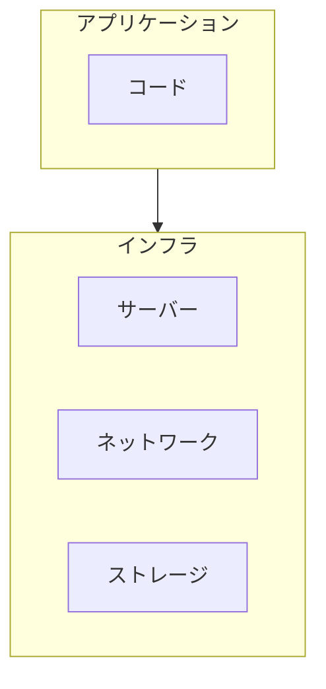

# 07. インフラ基礎

## 概要

**学習日数**: 2-3日

システムを動かす基盤について学びます。サーバー、ネットワーク、クラウド、Dockerの基礎を理解します。

## なぜ学ぶ必要があるのか

### この技術が解決する問題

アプリケーションはインフラなしには動きません。インフラを理解することで：

- **問題の原因特定**: アプリの問題かインフラの問題かを切り分けられる
- **パフォーマンス最適化**: インフラレベルでの最適化ができる
- **コスト削減**: 適切なインフラ選択でコストを削減

### 実務での重要性

- **デプロイ**: 自分で書いたコードをデプロイできる
- **トラブルシューティング**: 問題発生時に原因を特定できる
- **コミュニケーション**: インフラチームとの会話ができる

## 学習内容

| No | コンテンツ | 難易度 | 内容 |
|----|------------|--------|------|
| 01 | [サーバー基礎](07-infrastructure-basics-01.md) | [基礎] | サーバーの基礎 |
| 02 | [ネットワーク基礎](07-infrastructure-basics-02.md) | [基礎] | TCP/IP、DNS、HTTP |
| 03 | [クラウド基礎](07-infrastructure-basics-03.md) | [基礎] | AWS/GCP/Azureの基本概念 |
| 04 | [Docker基礎](07-infrastructure-basics-04.md) | [中級] | コンテナ、イメージ、Dockerfile |

## 学習目標

- [ ] サーバーの基本概念を説明できる
- [ ] TCP/IP、DNS、HTTPの基本を理解している
- [ ] クラウドの基本概念を説明できる
- [ ] Dockerでコンテナを起動できる

## 参考リソース

- [Docker公式ドキュメント](https://docs.docker.com/)
- [AWS入門](https://aws.amazon.com/jp/getting-started/)

---

**著作権表示**

Copyright © 2024 Honeycome Inc. All rights reserved.

本コンテンツは、Honeycome Inc.の所有物です。無断での複製、配布、転載を禁止します。
詳細は[利用規約](../../../docs/terms-of-use.md)をご覧ください。
