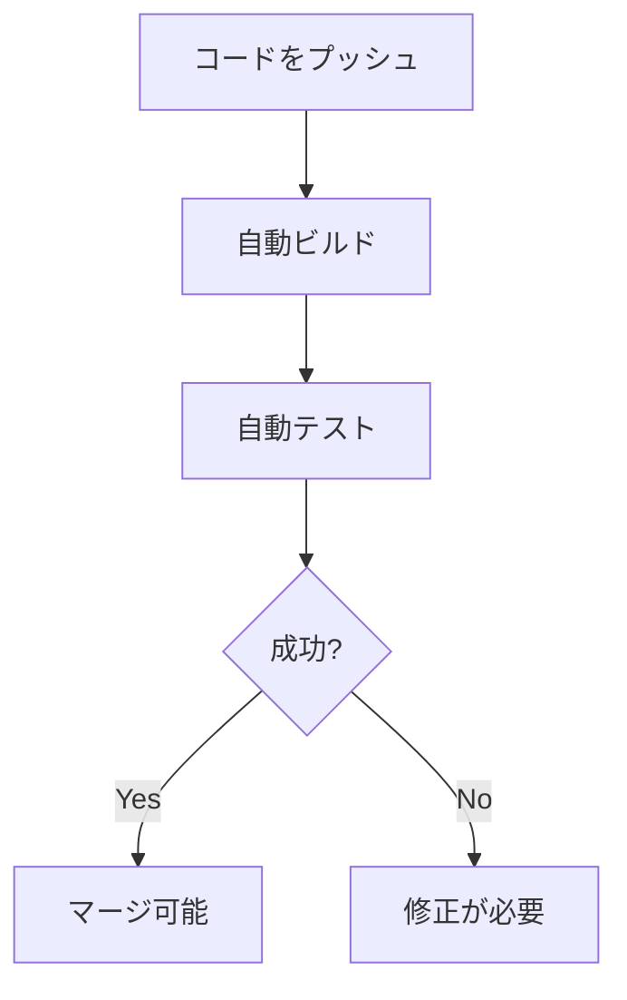

# CI/CDの概念

## 📋 概要

| 項目 | 内容 |
|------|------|
| 所要時間 | 30分 |
| 難易度 | [基礎] |
| 前提知識 | Git基礎 |

## 🎯 なぜこれを学ぶのか

CI/CDは、コードの品質を保ちながら素早くリリースするための仕組みです。手動作業を自動化することで、ミスを減らし、開発速度を向上させます。

## 📚 学習内容

### 1. CI/CDとは


| 用語 | 正式名称 | 説明 |
|------|---------|------|
| CI | Continuous Integration | 継続的インテグレーション |
| CD | Continuous Delivery | 継続的デリバリー |
| CD | Continuous Deployment | 継続的デプロイメント |

### 2. CI（継続的インテグレーション）



**CIの目的**:
- コードの統合を頻繁に行う
- 問題を早期発見
- コード品質の維持

### 3. CD（継続的デリバリー/デプロイメント）

| 種類 | 説明 |
|------|------|
| 継続的デリバリー | 本番デプロイ可能な状態を維持（手動デプロイ） |
| 継続的デプロイメント | 自動で本番環境にデプロイ |

### 4. CI/CDパイプライン


### 5. CI/CDツール

| ツール | 特徴 |
|--------|------|
| GitHub Actions | GitHubに統合、無料枠あり |
| GitLab CI | GitLabに統合 |
| CircleCI | 高速、並列実行 |
| Jenkins | 自己ホスト、高いカスタマイズ性 |

### 6. CI/CDのメリット

```
✅ メリット
- バグの早期発見
- リリース頻度の向上
- 手動作業の削減
- 品質の一貫性
- チームの生産性向上

❌ CI/CDがない場合
- 手動テストの漏れ
- デプロイミス
- リリースの遅延
- 本番環境でのバグ発覚
```

## ✅ まとめ

| 概念 | ポイント |
|------|---------|
| CI | 自動ビルド・テスト |
| CD | 自動デプロイ |
| パイプライン | 一連の自動化プロセス |

## 🔗 次のコンテンツ

[GitHub Actions](08-ci-cd-basics-02.md)に進んでください。

---

**著作権表示**

Copyright © 2024 Honeycome Inc. All rights reserved.

本コンテンツは、Honeycome Inc.の所有物です。無断での複製、配布、転載を禁止します。
詳細は[利用規約](../../docs/terms-of-use.md)をご覧ください。
