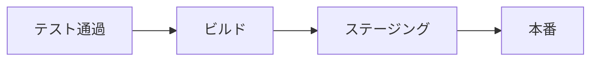

# 自動デプロイ

## 📋 概要

| 項目 | 内容 |
|------|------|
| 所要時間 | 30分 |
| 難易度 | [中級] |
| 前提知識 | 自動テスト |

## 🎯 なぜこれを学ぶのか

自動デプロイにより、テストが通ったコードを素早く本番環境にリリースできます。手動デプロイのミスを防ぎ、リリース頻度を向上させます。

## 📚 学習内容

### 1. デプロイパイプライン



### 2. Vercelへのデプロイ

```yaml
name: Deploy to Vercel

on:
  push:
    branches: [main]

jobs:
  deploy:
    runs-on: ubuntu-latest
    steps:
      - uses: actions/checkout@v4
      
      - name: Deploy to Vercel
        uses: amondnet/vercel-action@v25
        with:
          vercel-token: ${{ secrets.VERCEL_TOKEN }}
          vercel-org-id: ${{ secrets.VERCEL_ORG_ID }}
          vercel-project-id: ${{ secrets.VERCEL_PROJECT_ID }}
          vercel-args: '--prod'
```

### 3. AWS S3へのデプロイ（静的サイト）

```yaml
name: Deploy to S3

on:
  push:
    branches: [main]

jobs:
  deploy:
    runs-on: ubuntu-latest
    steps:
      - uses: actions/checkout@v4
      
      - name: Setup Node.js
        uses: actions/setup-node@v4
        with:
          node-version: '20'
      
      - name: Build
        run: |
          npm ci
          npm run build
      
      - name: Configure AWS credentials
        uses: aws-actions/configure-aws-credentials@v4
        with:
          aws-access-key-id: ${{ secrets.AWS_ACCESS_KEY_ID }}
          aws-secret-access-key: ${{ secrets.AWS_SECRET_ACCESS_KEY }}
          aws-region: ap-northeast-1
      
      - name: Deploy to S3
        run: aws s3 sync ./dist s3://${{ secrets.S3_BUCKET }} --delete
```

### 4. Dockerイメージのプッシュ

```yaml
name: Build and Push Docker

on:
  push:
    branches: [main]

jobs:
  build:
    runs-on: ubuntu-latest
    steps:
      - uses: actions/checkout@v4
      
      - name: Login to Docker Hub
        uses: docker/login-action@v3
        with:
          username: ${{ secrets.DOCKERHUB_USERNAME }}
          password: ${{ secrets.DOCKERHUB_TOKEN }}
      
      - name: Build and push
        uses: docker/build-push-action@v5
        with:
          push: true
          tags: user/app:latest,user/app:${{ github.sha }}
```

### 5. 環境ごとのデプロイ

```yaml
name: Deploy

on:
  push:
    branches:
      - main
      - develop

jobs:
  deploy:
    runs-on: ubuntu-latest
    environment: ${{ github.ref == 'refs/heads/main' && 'production' || 'staging' }}
    
    steps:
      - uses: actions/checkout@v4
      
      - name: Deploy
        run: |
          if [ "${{ github.ref }}" == "refs/heads/main" ]; then
            echo "Deploying to production"
            # 本番デプロイコマンド
          else
            echo "Deploying to staging"
            # ステージングデプロイコマンド
          fi
```

### 6. 手動承認

```yaml
jobs:
  deploy-staging:
    runs-on: ubuntu-latest
    steps:
      - run: echo "Deploy to staging"

  deploy-production:
    needs: deploy-staging
    runs-on: ubuntu-latest
    environment:
      name: production
      url: https://myapp.com
    steps:
      - run: echo "Deploy to production"
```

GitHubの Environment 設定で承認者を指定すると、本番デプロイ前に承認が必要になります。

### 7. ロールバック

```yaml
name: Rollback

on:
  workflow_dispatch:
    inputs:
      version:
        description: 'Version to rollback to'
        required: true

jobs:
  rollback:
    runs-on: ubuntu-latest
    steps:
      - name: Rollback
        run: |
          echo "Rolling back to ${{ github.event.inputs.version }}"
          # ロールバックコマンド
```

## ✅ まとめ

| 観点 | ポイント |
|------|---------|
| 自動化 | テスト通過後に自動デプロイ |
| 環境分離 | ステージング→本番 |
| 承認 | 本番前に手動承認も可能 |
| ロールバック | 問題時は素早く戻せる |

## 🔗 次のステップ

CI/CD基礎カテゴリを修了しました！
[実践課題](./exercises/)に取り組んでから、[AI駆動開発](../09-ai-driven-development/)に進んでください。

---

**著作権表示**

Copyright © 2024 Honeycome Inc. All rights reserved.

本コンテンツは、Honeycome Inc.の所有物です。無断での複製、配布、転載を禁止します。
詳細は[利用規約](../../docs/terms-of-use.md)をご覧ください。
