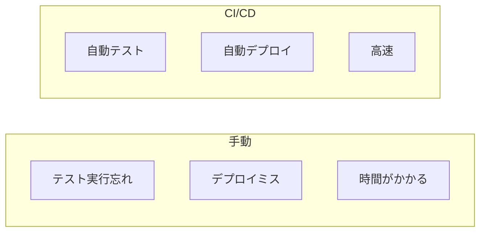

# 08. CI/CD基礎

## 概要

**学習日数**: 1-2日

開発を効率化するためのCI/CD（継続的インテグレーション/継続的デリバリー）を学びます。GitHub Actionsを使った自動テスト、自動デプロイについて理解します。

## なぜ学ぶ必要があるのか

### この技術が解決する問題

### 実務での重要性

- **品質向上**: プルリクエストごとに自動テスト
- **リリース速度**: 自動デプロイで素早くリリース
- **ヒューマンエラー削減**: 自動化でミスを防ぐ

## 学習内容

| No | コンテンツ | 難易度 | 内容 |
|----|------------|--------|------|
| 01 | [CI/CDの概念](08-ci-cd-basics-01.md) | [基礎] | 継続的インテグレーション、継続的デリバリー |
| 02 | [GitHub Actions](08-ci-cd-basics-02.md) | [基礎] | ワークフローの作成 |
| 03 | [自動テスト](08-ci-cd-basics-03.md) | [中級] | CIでのテスト実行 |
| 04 | [自動デプロイ](08-ci-cd-basics-04.md) | [中級] | 基本的なデプロイパイプライン |

## 学習目標

- [ ] CI/CDの概念を説明できる
- [ ] GitHub Actionsでワークフローを作成できる
- [ ] 自動テストを設定できる
- [ ] 基本的なデプロイパイプラインを構築できる

## 参考リソース

- [GitHub Actions公式ドキュメント](https://docs.github.com/ja/actions)

---

**著作権表示**

Copyright © 2024 Honeycome Inc. All rights reserved.

本コンテンツは、Honeycome Inc.の所有物です。無断での複製、配布、転載を禁止します。
詳細は[利用規約](../../../docs/terms-of-use.md)をご覧ください。
