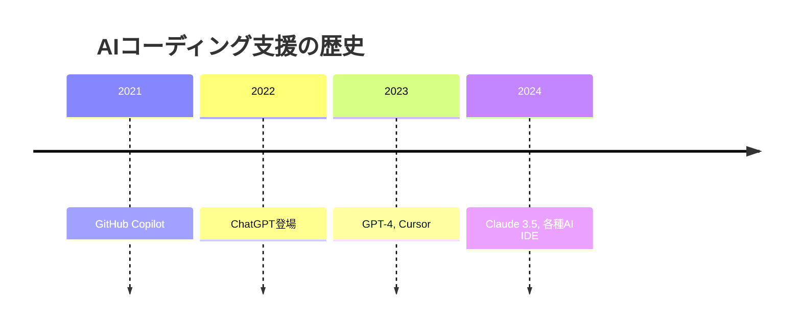
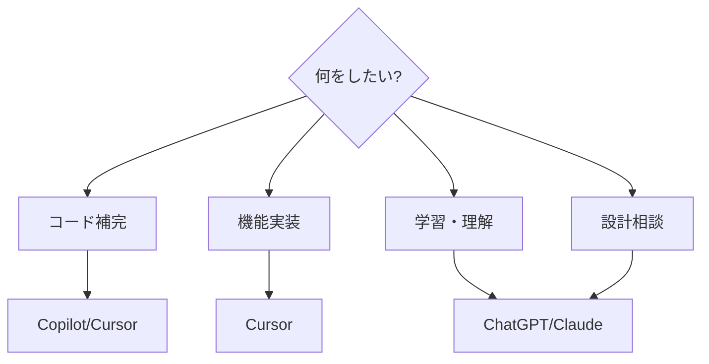

# AIツール概要

## 📋 概要

| 項目 | 内容 |
|------|------|
| 所要時間 | 30分 |
| 難易度 | [基礎] |
| 前提知識 | プログラミング基礎 |

## 🎯 なぜこれを学ぶのか

AI支援ツールは現代の開発に欠かせません。ツールの特徴を理解し、適切に活用することで、開発効率が大幅に向上します。

## 📚 学習内容

### 1. AIコーディングツールの進化



### 2. 主要ツール比較

| ツール | 特徴 | 用途 |
|--------|------|------|
| GitHub Copilot | コード補完に強い | エディタ内補完 |
| Cursor | AIファーストIDE | 全般的な開発 |
| ChatGPT | 汎用的、説明が得意 | 学習、設計相談 |
| Claude | 長いコンテキスト | 大規模コード理解 |

### 3. Cursor

**AIファーストなコードエディタ**

- コードベース全体を理解
- チャットでコード生成
- インライン編集
- ターミナル統合

### 4. GitHub Copilot

**コード補完に特化**

- リアルタイム補完
- 複数の候補を提示
- コメントからコード生成

### 5. ChatGPT / Claude

**汎用AIアシスタント**

- コードの説明
- 設計の相談
- 学習サポート
- バグの原因調査

### 6. ツールの使い分け



| シーン | 推奨ツール |
|--------|-----------|
| 日常的なコーディング | Cursor |
| 関数の補完 | Copilot |
| 新技術の学習 | ChatGPT/Claude |
| コードの説明を求める | ChatGPT/Claude |
| リファクタリング | Cursor |

### 7. 注意点

```
⚠️ AIを使う際の注意

1. AIは間違える
   - 出力は必ず検証
   - 基礎知識がないと間違いに気づけない

2. セキュリティ
   - 機密情報を入力しない
   - 生成コードの脆弱性をチェック

3. ライセンス
   - 生成コードの著作権に注意
   - 利用規約を確認

4. 依存しすぎない
   - 基礎力を維持する
   - AIなしでも書ける力を
```

## ✅ まとめ

| ツール | 強み |
|--------|------|
| Cursor | 全般的な開発支援 |
| Copilot | コード補完 |
| ChatGPT/Claude | 説明・学習・相談 |

## 🔗 次のコンテンツ

[Cursorの使い方](09-ai-driven-development-02.md)に進んでください。

---

**著作権表示**

Copyright © 2024 Honeycome Inc. All rights reserved.

本コンテンツは、Honeycome Inc.の所有物です。無断での複製、配布、転載を禁止します。
詳細は[利用規約](../../docs/terms-of-use.md)をご覧ください。
