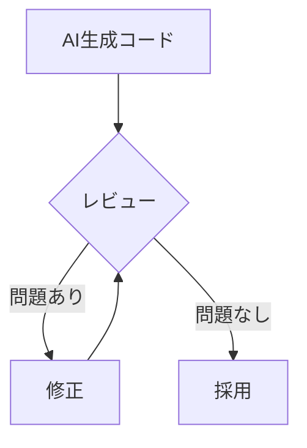
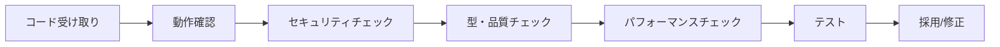

# AI生成コードのレビュー

## 📋 概要

| 項目 | 内容 |
|------|------|
| 所要時間 | 45分 |
| 難易度 | [中級] |
| 前提知識 | これまでの技術基礎 |

## 🎯 なぜこれを学ぶのか

**AIは間違える**。基礎知識がないとAIの間違いを見抜けません。これまで学んだ知識を活用して、AI生成コードをレビューするスキルを身につけます。

## 📚 学習内容

### 1. なぜレビューが必要か



**AIが生成するコードの問題**:
- セキュリティの脆弱性
- パフォーマンスの問題
- 古い/非推奨のAPI
- エッジケースの未考慮
- プロジェクトの規約違反

### 2. レビューチェックリスト

```
□ セキュリティ
  □ SQLインジェクション対策
  □ XSS対策
  □ 入力検証
  □ 機密情報のハードコード

□ 品質
  □ TypeScriptの型が適切
  □ エラーハンドリング
  □ エッジケースの考慮

□ パフォーマンス
  □ N+1クエリ
  □ メモリリーク
  □ 不要なループ

□ 保守性
  □ 命名が適切
  □ 関数が小さい
  □ DRY原則
```

### 3. セキュリティの問題を見抜く

```typescript
// ❌ AIが生成した脆弱なコード
async function getUser(id: string) {
  const query = `SELECT * FROM users WHERE id = '${id}'`;
  return await db.query(query);
}

// 問題: SQLインジェクション
// 修正: パラメータ化クエリを使用

// ✅ 修正後
async function getUser(id: string) {
  return await db.query('SELECT * FROM users WHERE id = $1', [id]);
}
```

### 4. 型の問題を見抜く

```typescript
// ❌ AIが生成した曖昧な型
async function fetchData(url: string): Promise<any> {
  const response = await fetch(url);
  return response.json();
}

// 問題: any型で型安全性がない
// 修正: 適切な型を定義

// ✅ 修正後
interface User {
  id: number;
  name: string;
  email: string;
}

async function fetchUser(id: number): Promise<User> {
  const response = await fetch(`/api/users/${id}`);
  if (!response.ok) {
    throw new Error('User not found');
  }
  return response.json() as Promise<User>;
}
```

### 5. エラーハンドリングの問題

```typescript
// ❌ AIが生成した不十分なコード
async function saveUser(user: User) {
  await db.insert('users', user);
  return { success: true };
}

// 問題: エラーハンドリングがない
// 修正: try-catchとエラー処理を追加

// ✅ 修正後
async function saveUser(user: User): Promise<{ success: boolean; error?: string }> {
  try {
    await db.insert('users', user);
    return { success: true };
  } catch (error) {
    console.error('Failed to save user:', error);
    return { success: false, error: 'Failed to save user' };
  }
}
```

### 6. パフォーマンスの問題

```typescript
// ❌ AIが生成したN+1問題のあるコード
async function getUsersWithOrders() {
  const users = await db.query('SELECT * FROM users');
  
  for (const user of users) {
    user.orders = await db.query(
      'SELECT * FROM orders WHERE user_id = $1',
      [user.id]
    );
  }
  
  return users;
}

// 問題: ユーザー数だけクエリが実行される（N+1）
// 修正: JOINまたは一括取得

// ✅ 修正後
async function getUsersWithOrders() {
  return await db.query(`
    SELECT 
      u.*,
      json_agg(o.*) as orders
    FROM users u
    LEFT JOIN orders o ON u.id = o.user_id
    GROUP BY u.id
  `);
}
```

### 7. レビューの手順



1. **まず動かしてみる**: 基本的な動作を確認
2. **セキュリティ**: OWASP Top 10の観点で確認
3. **型・品質**: TypeScriptの型、エラーハンドリング
4. **パフォーマンス**: N+1、メモリ
5. **テスト**: テストを書いて検証

### 8. AIにレビューを依頼する

```
このコードをセキュリティの観点でレビューしてください:

確認してほしい観点:
- SQLインジェクション
- XSS
- 認証・認可の不備
- 機密情報の漏洩

問題があれば、修正コードも示してください。

[コード]
```

## ✅ まとめ

| 観点 | チェックポイント |
|------|---------------|
| セキュリティ | SQLi, XSS, 入力検証 |
| 型 | any排除、適切な型定義 |
| エラー | try-catch、適切な処理 |
| パフォーマンス | N+1、メモリ |

## 🔗 次のコンテンツ

[AIと協働する開発フロー](09-ai-driven-development-05.md)に進んでください。
