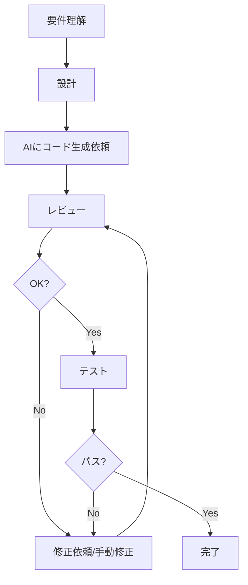
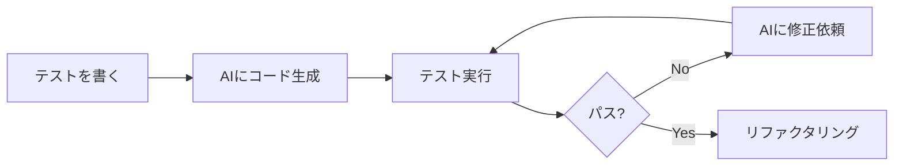

# AIと協働する開発フロー

## 📋 概要

| 項目 | 内容 |
|------|------|
| 所要時間 | 30分 |
| 難易度 | [中級] |
| 前提知識 | AI生成コードのレビュー |

## 🎯 なぜこれを学ぶのか

AIを効果的に活用するには、適切な開発フローが重要です。AIに任せることと自分でやることを明確にし、効率的に開発を進めます。

## 📚 学習内容

### 1. AI協働開発フロー



### 2. 人間とAIの役割分担

| 人間が担当 | AIが担当 |
|-----------|---------|
| 要件の理解・判断 | コードの生成 |
| 設計の決定 | ボイラープレート |
| コードレビュー | テストコードの雛形 |
| 最終的な品質判断 | ドキュメント生成 |

### 3. 実践的な開発の流れ

#### Step 1: 要件を明確にする

```
自分で考える:
- 何を実現したいか
- どんな制約があるか
- 使用する技術スタック
```

#### Step 2: AIに依頼

```
Cursorで:
「以下の要件でAPIを実装してください:
- [要件を具体的に記述]
- @src/models/User.ts を参照」
```

#### Step 3: レビューと修正

```
チェックポイント:
- セキュリティ
- 型の適切さ
- エラーハンドリング
- プロジェクトの規約
```

#### Step 4: テストで検証

```
AIに依頼:
「この関数のテストを書いてください」

または TDDで:
1. テストを先に書く
2. AIにコードを生成させる
3. テストで検証
```

### 4. TDDとAIの組み合わせ



**メリット**:
- テストで仕様を明確化
- AIの出力を自動検証
- 品質を担保

### 5. よくあるパターン

#### 新機能の実装

```
1. 設計を自分で考える
2. AIにスケルトンを生成させる
3. 詳細を自分で/AIで実装
4. テストで検証
```

#### バグ修正

```
1. 問題を特定（自分で）
2. AIに原因分析を依頼
3. 修正案をAIに生成させる
4. 修正案をレビュー
5. 採用または手動修正
```

#### リファクタリング

```
1. 改善点を特定（自分で）
2. AIにリファクタリングを依頼
3. 変更をレビュー
4. テストで動作確認
```

### 6. 効率的なコミュニケーション

```
❌ 非効率なやり取り
User: 「動かない」
AI: 「エラーメッセージを教えてください」
User: 「TypeError: ...」
AI: 「コードを見せてください」

✅ 効率的なやり取り
User: 「以下のエラーが発生します。
エラー: TypeError: Cannot read property 'map' of undefined
コード: [コード]
試したこと: console.logでdataを確認 → undefined」
```

## ✅ まとめ

| フェーズ | 人間 | AI |
|---------|------|-----|
| 要件理解 | ◯ | △ |
| 設計 | ◯ | △ |
| 実装 | △ | ◯ |
| レビュー | ◯ | △ |
| テスト | △ | ◯ |

## 🔗 次のコンテンツ

[AIの限界と注意点](09-ai-driven-development-06.md)に進んでください。
