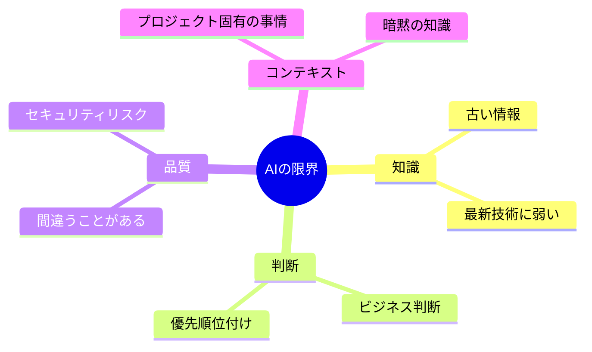
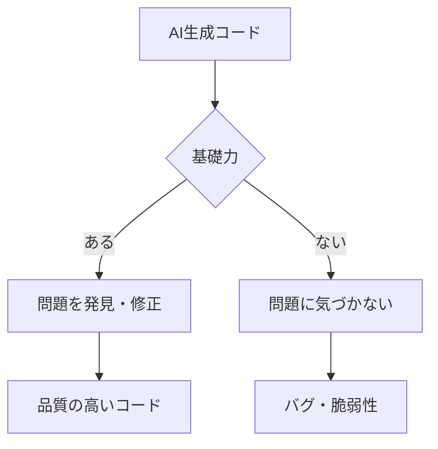

# AIの限界と注意点

## 📋 概要

| 項目 | 内容 |
|------|------|
| 所要時間 | 30分 |
| 難易度 | [基礎] |
| 前提知識 | AIと協働する開発フロー |

## 🎯 なぜこれを学ぶのか

AIを活用するには、その限界を理解することが重要です。AIに頼りすぎず、適切に活用するための知識を身につけます。

## 📚 学習内容

### 1. AIの限界



### 2. AIが苦手なこと

| 苦手なこと | 説明 |
|-----------|------|
| 最新技術 | 学習データ以降の情報がない |
| ビジネス判断 | 何を優先すべきか決められない |
| プロジェクト固有の知識 | 暗黙のルールを知らない |
| 創造的な設計 | 革新的なアイデアは限定的 |
| 長期的な影響 | 変更の影響範囲を完全には予測できない |

### 3. よくある問題

#### 古い情報・非推奨API

```typescript
// AIが生成した古いコード
const fs = require('fs');  // CommonJS
fs.readFile('file.txt', 'utf8', (err, data) => {
  // コールバック地獄
});

// 現代的な書き方
import { readFile } from 'fs/promises';
const data = await readFile('file.txt', 'utf8');
```

#### セキュリティの問題

```typescript
// AIが生成した脆弱なコード
app.get('/user/:id', async (req, res) => {
  const sql = `SELECT * FROM users WHERE id = ${req.params.id}`;
  // SQLインジェクションの脆弱性
});
```

#### 幻覚（Hallucination）

```typescript
// 存在しないAPIを生成
import { nonExistentFunction } from 'some-library';
// この関数は存在しない
```

### 4. 基礎力の重要性



**基礎力がないとAIに振り回される**:
- AIの間違いに気づけない
- 修正方法がわからない
- 問題が本番環境で発覚

**基礎力があればAIを活用できる**:
- 出力をレビューして問題発見
- 適切な修正ができる
- AIの強みと弱みを理解

### 5. 適切な活用のためのガイドライン

```
✅ AIを活用すべき場面
- ボイラープレートコードの生成
- 既知のパターンの実装
- テストコードの雛形
- ドキュメント生成
- リファクタリングの提案

❌ AIに任せきりにすべきでない場面
- セキュリティクリティカルなコード
- ビジネスロジックの設計
- パフォーマンスが重要な部分
- 最終的な品質判断
```

### 6. セキュリティ上の注意

```
⚠️ AIツール使用時の注意

1. 機密情報を入力しない
   - APIキー
   - パスワード
   - 個人情報
   - 社外秘のコード

2. 生成コードのセキュリティレビュー
   - OWASP Top 10の確認
   - 入力検証の確認
   - 認証・認可の確認

3. ライセンスへの配慮
   - 生成コードの著作権
   - オープンソースライセンス
```

### 7. 継続的な学習

```
AIが進化しても大切なこと:

1. 基礎を固める
   - プログラミングの基本
   - 設計原則
   - セキュリティの基礎

2. 批判的思考
   - AIの出力を鵜呑みにしない
   - 常に「なぜ?」を考える

3. 最新情報のキャッチアップ
   - AIの進化を追う
   - 新しいツールを試す
```

## ✅ まとめ

| 観点 | ポイント |
|------|---------|
| 限界 | 最新情報、ビジネス判断、創造性 |
| リスク | セキュリティ、古いAPI、幻覚 |
| 対策 | 基礎力、レビュー、批判的思考 |

## 🔗 次のステップ

AI駆動開発カテゴリを修了しました！
[実践課題](./exercises/)に取り組んでから、[仕様駆動開発](../10-spec-driven-development/)に進んでください。

---

**著作権表示**

Copyright © 2024 Honeycome Inc. All rights reserved.

本コンテンツは、Honeycome Inc.の所有物です。無断での複製、配布、転載を禁止します。
詳細は[利用規約](../../docs/terms-of-use.md)をご覧ください。
