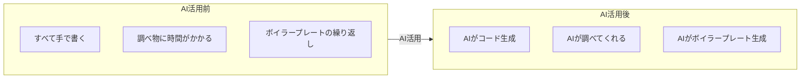
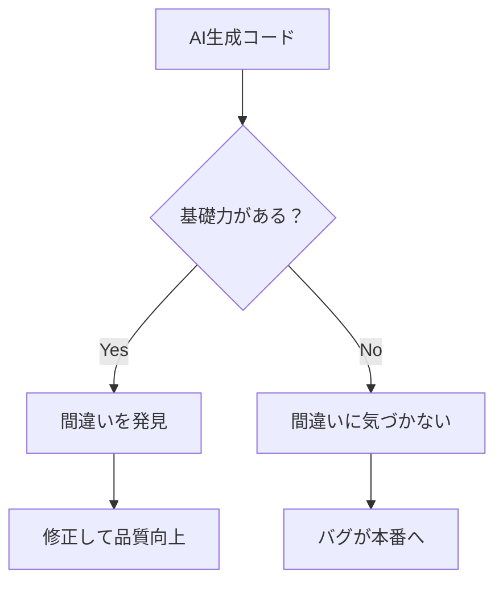
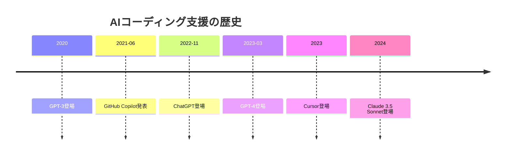
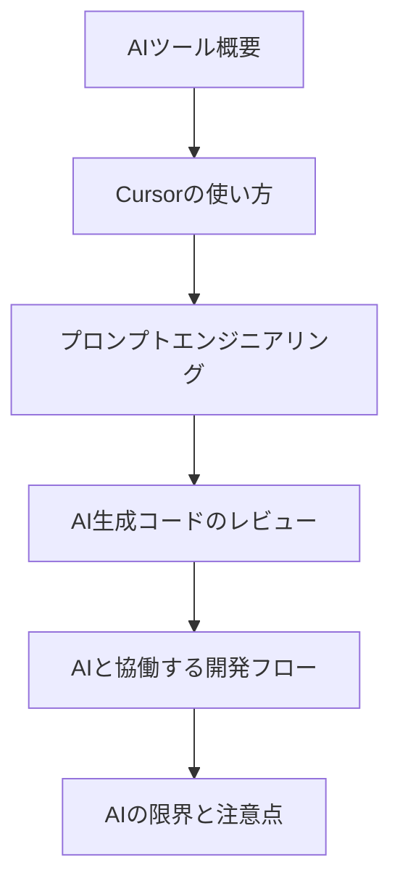
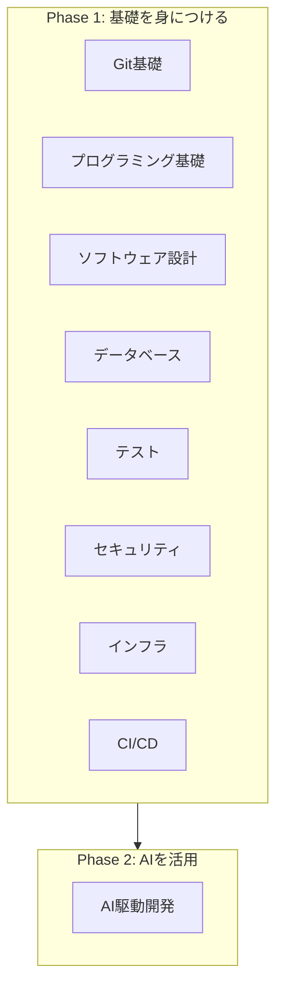

# 09. AI駆動開発（Cursor前提）

## 概要

**学習日数**: 2-3日

AIコーディング支援ツールを活用した開発手法を学びます。Cursorを中心に、AIと協働する開発フローを理解し、効果的にAIを活用できるようになります。

## なぜ学ぶ必要があるのか

### この技術が解決する問題



**ただし、注意が必要です**：
- AIは**間違うことがある**
- 基礎知識がないとAIの間違いを見抜けない
- AIに振り回されないための**正しいフローの理解**が必要

### 実務での重要性

- **開発効率の向上**: AIを活用することで開発速度が大幅に向上
- **学習効率の向上**: AIに質問しながら学習できる
- **現代の開発標準**: 多くの開発者がAIツールを活用

### AI時代における重要性（なぜ基礎が必要か）



**基礎力がないとAIに振り回される**：
- AIの出力をそのまま使ってしまう
- 間違いに気づかない
- 問題が発生しても原因がわからない

**基礎力があればAIを活用できる**：
- AIの出力をレビューして間違いを発見
- 適切な指示を出せる
- 問題発生時に原因を特定できる

## 技術の歴史的背景

### 技術の誕生



- **2021年**: GitHub CopilotがAIコーディング支援の先駆けに
- **2022年**: ChatGPTの登場で一般に普及
- **2023年**: Cursor等のAIファーストエディタが登場

### 進化の過程

| 年 | ツール | 特徴 |
|----|--------|------|
| 2021 | GitHub Copilot | コード補完に特化 |
| 2022 | ChatGPT | 汎用的なコード生成、説明 |
| 2023 | Cursor | AIファーストエディタ、プロジェクト全体を理解 |
| 2024 | Claude | 長いコンテキスト、高精度 |

## 学習内容

### コンテンツ一覧

| No | コンテンツ | 難易度 | 内容 |
|----|------------|--------|------|
| 01 | [AIツール概要](09-ai-driven-development-01.md) | [基礎] | GitHub Copilot、Cursor、ChatGPT、Claude |
| 02 | [Cursorの使い方](09-ai-driven-development-02.md) | [基礎] | Cursorの基本操作 |
| 03 | [プロンプトエンジニアリング](09-ai-driven-development-03.md) | [中級] | 効果的なプロンプトの書き方 |
| 04 | [AI生成コードのレビュー](09-ai-driven-development-04.md) | [中級] | 従来の基礎知識を活用したレビュー |
| 05 | [AIと協働する開発フロー](09-ai-driven-development-05.md) | [中級] | 要件定義→AI生成→レビュー→修正 |
| 06 | [AIの限界と注意点](09-ai-driven-development-06.md) | [基礎] | セキュリティ、パフォーマンス、ライセンス |

### 学習の流れ



## 学習目標

このカテゴリを修了すると、以下ができるようになります：

- [ ] AIコーディング支援ツールの種類と特徴を説明できる
- [ ] Cursorを使ってコードを生成できる
- [ ] 効果的なプロンプトを書ける
- [ ] AI生成コードをレビューし、問題を発見できる
- [ ] AIと協働する開発フローを実践できる
- [ ] AIの限界を理解し、適切に活用できる

## 重要な注意点

### AIを使う前に基礎を身につける

この研修では、AI駆動開発を**最後**に学びます。これは意図的な順番です。



**理由**：
1. 基礎がないとAIの間違いを見抜けない
2. 正しい開発フローを知らないとAIに振り回される
3. 基礎があってこそAIを効果的に活用できる

### AIは完璧ではない

```typescript
// AIが生成したコード（一見正しそう）
async function getUser(id: string) {
  const user = await db.query(`SELECT * FROM users WHERE id = '${id}'`);
  return user;
}

// 問題点：SQLインジェクションの脆弱性！
// 正しくは：
async function getUser(id: string) {
  const user = await db.query('SELECT * FROM users WHERE id = $1', [id]);
  return user;
}
```

この問題を発見するには、セキュリティの基礎知識が必要です。

## 実践課題

[exercises/common/09-ai-driven-development/](../../../exercises/common/09-ai-driven-development/)

## 理解度チェック

[tests/common/09-ai-driven-development/](../../../tests/common/09-ai-driven-development/)

## 参考リソース

- [Cursor公式ドキュメント](https://cursor.sh/)
- [GitHub Copilot](https://github.com/features/copilot)
- [プロンプトエンジニアリングガイド](https://www.promptingguide.ai/jp)

---

**著作権表示**

Copyright © 2024 Honeycome Inc. All rights reserved.

本コンテンツは、Honeycome Inc.の所有物です。無断での複製、配布、転載を禁止します。
詳細は[利用規約](../../../docs/terms-of-use.md)をご覧ください。
