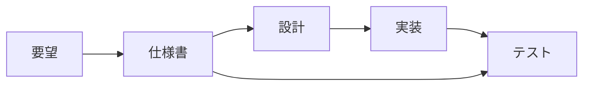

# 仕様書の読み方・書き方

## 📋 概要

| 項目 | 内容 |
|------|------|
| 所要時間 | 30分 |
| 難易度 | [基礎] |
| 前提知識 | なし |

## 🎯 なぜこれを学ぶのか

仕様書は開発の設計図です。仕様を正確に理解し、書けることで、認識のずれを防ぎ、品質の高いソフトウェアを作れます。

## 📚 学習内容

### 1. 仕様書とは



**仕様書** = 「何を作るか」を定義したドキュメント

### 2. 仕様書の種類

| 種類 | 内容 | 例 |
|------|------|-----|
| 要件定義書 | ビジネス要件 | 「ユーザーが商品を購入できる」 |
| 機能仕様書 | 機能の詳細 | 「購入ボタンをクリックすると...」 |
| 技術仕様書 | 技術的な詳細 | API定義、DB設計 |
| 画面仕様書 | UI/UX | ワイヤーフレーム |

### 3. 仕様書の読み方

```
確認すべきポイント:

1. 目的（Why）
   - この機能は何のためか
   - 誰が使うのか

2. 機能（What）
   - 何ができるようになるか
   - 入力と出力は何か

3. 制約（Constraints）
   - 技術的な制約
   - ビジネス上の制約

4. 非機能要件
   - パフォーマンス
   - セキュリティ
```

### 4. 仕様書の書き方

#### テンプレート

```markdown
# 機能名

## 概要
[機能の目的と概要を1-2文で]

## 背景
[なぜこの機能が必要か]

## 機能要件
### 基本機能
- [機能1]
- [機能2]

### 入力
- [入力項目と型]

### 出力
- [出力項目と型]

## 画面
[ワイヤーフレームまたは説明]

## 非機能要件
- パフォーマンス: [要件]
- セキュリティ: [要件]

## 制約・前提条件
- [制約1]
- [制約2]

## 除外事項（スコープ外）
- [今回対応しないこと]
```

### 5. 良い仕様書の特徴

```
✅ 良い仕様書
- 具体的で曖昧さがない
- 入力と出力が明確
- エッジケースが考慮されている
- 非機能要件が含まれている

❌ 悪い仕様書
- 曖昧な表現（「適切に」「必要に応じて」）
- 前提条件が不明
- エラーケースの記載がない
```

### 6. 仕様のレビューポイント

```
□ 目的が明確か
□ 入力/出力が定義されているか
□ 正常系/異常系が網羅されているか
□ エッジケースは考慮されているか
□ 実装可能な粒度か
□ テスト可能か
```

## ✅ まとめ

| 観点 | ポイント |
|------|---------|
| 読む | 目的、機能、制約を確認 |
| 書く | 具体的に、曖昧さを排除 |
| レビュー | 網羅性、実装可能性 |

## 🔗 次のコンテンツ

[要件定義](10-spec-driven-development-02.md)に進んでください。

---

**著作権表示**

Copyright © 2024 Honeycome Inc. All rights reserved.

本コンテンツは、Honeycome Inc.の所有物です。無断での複製、配布、転載を禁止します。
詳細は[利用規約](../../docs/terms-of-use.md)をご覧ください。
