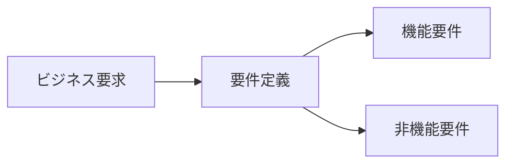
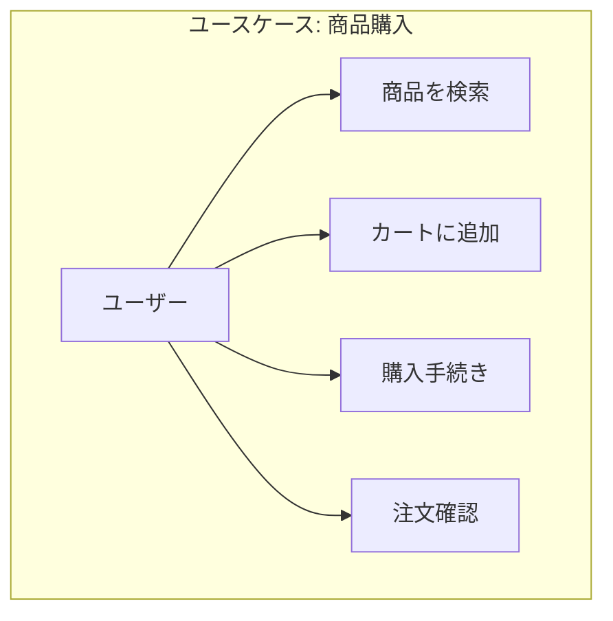
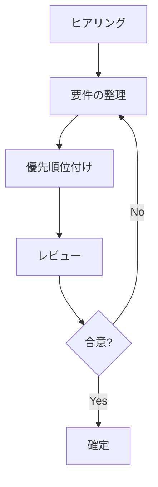

# 要件定義

## 📋 概要

| 項目 | 内容 |
|------|------|
| 所要時間 | 45分 |
| 難易度 | [中級] |
| 前提知識 | 仕様書の読み方・書き方 |

## 🎯 なぜこれを学ぶのか

要件定義は、「何を作るか」を決める最も重要なフェーズです。ここで間違えると、後の工程で大きな手戻りが発生します。

## 📚 学習内容

### 1. 要件定義とは



**要件定義** = ステークホルダーの要求を、実装可能な要件に落とし込むプロセス

### 2. 機能要件と非機能要件

| 種類 | 内容 | 例 |
|------|------|-----|
| 機能要件 | システムが「何をするか」 | ログイン機能、検索機能 |
| 非機能要件 | システムが「どうあるべきか」 | 応答時間3秒以内 |

#### 非機能要件の例

| カテゴリ | 例 |
|---------|-----|
| パフォーマンス | 応答時間、スループット |
| 可用性 | 稼働率99.9% |
| セキュリティ | 暗号化、認証 |
| 拡張性 | 1000ユーザーまで対応 |
| 保守性 | ログ出力、監視 |

### 3. ユースケース



```markdown
## ユースケース: 商品購入

### アクター
- ユーザー（ログイン済み）

### 事前条件
- ユーザーがログインしている
- 商品の在庫がある

### 基本フロー
1. ユーザーが商品を検索する
2. システムが検索結果を表示する
3. ユーザーが商品を選択する
4. ユーザーがカートに追加する
5. ユーザーが購入手続きに進む
6. システムが決済を処理する
7. システムが注文確認メールを送信する

### 代替フロー
- 3a. 在庫がない場合
  - システムが在庫なしを表示
  - 処理終了

### 事後条件
- 注文が作成される
- 在庫が減少する
- 確認メールが送信される
```

### 4. 要件の書き方

#### SMART原則

| 原則 | 説明 | 例 |
|------|------|-----|
| Specific | 具体的 | ❌「高速」→ ✅「3秒以内」 |
| Measurable | 測定可能 | ❌「使いやすい」→ ✅「3クリック以内」 |
| Achievable | 達成可能 | 技術的に実現可能か |
| Relevant | 関連性 | ビジネス目標に合致 |
| Time-bound | 期限 | いつまでに必要か |

### 5. 要件の優先順位

| 優先度 | 説明 |
|--------|------|
| Must | 必須。ないとリリースできない |
| Should | 重要。できれば対応 |
| Could | あると良い |
| Won't | 今回は対応しない |

### 6. 要件定義のプロセス



### 7. よくある問題

```
⚠️ 要件定義の落とし穴

1. 曖昧な表現
   ❌「適切に処理する」
   ✅「エラーコード400を返す」

2. 暗黙の了解
   ❌「普通にログインできる」
   ✅「メールアドレスとパスワードで認証」

3. スコープクリープ
   - 「ついでにこれも」が積み重なる
   - 明確なスコープ定義が重要

4. ステークホルダーの未参加
   - 決定権者が参加していない
   - 後から覆される
```

## ✅ まとめ

| 観点 | ポイント |
|------|---------|
| 機能要件 | 何をするか |
| 非機能要件 | どうあるべきか |
| 優先順位 | Must/Should/Could/Won't |
| 書き方 | SMART原則 |

## 🔗 次のコンテンツ

[設計書の作成](10-spec-driven-development-03.md)に進んでください。
