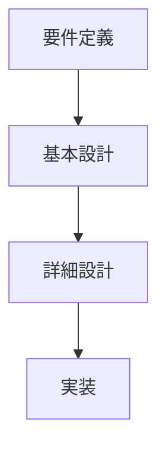
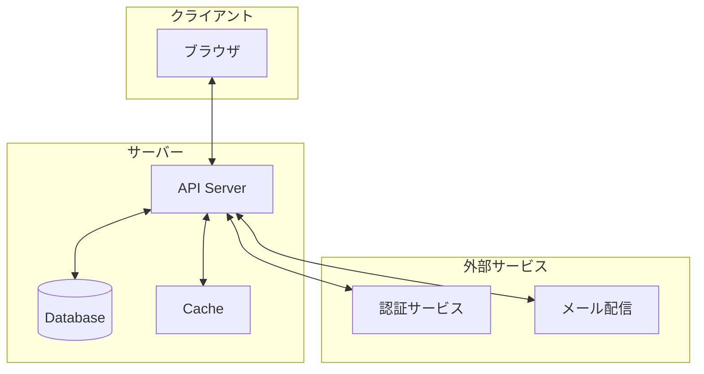
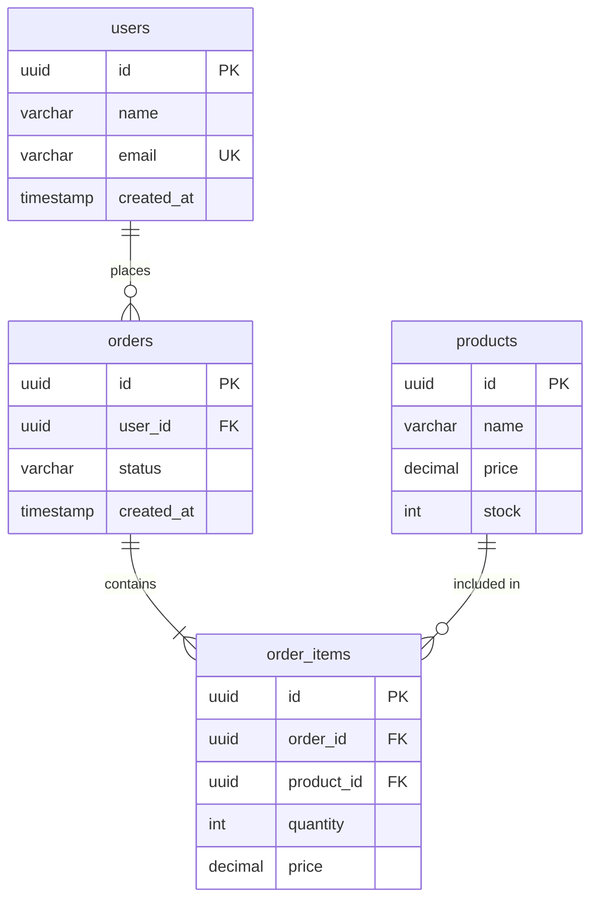
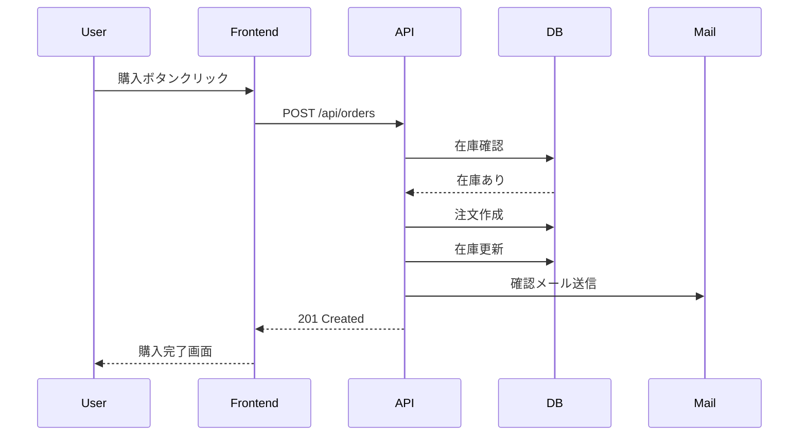

# 設計書の作成

## 📋 概要

| 項目 | 内容 |
|------|------|
| 所要時間 | 45分 |
| 難易度 | [中級] |
| 前提知識 | 要件定義 |

## 🎯 なぜこれを学ぶのか

設計書は、要件を「どう実現するか」を定義します。実装前に設計を固めることで、効率的な開発が可能になります。

## 📚 学習内容

### 1. 設計の種類



| 設計 | 内容 | 成果物 |
|------|------|--------|
| 基本設計 | システム全体の構造 | アーキテクチャ図、画面遷移図 |
| 詳細設計 | 個別機能の詳細 | API定義、DB設計、シーケンス図 |

### 2. アーキテクチャ図



### 3. API設計（OpenAPI/Swagger）

```yaml
openapi: 3.0.0
info:
  title: User API
  version: 1.0.0

paths:
  /api/users:
    get:
      summary: ユーザー一覧取得
      responses:
        '200':
          description: 成功
          content:
            application/json:
              schema:
                type: array
                items:
                  $ref: '#/components/schemas/User'
    
    post:
      summary: ユーザー作成
      requestBody:
        required: true
        content:
          application/json:
            schema:
              $ref: '#/components/schemas/CreateUserInput'
      responses:
        '201':
          description: 作成成功

components:
  schemas:
    User:
      type: object
      properties:
        id:
          type: string
        name:
          type: string
        email:
          type: string
    
    CreateUserInput:
      type: object
      required:
        - name
        - email
      properties:
        name:
          type: string
          minLength: 1
          maxLength: 100
        email:
          type: string
          format: email
```

### 4. データベース設計（ER図）



### 5. シーケンス図



### 6. 画面設計

```markdown
## 画面: 商品一覧

### 概要
商品を一覧表示し、検索・フィルターができる

### レイアウト
```
+------------------------+
| ヘッダー                |
+------------------------+
| 検索バー    | フィルター |
+------------------------+
| 商品カード | 商品カード |
| 商品カード | 商品カード |
+------------------------+
| ページネーション        |
+------------------------+
```

### 要素
| 要素 | 説明 |
|------|------|
| 検索バー | 商品名で検索 |
| フィルター | カテゴリ、価格帯 |
| 商品カード | 画像、名前、価格、カートボタン |
```

### 7. 設計レビューのチェックリスト

```
□ 要件をすべて満たしているか
□ 技術的に実現可能か
□ パフォーマンス要件を満たせるか
□ セキュリティは考慮されているか
□ 拡張性はあるか
□ テスト可能か
□ 運用・保守しやすいか
```

## ✅ まとめ

| 成果物 | 内容 |
|--------|------|
| アーキテクチャ図 | システム全体の構造 |
| API設計 | エンドポイント、リクエスト/レスポンス |
| DB設計 | テーブル、リレーション |
| シーケンス図 | 処理の流れ |

## 🔗 次のコンテンツ

[仕様から実装へ](10-spec-driven-development-04.md)に進んでください。
