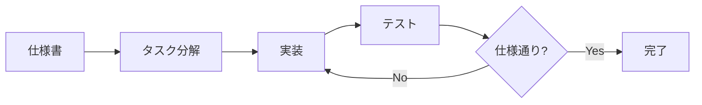
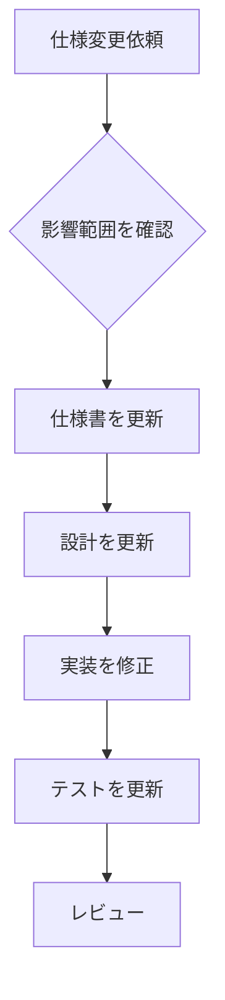

# 仕様から実装へ

## 📋 概要

| 項目 | 内容 |
|------|------|
| 所要時間 | 30分 |
| 難易度 | [中級] |
| 前提知識 | 設計書の作成 |

## 🎯 なぜこれを学ぶのか

設計書と実装を結びつける方法を学ぶことで、仕様通りの実装ができ、AIへの指示も明確になります。

## 📚 学習内容

### 1. 仕様→実装の流れ



### 2. 仕様からコードへの変換

#### 仕様（API定義）

```yaml
POST /api/users
Request:
  - name: string (1-100文字)
  - email: string (メール形式)
Response:
  - 201: ユーザーオブジェクト
  - 400: バリデーションエラー
```

#### 実装

```typescript
// 型定義
interface CreateUserInput {
  name: string;
  email: string;
}

interface User {
  id: string;
  name: string;
  email: string;
  createdAt: Date;
}

// バリデーション（仕様の制約を反映）
const createUserSchema = z.object({
  name: z.string().min(1).max(100),
  email: z.string().email(),
});

// エンドポイント
app.post('/api/users', async (req, res) => {
  // バリデーション
  const result = createUserSchema.safeParse(req.body);
  if (!result.success) {
    return res.status(400).json({
      error: 'Validation failed',
      details: result.error.errors,
    });
  }

  // ユーザー作成
  const user = await userService.create(result.data);
  
  // 201で返す
  return res.status(201).json(user);
});
```

### 3. 仕様とテストの対応

#### 仕様

```
ユーザー作成:
- 正常: 名前とメールで作成
- エラー: 名前が空
- エラー: メール形式が不正
- エラー: メールが重複
```

#### テスト

```typescript
describe('POST /api/users', () => {
  test('正常にユーザーを作成できる', async () => {
    const res = await request(app)
      .post('/api/users')
      .send({ name: 'Alice', email: 'alice@example.com' });
    
    expect(res.status).toBe(201);
    expect(res.body.name).toBe('Alice');
  });

  test('名前が空の場合は400エラー', async () => {
    const res = await request(app)
      .post('/api/users')
      .send({ name: '', email: 'alice@example.com' });
    
    expect(res.status).toBe(400);
  });

  test('メール形式が不正な場合は400エラー', async () => {
    const res = await request(app)
      .post('/api/users')
      .send({ name: 'Alice', email: 'invalid' });
    
    expect(res.status).toBe(400);
  });

  test('メールが重複している場合は409エラー', async () => {
    // 先に作成
    await request(app)
      .post('/api/users')
      .send({ name: 'Alice', email: 'alice@example.com' });
    
    // 重複
    const res = await request(app)
      .post('/api/users')
      .send({ name: 'Bob', email: 'alice@example.com' });
    
    expect(res.status).toBe(409);
  });
});
```

### 4. AIへの仕様伝達

```
以下の仕様でユーザー作成APIを実装してください:

## エンドポイント
POST /api/users

## リクエスト
```json
{
  "name": "string (1-100文字、必須)",
  "email": "string (メール形式、必須)"
}
```

## レスポンス
### 成功 (201)
```json
{
  "id": "uuid",
  "name": "string",
  "email": "string",
  "createdAt": "ISO8601"
}
```

### エラー (400)
```json
{
  "error": "Validation failed",
  "details": [...]
}
```

### エラー (409)
```json
{
  "error": "Email already exists"
}
```

## 技術スタック
- Express + TypeScript
- zod でバリデーション
- PostgreSQL
```

### 5. 仕様変更への対応



```
仕様変更時のチェックリスト:
□ 影響するドキュメントを特定
□ 仕様書を更新
□ 設計書を更新
□ コードを修正
□ テストを追加/修正
□ 変更履歴を記録
```

## ✅ まとめ

| 観点 | ポイント |
|------|---------|
| 変換 | 仕様の制約→バリデーション |
| テスト | 仕様のケース→テストケース |
| AI活用 | 仕様を明確に伝える |
| 変更 | 仕様→設計→実装→テストを同期 |

## 🔗 次のステップ

仕様駆動開発カテゴリを修了しました！
[実践課題](./exercises/)に取り組んでください。

これで共通基礎カリキュラムは完了です！
次は[コース別カリキュラム](../../web/)に進んでください。
