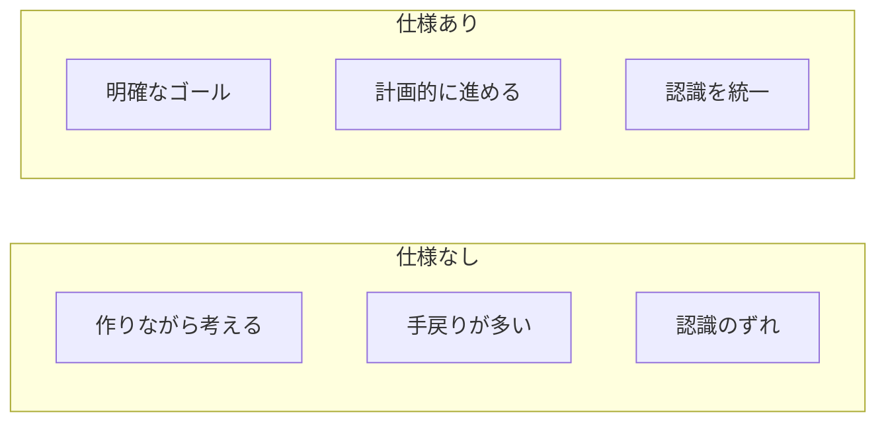

# 10. 仕様駆動開発

## 概要

**学習日数**: 1-2日

仕様書から実装する開発手法を学びます。要件定義、設計書の作成、仕様から実装への落とし込みについて理解します。

## なぜ学ぶ必要があるのか

### この技術が解決する問題

### 実務での重要性

- **チーム開発**: 仕様書があることで認識を統一
- **見積もり**: 仕様が明確だと見積もりがしやすい
- **品質**: 仕様に基づいてテストできる

### AI時代における重要性

- **AIへの指示**: 仕様を明確に書けるとAIへの指示も明確になる
- **AI生成コードの検証**: 仕様に基づいて検証できる

## 学習内容

| No | コンテンツ | 難易度 | 内容 |
|----|------------|--------|------|
| 01 | [仕様書の読み方・書き方](10-spec-driven-development-01.md) | [基礎] | 仕様書の構成、読み方、書き方 |
| 02 | [要件定義](10-spec-driven-development-02.md) | [中級] | 要件定義の基礎 |
| 03 | [設計書の作成](10-spec-driven-development-03.md) | [中級] | 設計書の作成方法 |
| 04 | [仕様から実装へ](10-spec-driven-development-04.md) | [中級] | 仕様から実装への落とし込み |

## 学習目標

- [ ] 仕様書を読み、理解できる
- [ ] 簡単な仕様書を書ける
- [ ] 要件定義の基本を理解している
- [ ] 仕様から実装への落とし込みができる

## 参考リソース

- [要件定義の基本](https://www.ipa.go.jp/sec/softwareengineering/tool/ep/ep1.html)

---

**著作権表示**

Copyright © 2024 Honeycome Inc. All rights reserved.

本コンテンツは、Honeycome Inc.の所有物です。無断での複製、配布、転載を禁止します。
詳細は[利用規約](../../../docs/terms-of-use.md)をご覧ください。
